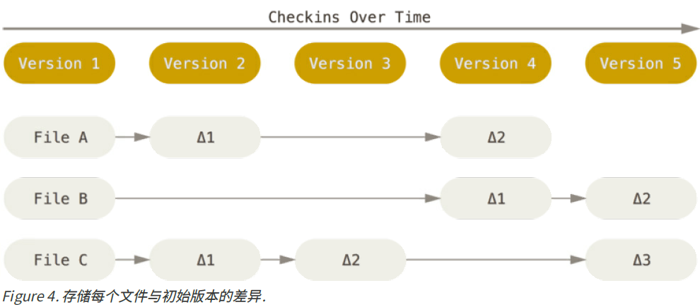

> 本文档参考：
>
> 1. 《精通Git-第二版》

# 1. 起步

## 1.1 Git基础

### 1.1.1 直接记录快照，而非差异比较：

Git和其它版本控制系统（包括Subversion和近似工具）的主要差别在于Git对待数据的方法。概念上区分，其它大部分系统以**文件变更列表**的方式存储信息。这类系统（CVS、Subversion、Perforce、Bazaar等等）将它们保存的信息看做是**一组基本文件和每个文件随时间逐步积累的差异**。

Git不按照以上方式对待或保存数据。反之，Git更像是把数据看作是对小型文件系统的一组快照。每次你提交更新，或在Git中保存项目状态时，它主要对当时的全部文件制作一个快照并保存这个快照

