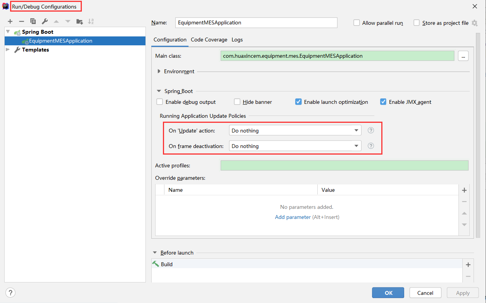

# 1. 快捷键

| 描述             | 快捷键                      |
| :--------------- | --------------------------- |
| 全文查找         | Ctrl + Shift + F            |
| 显示类结构       | Ctrl + F12                  |
| 显示被调用的位置 | Alt + F7 或 Ctrl + 鼠标左键 |
| 替换             | Ctrl + R                    |
| 显示类的继承结构 | Ctrl + H                    |
|                  |                             |

# 2. 一些设置

## 2.1 禁止自动编译

将Run/Debug Configurations面板中框红线的两处地方修改为 `"Do nothing"`，即修改代码之后什么也不处理。

