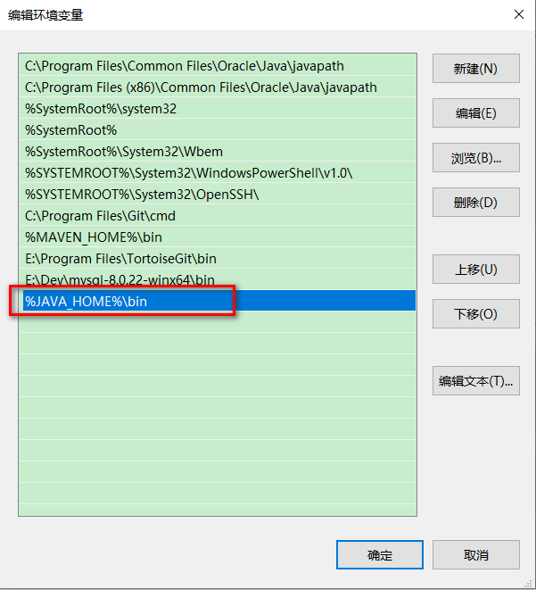
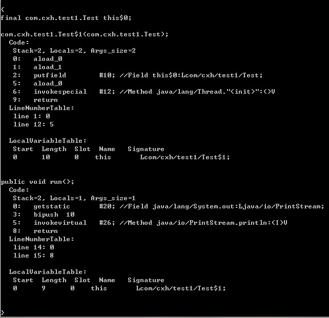

# 1. Java介绍

## 1.1 Java简介

> Java是由`Sun Microsystems`公司与于1995年推出的 `Java面向对象程序设计语言` 和 `Java平台` 的总称。 

Java不只是一种语言，它是一个完整的平台，有一个庞大的库，其中包含了很多可充用的 代码和一个提供诸如安全性、跨操作系统的可以执行以及自动垃圾收集等服务的执行环境。


## 1.2 Java的主要特性

### 1.2.1 简单性：

Java语言的语法与C语言和C++语言很接近，使得大多数程序员很容易学习和使用。另一方面，Java丢弃了C++中很少使用的、很难理解的、令人迷惑的那些特性，如操作符重载、多继承、自动的强制类型转换。特别的，Java语言不适用指针，而是引用。并提供了自动分配和回收内存空间，使得程序员不必为内存管理而担忧。

### 1.2.2 面向对象：

Java语言提供类、接口和继承等面向对象的特性，为了简单起见，只支持类之间的单继承，但支持接口之间的多继承，并且支持类与接口之间的多实现。Java语言全面支持动态绑定，而C++语言只对虚函数使用动态绑定。

总之，Java是一个纯的面向对象程序设计语言。

### 1.2.3 分布式：

Java设计成支持在网络上应用，它是分布式语言。Java既支持各种层次的网络连接，又以Socket类支持可靠的流（stream）网络连接，所以用户可以产生分布式的客户机和服务器。

### 1.2.4 健壮性：

Java的强类型机制、异常处理、垃圾的自动收集等是Java程序健壮性的重要保证。对指针的丢弃是Java的明智选择。Java的安全检查机制使得Java更具健壮性。

### 1.2.5 安全性：

Java通常被用在网络环境中，为此，Java提供了一个安全机制以防恶意代码的攻击。除了Java语言具有的许多安全特性以外，Java对通过网络下载的类具有一个安全防范机制（类加载器），如分配不同的名字空间以防替代本地的同名类、字节码检查，并提供安全管理机制（SecurityManager）让Java应用设置安全哨兵。

### 1.2.6 体系结构中立：

Java程序（后缀为java的文件）在Java平台上被编译为体系结构中立的字节码格式（后缀为class的文件），然后可以在实现这个Java平台的任何系统中运行。这种途径适合于异构的网络环境和软件的分发。

### 1.2.7 可移植性：

这种可移植性来源于体系结构中立性，另外，Java还严格规定了各个基本数据类型的长度。Java系统也具有很强的可移植性，Java编译器是用Java实现的，Java的运行环境是用ANSI C实现的。

### 1.2.8 解释型：

如前所述，Java程序在Java平台上被编译为字节码格式，然后可以在实现这个Java平台的任何系统中运行。在运行时，Java平台中的Java解释器对这些字节码进行解释执行，执行过程中需要的类在链接阶段被载入到运行环境中。

### 1.2.9 高性能：

与那些解释型的高级脚本语言相比，Java的确是高性能的。事实上，Java的运行速度随着JIT（Just-In-Time）编译器技术的发展越来越接近于C++。

### 1.2.10 多线程：

在Java语言中，线程是一种特殊的对象，它必须由Thread类或其子类来创建。

### 1.2.11 动态性：

Java语言设计的目标之一是适应动态变化的环境。Java程序需要的类能够动态的被载入到运行环境，也可以通过网络来载入所需要的类。这也有利于软件的升级。另外，Java中的类有一个运行时刻的表示，能进行运行时刻的类型检查。


## 1.3 Java平台（体系）

- JavaSE：Java Platform Standard Edition，Java平台标准版。
- JavaEE：Java Platform Enterprise Edition，Java平台企业版。
- JavaME：Java Platform Micro Edition，Java平台微型版。


## 1.4 Java的发展历史

- 1995年5月23日，Java语言诞生
- 1996年1月，第一个JKD，JDK1.0诞生
- 1996年4月，10个最主要的操作系统供应商申明将在其产品中嵌入Java技术
- 1996年9月，约8.3万个网页应用了Java技术来制作
- 1997年2月18日，JDK1.1发布
- 1997年4月2日，JavaOne会议召开，参与者逾一万人，创当时全球同类会议规模之记录
- 1997年9月，JavaDeveloperConnection社区成员超过十万
- 1998年8月，JDK1.1被下载超过200万次
- 1998年12月8日，JAVA2企业平台J2EE发布
- 1999年6月，SUN公司发布Java的三个版本：J2SE、J2EE、J2ME
- 2000年5月6日，JDK1.3发布
- 2000年5月29日，JDK1.4发布
- 2001年6月5日，NOKIA宣布，到2003年将出售一亿部支持Java的手机
- 2001年9月24日，J2EE1.3发布
- 2002年2月26日，J2SE1.4发布，自此Java的计算能力有了大幅提升
- 2004年9月30日 18:00PM，J2SE1.5发布，成为Java语言发展史上的又一里程碑。为了表示该版本的重要性，J2SE1.5更名为Java SE5.0
- 2005年6月，JavaOne大会召开，SUN公司公开Java SE6。此时，Java的各种版本已经更名，以取消其中的数字 "2"：J2SE更名为Java SE，J2EE更名为Java EE，J2ME更名为Java ME
- 2006年12月，SUN公司发布JRE6.0
- 2009年04月20日，Oracle74亿美元收购SUN，取得Java的版权
- 2010年11月，由于Oracle对于Java社区的不友善，因此Apache扬言将推出JCP
- 2011年7月28日，Oracle发布Java7.0的正式版
- 2014年3月18日，Oracle发布Java SE 8
- 2017年9月21日，Oracle发布Java SE 9
- 2018年3月21日，Oracle发布Java SE 10
- 2018年9月25日，Java SE 11发布
- 2019年3月20日，Java SE 12发布


# 2. Java开发环境配置

## 2.1 JDK安装与配置

JDK下载安装与配置详细步骤略...


## 2.2 JDK目录介绍

> [参考]https://blog.csdn.net/weixin_45797022/article/details/105246383

### 2.2.1 bin目录：

是binary的缩写，里面存放了JDK的各种工具命令，即JDK开发工具的可执行文件（文件都是二进制的，其中包括编译器、解释器以及其他一些工具），该目录应该配置到PATH变量中。

作为JDK实用程序，文件中主要程序有以下几个：

- java：Java解释器，直接从类文件执行Java应用程序字节代码；
- javac：Java编译器，将Java源代码转换成字节码；
- appletviewer：小程序浏览器，一种执行HTML文件中 java小程序的Java浏览器；
- javadoc：根据Java源码及说明语句生成HTML文档；
- jdb：Java调试器，可以逐行执行程序，设置断点和检查变量；
- javah：产生可以调用javac过程的C过程，或建立能被Java程序调用的C过程的头文件；
- javap：Java反编译器，显示编译类文件中的可访问功能和数据，同时显示字节码含义；
- ...

### 2.2.2 db目录：

db文件是从Java6开始新增的一个目录，这是一个纯Java实现、开源的数据库管理系统（DBMS），源于Apache软件基金会（ASF）名下的项目Derby。

它是一个先进的全事务处理的基于Java技术的数据库，它支持各类开放标准、触发器和存储程序。Java DB可以客户端服务器模式使用，也可以直接嵌入到一个Java应用程序中。因此Java DB可以在同样的Java虚拟机中运行，这就无需在应用程序之外单独购买、下载、安装或管理这个数据库。

它只有3MB大小，对比动辄上G的数据库来说可谓袖珍，但这并不妨碍Derby功能齐备，支持几乎大部分的数据库应用所需的特性。Java程序员不再需要耗费大量精力安装和配置数据库，就能进行安全、易用、标准并且免费的数据库编程。

### 2.2.3 include目录：

由于JDK是通过C和C++实现的，因此在启动时需要引入一些C语言的头文件，所以inculde目录里面放的就是一些提供C语言使用的头文件，其中C语言的头文件支持Java本地接口和Java虚拟机调试程序接口的本地编程技术。

### 2.2.4 jre目录：

jre（java runtime environment，即Java运行时环境）目录路径下安装的就是运行Java程序所必须的JRE环境。

### 2.2.5 lib目录：

lib是library的缩写，存放的是开发工具使用的归档文件。例如Jar 包等。

dt.jar是所谓DesignTime的东西，是给JavaBean和IDE用到。

jconsole.jar是给jconsole工具用的。

tools.jar包含了对开发工具的支持功能库。


## 2.3 名词解释与作用

### 2.3.1 jdk、jre、jvm：

- jvm：Java Virtual Machine，就是我们耳熟能详的Java虚拟机，它只认识xxx.class类型的文件，它能够将class文件中的字节码指令进行识别，并调用操作系统提供的API完成动作。
- jre：Java Runtime Environment，即Java运行时环境，它主要包含两个部分，jvm的标准实现和java的一些基本类库。
- jdk：Java Development Kit，即Java开发工具包。JDK是整个Java开发的核心，它集成了jre和一些好用的小工具。例如：javac.exe，java.exe，jar.exe


### 2.3.2 JAVA_HOME：

设置JAVA_HOME变量，主要有一下几个目的：

- 为了方便引用，如果以后修改了jdk的安装目录，或者想要安装新的jdk，那么只需要将JAVA_HOME变量的值改变就行，path环境变量的值可以不变；
- 第三方软件会引用约定好的JAVA_HOME变量，典型的就是Tomcat，如果不配置JAVA_HOME，那么Tomcat服务器根本运行不起来；

### 2.3.3 path变量：

操作系统用path的路径来查找可执行程序（.exe程序），在windows下当我们敲任何一个命令时，实际上就是在执行一个可执行文件，如输入notepad命令就可以打开一个记事本。

实际上就是执行了`c:\Windows`下的notepad.exe这个可执行文件，和用鼠标双击notepad.exe后能够打开一个记事本的效果是一样的。

当在命令窗口敲一个命令时，系统就会去自动寻找这个命令对应的可执行文件（.exe），如果这个文件不存在，就当然无法执行这个命令了。`这个可执行文件的根目录必须设置在path环境变量中`。

直接输入 "echo %path%" 命令就可以显示当前设置的path环境变量的所有根目录了，只要是根目录里存在相应的.exe文件，敲入命令时就能执行这个相应的.exe文件

````shell
echo %path%
````


Windows系统中，根目录都是以 `";"` 分割的，可以看到，我当前电脑中的根目录有很多，此时如果我们输入`"notepad"`命令，windows查找的过程如下：

> - 先在 "C:\Program Files\Java\jdk1.8.0_241\bin" 目录下查找是否有notepad.exe，如果有，则执行该可执行文件。如果没有，继续下一步；
>
> - 然后在 "C:\Program Files\Common Files\Oracle\Java\javapath" 目录下查找是否有notepad.exe，如果有，则执行该可执行文件。如果没有，继续下一步；
>
> - 依次类推，直到在某个目录下找到notead.exe并执行，否则就报错：
>
>   ​	'xxx' 不是内部或外部命令，也不是可运行的程序或批处理文件

> 所以，如果我们想要执行某个命令的时候能够更快的响应，可以将包含该命令的目录配置到path环境变量的前面。如这里我想执行javac、java命令的时候能够更快的响应，所以我将javac/java命令所在的目录 "C:\Program Files\Java\jdk1.8.0_241\bin" 放在了最前面。

### 2.3.4 classpath：

classpath并不是操作系统的概念，而是java的概念，表示的是类所在的路径。

设置classpath的目的，作用是指定类搜索路径，在于告诉java执行环境（JVM），在哪些目录下可以找到你要执行的java程序（.class文件）。

> 总而言之，path是Windows查找.exe文件的路径；classpath是jvm查找.class文件的路径。

### 2.3.5 多版本jdk：

一般情况下，我们直到自己安装的JDK的版本，但是有时候，却发现执行 `"java -version"` 命令，给出的信息却不是我们想要的版本。

下面是演示的一种情况：

我们配置了 `"JAVA_HOME" = "C:\Program Files\Java\jdk1.8.0_241"`

```SHELL
C:\Users\admin>echo %JAVA_HOME%
C:\Program Files\Java\jdk1.8.0_241
```

并且也将JAVA_HOME配置到了path环境变量中



此时，我们执行 `"java -version"` 命令，发出输出的信息如下：

```shell
C:\Users\admin>java -version
java version "15.0.1" 2020-10-20
Java(TM) SE Runtime Environment (build 15.0.1+9-18)
Java HotSpot(TM) 64-Bit Server VM (build 15.0.1+9-18, mixed mode, sharing)
```

发现输出的版本信息是Java15，并不是我们JAVA_HOME指定的Java8，这是为什么呢？:flushed:

这是因为在JAVA_HOME之前的环境变量中的某个目录下已经存在java.exe了，那怎样才能知道是使用哪个目录下的jdk的呢？

此时，我们可以使用 `"java -verbose"` 输出更详细的信息：

```shell
C:\Users\admin>java -verbose
[0.022s][info][class,load] opened: C:\Program Files\Java\jdk-15.0.1\lib\modules
[0.030s][info][class,load] java.lang.Object source: shared objects file
...
```

从这里可以看到是 "C:\Program Files\Java\jdk-15.0.1" 这个15版本的JDK。

所以，一般我们都是讲JAVA_HOME放到path变量的最前面。


## 2.4 用户变量和系统变量的区别

环境变量中有两种变量，一种是用户变量，另一种是系统变量，那么这两种变量有什么区别呢？

> 用户变量，是针对某一个特定的用户，只对特定的用户有效；而系统变量，则对所有用户有效。

我们看到我们的环境变量中有两个path环境变量，一个是用户变量，一个是系统变量：


那么当需要使用到path变量的值时，到底使用哪一个呢，怎么区分这两个path呢？:flushed:

> 操作系统的做法是把用户自己创建的 "path用户变量的值" 和 "path系统变量的值" 合在一起使用，会把 "path用户变量的值" 追加到 "path系统变量的值" 的后面。

输出整合后的path变量值：

```shell
C:\Users\admin>echo %path%
C:\Program Files\Java\jdk1.8.0_241\bin;C:\Program Files\Common Files\Oracle\Java\javapath;C:\Program Files (x86)\Common Files\Oracle\Java\javapath;C:\WINDOWS\system32;C:\WINDOWS;C:\WINDOWS\System32\Wbem;C:\WINDOWS\System32\WindowsPowerShell\v1.0\;C:\WINDOWS\System32\OpenSSH\;C:\Program Files\Git\cmd;E:\Dev\apache-maven-3.6.3\bin;E:\Program Files\TortoiseGit\bin;E:\Dev\mysql-8.0.22-winx64\bin;
C:\Users\admin\AppData\Local\Microsoft\WindowsApps;C:\Program Files\Bandizip\;E:\Program Files\JetBrains\DataGrip 2019.1\bin;;C:\Users\admin\AppData\Local\Programs\Microsoft VS Code\bin;
```

我们仔细查看就能发现，用户的path变量的值追加到了系统的path变量的值的后面。


# 3. Java基础

## 3.1 保留字&关键字

### 3.1.1 保留字：

> 指在高级语言中已经定义过的字，使用者不能再将这些字作为变量名/方法名/类名/包名使用（就是Java系统可以用也可以不用，但是你不能用）

```java
true false null goto const
```

在Java现有版本中没有特殊含义，以后版本可能会作为有特殊含义的词，或者该词虽然在Java中没有特殊含义，以后版本也不打算使用，但在其他语言中有特殊含义，不宜在Java中使用。

### 3.1.2 关键字：

> 在语言中有特定含义，称为语法中一部分的那些字。

注：**关键字一定是保留字**


## 3.2 标识符：

### 3.2.1 定义：

> Java中标识符是为方法、变量或其他用户自定义项所定义的名称。标识符可以有一个或多个字符

### 3.2.2 标识符的构成：

> - 标识符由字母（A-Z和a-z）、数字（0-9）、下划线（_）以及美元符号($)构成
> - 标识符的第一个字符只能是字母、下划线、美元符号，后面可以是任何字母、数字、下划线、美元符号

【注】**Java区分大小写**，因此 `myvar` 和 `myVar` 是两个不同的标识符。


## 3.3 注释

> 注释是对程序代码的说明，有助于程序员理解代码。注释不是编程语句，也是给计算机看到，因此编译器会忽略。

Java中支持三种注释：

### 3.3.1 单行注释：

以双斜杠 `"//"` 标识，只能注释一行内容，用在注释信息内容少的地方。

### 3.3.2 多行注释：

包含在 `"/*"` 和 `"*/"`之间，能注释很多行的内容。

【注】多行注释可以嵌套单行注释，但是不能嵌套多行注释和文档注释

### 3.3.3 文档注释：

包含在 `"/**"` 和 `"*/"` 之间，也能注释多行内容。

文档注释可以通过javadoc命令把文档注释中的内容生成文档，并输出到HTML文件中，方便记录程序信息。文档注释只放在类、接口、成员变量、方法之前，因为javadoc只处理这些地方的文档注释，而忽略其他地方的文档注释。

详细的关于文档注释，可以参考[这里](http://c.biancheng.net/view/6262.html)


## 3.4 变量

Java语言是强类型语言，强类型包含以下两方面的含义：

1. 所有的变量必须先声明，后使用；
2. 指定类型的变量只能接受类型与之匹配的值；

这意味着每个变量和每个表达式都有一个在编译时就确定的类型。类型限制了一个变量能被赋予的值，限制了一个表达式可以产生的值，限制了在这些值上可以进行的操作，并确定了这些操作的含义。

> 变量并不仅仅说是一个名字，变量包含三个部分：变量类型、变量名、变量值。

**Java程序在运行期间，随时可能产生一些临时数据，应用程序会将这些数据保存在一些存储单元中，每个内存单元都用一个标识符来标识。这些内存单元被称为变量，定义的标识符就是变量名，内存单元中存储的数据就是变量的值。**

> 变量本质上就是代表一个 "可操作的存储空间" ，空间位置是确定的，但是里面放置什么值不确定。我们可以通过变量名来访问 "对应的存储空间"，从而操纵这个 "存储空间" 存储的值。

### 3.4.1 变量声明：

```java
DataType identifier;
```

或

```java
DataType identifier = value;
```

变量只有先声明才能使用，否则会报错。

### 3.4.2 变量赋值：

变量赋值是指为变量指定一个明确的值。初始化变量有两种方式：一种是声明时直接赋值，一种是先声明后赋值。

声明时直接赋值的方式：

```java
int a = 1;
```

先声明，再赋值的方式：

```java
int a;
a = 1;
```

### 3.4.3 赋值与初始化：

#### 3.4.3.1 赋值：

> 赋值是给变量指定一个值或者是改变一个变量的值。

#### 3.4.3.2 初始化：

> 声明一个变量以后，必须对变量进行初始化，然后才能使用这个变量。

所以，可以说，`初始化也是赋值`。

### 3.4.4 默认初始化与显式初始化：

#### 3.4.4.1 默认初始化：

```java
public class Test {
    private String name;
}
```

name变量没有`"指定初始化(显式初始化)"`，运行时就会就会为其赋予一个默认值，这就是默认初始化。

#### 3.4.4.2 显式初始化：

```java
public class Test {
    private String name = "cm";
}
```

我们在声明name变量的同时，并为其初始化为"cm"

#### 3.4.4.3 赋值：

```java
public class Test {
    private String name = "cm";
    {
        name = "chenming";
    }
}
```

我们在声明name变量的同时，并为期初始化为 "cm"，然后又为其赋值为 "chenming"

#### 3.4.4.4 比较：

```java
public class Test {
    private String name;	//默认初始化
    {
        name = "chenming";	// 这个应该是叫显式初始化,还是赋值呢？
    }
}
```

个人认为，初始化只能有一种，要么是默认初始化，要么是显示初始化，所有这里我认为应该是赋值。

#### 3.4.4.5 举例：

下面以一个简单的示例说明变量的声明过程：

```java
int age = 18;
```

1. 根据变量类型，开辟出指定大小的内存空间（4个字节的内存空间）；
2. 将内存地址复制给变量名a；
3. 将18设置到内存空间中；


### 3.4.5 各种类型数据的默认值：

- 整型变量（byte/short/int/long）的默认值是0；
- 浮点型变量（float/double）的默认值是0.0；
- 布尔型变量（boolean）的默认值是false；
- 字符型变量（char）的默认值是'u0000'；
- 引用类型的默认值是null；

## 3.5 变量类型

在Java语言中，所有的变量在使用前必须声明，声明变量的基本格式如下：

```shell
type identifier [ = value][, identifier [ = value]...]
```

Java语言支持的变量类型有：

- 类变量：用static修饰，不属于某个对象，而是属于类；
- 实例变量：也叫成员变量，从属于某个具体对象，也就是说每个对象都有一份自己的实例变量，即使是由同一个类创建的对象；
- 局部变量：类的方法中的变量；

```java
public class Variable{
    static int allClicks=0;    // 类变量
 
    String str="hello world";  // 实例变量
 
    public void method(){
 
        int i =0;  // 局部变量
 
    }
}
```

### 3.5.1 局部变量：

> - 局部变量声明在方法、构造方法或者语句块中；
> - 局部变量在方法、构造方法、或者语句块被执行的时候创建，当它们执行完成后，变量将被销毁；
> - 访问修饰符不能修饰局部变量；
> - 局部变量只在声明它的方法、构造方法或者语句块中可见；
> - 局部变量是在栈上分配的；
> - 局部变量没有默认值，所以局部变量被声明后，必须经过初始化，才可以使用；

**【局部变量只在其作用内有效】**

```java
public class App {
    {
        String name = "cm";
    }
    
    @Test
    public void test() {
        System.out.println(name);   // Cannot resolve symbol 'name'
    }
}
```

 报错，name的作用范围只在其语句块中，所以test方法中找不到。

**【局部变量必须要初始化之后才能使用】**

```java
public class App {
    @Test
    public void test() {
        int age;
        age = 10;
        age = age + 18;

        String name;
        name = name + "hello world";    // Variable 'name' might not have been initialized
    }
}
```

### 3.5.2 实例变量：

> - 实例变量声明在一个类中，但在方法、构造方法和语句块之外；
> - 当一个对象被实例化之后，每个实例变量的值就跟着确定；
> - 实例变量在对象创建的时候创建，在对象销毁的时候销毁；
> - 访问修饰符可以修饰实例变量；
> - 实例变量对于类中的方法、构造方法或者语句块是可见的。一般情况下应该把实例变量设为私有；
> - 实例变量可以声明在使用前或者使用后；
> - 实例变量具有默认值；
> - 

**【实例变量可以先使用再声明】**

```java
public class App {
    {
        name = "cm";
    }
    String name;
}
```

### 3.5.3 类变量：

> - 类变量也称为静态变量，在类中以static关键字声明，但必须在方法之外；
> - 无论一个类创建了多少个对象，类变量只有一份，且不属于任何对象，而是属于类；
> - 静态变量存储在静态存储区，经常被声明为常量，很少单独使用static声明变量；
> - 静态变量在第一次访问时被创建，在类销毁之前被销毁；
> - 静态变量可以通过ClassName.VariableName的方式访问；


## 3.6 数据类型

变量就是申请内存来存储值，也就是说，当创建变量的时候，需要在内存中申请空间。

内存管理系统根据变量的类型为变量分配存储空间，分配的空间只能用来存储该类型数据。


因此，通过定义不同类型的变量，可以在内存中存储整数、小数或者字符。

Java的两大数据类型：

- **基本数据类型**
- **引用数据类型**

### 3.6.1 基本数据类型：

Java语言提供了八种基本类型。六种数字类型（四个整数型、两个浮点型），一种字符类型，一种布尔类型。

#### 3.6.1.1 byte：

- byte数据类型是8位、有符号的，以二进制补码表示的整数；
- 最小值是`-128（-2^7）`;
- 最大值是`127（2^7-1）`;
- 默认值是0；
- byte类型用在大型数组中节约空间，因为byte变量占用的空间只有int类型的四分之一；

#### 3.6.1.2 short：

- short数据类型是16位、有符号的以二进制补码表示的数；
- 最小值是-32768（-2^15）;
- 最大值是32767（2^15-1）;
- short数据类型也可以像byte那样可以节省空间；
- 默认值是0；

#### 3.6.1.3 int：

- int数据类型是32位、有符号的以二进制补码表示的整数；
- 最小值是-2147483648（-2^31）;
- 最大值是2147483647（2^31-1）；
- 默认值是0；

#### 3.6.1.4 long：

- long数据类型是64位、有符号的以二进制补码表示的整数；
- 最小值是-2^63；
- 最大值是2^63-1；
- 默认值是`0L`；

#### 3.6.1.5 float：

- float数据类型是单精度、32位、符合IEEE 754标准的浮点数；
- 默认值是`0.0f`；
- 浮点数不能用来表示精确的值，如货币；

#### 3.6.1.6 double：

- double数据类型是双精度、64位、符合IEEE 754标准的浮点数；
- 浮点数的默认类型为double类型；
- double类型同样不能表示精确的值，如货币；
- 默认值是0.0d；

#### 3.6.1.7 boolean：

- boolean数据类型表示`一位`的信息；
- 只有两个取值：`true`和`false`；
- 这种类型只作为一种标志位来记录true/false情况；
- 默认值是`false`；

#### 3.6.1.8 char：

- char类型是一个单一的16位的Unicode字符；
- 最小值是 `'\u0000'`；
- 最大值是 `'\uffff'`；
- char类型可以存储任何字符；
- 默认值是 `'\u0000'`；

### 3.6.2 引用数据类型：

引用数据类型建立在基本数据类型的基础上，包括数组、类和接口。

引用数据类型是由用户自定义，用来限制其他数据的类型。另外，Java语言中不支持C++中的指针类型、结构类型、联合类型和枚举类型。

引用类型还有一种特殊的null类型。

所谓引用类型就是对一个对象的引用，对象包括实例和数组两种。实际上，引用类型变量就是一个指针，只是Java语言里不再使用指针这个说法。

空类型（null type）就是null值的类型，这种类型没有名称。因为null类型没有名称，所以不可能声明一个null类型的变量或者强制转型到null类型。

空引用（null）是null类型变量唯一的值。空引用（null）可以转换为任何引用类型。

### 3.6.3 数据类型转换：

> 数据类型的转换是在所赋值的数值类型和变量接收的数据类型不一致时发生的，它需要从一种数据类型转换成另一种数据类型。
>
> 数据类型的转换可以分为**隐式转换（自动类型转换）**和**显式转换（强制类型转换）**。

#### 3.6.3.1 隐式转换（自动类型转换）：

如果以下2个条件都满足，那么将一种类型的数据赋给另外一种类型变量时，将执行自动类型转换。

- 两种数据类型彼此兼容
- 目标类型的取值范围大于源数据类型（低级数据类型转换成高级数据类型）

当以上2个条件都满足时，拓宽转换（widening conversion）发生。例如byte类型向short类型转换时，由于short类型的取值范围较大，会自动将byte转换为short类型。

在运算过程中，由于不同的数据类型会转换成同一种数据类型，所以整型、浮点型、字符型都可以参加混合运算。自动转换的规则是从低级类型数据转换成高级类型数据。

转换规则如下：

- 数值类型的转换：byte -> short -> int -> long -> float -> double
- 字符型转换成整型：char -> int

以上数据类型的转换遵循从左到右的转换顺序，最终转换成**表达式中**表示范围最大的变量的数据类型。

> 注意：char类型比较特殊，char自动转换成int/long/float/double，但byte和short不能自动转换成char，char也不能自动转换成byte和short。

#### 3.6.3.2 显式转换（强制类型转换）：

> 当两种数据类型不兼容，或目标类型的取值范围小于源类型时，自动转换将无法进行，这时就需要进行强制类型转换。

#### 3.6.3.3 图解：


`箭头流转方向表示可以进行自动类型转换，但是虚线表示进行自动类型转换的时候，可能损失数据`。

int→float，long→float、long→double之所以可能会损失数据，是因为float、double的精度是有限的。

#### 3.6.3.4 思考：

- 例1：

```java
public static void main(String[] args) {
    byte b1 = 10;

    int a = 10;
    byte b2 = a;    //Error: Required byte, Provided int
    /**
     * 思考：b1为什么不报错,而b2报错
     *      我们知道,b2报错是因为将int类型的变量赋值给byte类型的变量,所以报错
     *      但是为什么将整型的数值10赋值给byte类型的变量b1却不报错呢？
     * 解答：
     *      其实这是因为编译器的范围检查,编译器在编译的时候,知道我们的字面量10在byte类型的取值范围之内,所以不会报错
     *      而将a赋值给b2,因为a是一个变量,其值只有在运行的时候才能真正确定,那么a的值就很可能超出byte的取值范围,所以报错
     */
}
```

- 例2

```java
public static void main(String[] args) {
    byte b1 = 10;
    byte b2 = b1 + 1; // Error: Required byte, Provided int
    /**
     * 思考: b2为什么报错？
     *
     * 解答:
     *      1. 因为小类型与大类型做运算,会先将小类型提升为大类型,然后进行运算：
     *          即 b1 + 1 进行运算,会将b1的类型byte提升为int,然后再与int型的1进行运算,最后结果是int
     *      2. 因为 b1 + 1 整体是一个变量,在编译期间无法确定其具体的值,所有将大类型赋值给小类型会报错
     *          既然这样,如果我们将1强转为byte是不是就可以了呢？看下面的例子
     */
    byte b3 = b1 + (byte)1; // Error: Required byte, Provided int
    /**
     * 思考: 我们将int型的1强转为了byte型,两个byte型操作,为什么会变成int型？
     *
     * 解答:
     *      int型的1强转为byte型是没有错的,这里最主要的问题是编译器做了优化
     *      因为两个byte型进行操作,很容易就超出了byte型的范围,所以编译器进行了优化,提升到了int型
     *      最后将int型数值赋值给byte型变量,所以报错
     */
    // 这是正确的做法
    byte b4 = (byte)(b1 + 1);
}
```

- 例3：

```java
// 编译正常
byte b5 = 1;
b5 += 1000;
/**
 * 上面的 b5 += 10000; 就相当于 b5 = (byte)(b5 + 10000)
 */
```


## 3.7 代码块

根据代码块在程序中不同的位置和不同的作用，把代码块分为三种：

### 3.7.1 局部代码块：

在方法中定义的代码块，比如我们的if语句块之类的：

```	java
public void method() {
    if () {
        // ...
    }
}
```

### 3.7.2 初始代码块：

又叫初始化代码块，在类中直接定义，和方法是平行关系，用来做初始化操作。

```java
public class Test {
    {
    	int a = 1;
        System.out.println("初始化代码块");
    }
    
    public void method() {
        // ...
    }
}
```

### 3.7.3 静态代码块：

使用static修饰的初始化代码块。

```java
public class Test {
    // 静态代码块
    static {
        int b = 10;
    }
    
    // 构造代码块
    {
        int a = 1;
    }
    
    public void method() {
        // 局部代码块
        if () {
            // ...
        }
    }
}
```

### 3.7.4 注意点：

不管是哪一种代码块，对于在其内声明的变量，都是属于局部变量，都有着局部变量的特征：

- 局部变量没有默认值，所以局部变量被声明后，必须经过初始化，才可以使用
- 局部变量只在声明它的方法、构造方法或者语句块中可见
- 访问修饰符不能修饰局部变量

```java
// 局部变量必须先初始化,才能使用
class Test {
    {
        int a;
        System.out.println(a);  // Variable 'a' might not have been initialized
    }
    static {
        int c;
        System.out.println(c); // Variable 'c' might not have been initialized
    }

    public void method() {
        int b;
        System.out.println(b);  // Variable 'b' might not have been initialized
    }
}
```


## 3.8 运算符

Java提供了一套丰富的运算符来操纵变量，可以把运算符分成如下几组：

- 算术运算符
- 关系运算符
- 位运算符
- 逻辑运算符
- 赋值运算符
- 其它运算符

### 3.8.1 位运算符：

Java定义了位运算符，应用于整数类型(int)、长整型(long)、短整型(short)、字节型(byte)、`字符型(char)`。

位运算符作用在所有的位上，并且按位运算。

下表列出了位运算符的基本运算，假设整数变量A的值为60，整数变量B的值为13（这里只取低8位进行运算）

| 操作符 |                             描述                             |             例子              |
| :----: | :----------------------------------------------------------: | :---------------------------: |
|   &    |         按位与：如果相应位都是1，则结果为1，否则为0          | (A & B) ，得到12，即0000-1100 |
|   \|   |         安位或：如果相应位都是0，则结果为0，否则为1          | (A \| B)，得到61，即0011-1101 |
|   ^    |       按位异或：如果相应位位值相同，则结果为0，否则为1       | (A ^ B)，得到49，即0011-0001  |
|   ~    |        按位取反：翻转操作数的每一位，即0变成1，1变成0        |   (~A) 得到-61，即1011-1101   |
|   <<   | 按位左移运算符。左操作数按位左移右操作数指定的位数<br>(右边补0)(相当于*2) | A << 2，得到240，即1111-0000  |
|   >>   | 按位右移运算符。左操作数按位右移右操作数指定的位数<br>(左边补符号位)(相当于/2) |  A >> 2，得到15，即0000-1111  |
|  >>>   | 无符号右移运算符。做操作数的值按右操作数指定的位数右移，移动得到的左边空位以0填充 | A >>> 2，得到15，即0000-1111  |

### 3.8.2 逻辑运算符：

下表列出逻辑运算符的基本运算，假设布尔变量A为真，变量B为假

| 操作符 |                             描述                             |      例子      |
| :----: | :----------------------------------------------------------: | :------------: |
|   &    | 逻辑与运算符，当且仅当两个操作数都为真，条件才为真<br>(不论左操作数是真还是假，都需要对右操作数判断) |  (A & B) 为假  |
|   \|   | 逻辑或运算符，两个操作数任何一个为真，条件为真<br>(不论左操作数是真还是假，都需要对右操作数判断) | (A \| B) 为真  |
|   \|   |        逻辑或运算符，两个操作数任何一个为真，条件为真        | (A \| B) 为真  |
|   !    | 逻辑非运算符，用来反转操作数的逻辑状态。如果条件为true，则逻辑非运算将得到false | !A为假，!B为真 |
|   &&   | 短路逻辑与运算符，当且仅当两个操作数都为真，条件才为真<br/>(当左操作数为真时，还需要对右操作数进行判断；<br/>当左操作数为假，整个条件表达式为假，不需要对右操作数判断) |                |
|  \|\|  | 短路逻辑或运算符，两个操作数任何一个为真，条件为真<br>(当左操作数为假时，还需要对右操作数进行判断；<br/>当左操作数为真，整个条件表达式为真，不需要对右操作数判断) |                |

### 3.8.3 instanceof运算符：

该操作符用于操作对象实例，用于检查一个对象是否是一个特定类型

### 3.8.4 运算符优先级：

下图列出各种运算符的优先级，从上到下，优先级依次降低


## 3.9 直接量（字面量）

并不是所有的数据类型都可以指定直接量，能指定直接量的通常只有三中类型：基本类型、字符串类型、null类型。

具体而言，Java支持如下8种类型的直接量：

### 3.9.1 int类型的直接量：

在程序中直接给出的整型数值，可分为二进制、八进制、十进制、十六进制4种，其中二进制需要以`0B`或`0b`开头，八进制需要以`0`开头，十六进制需要以`0x`或`0X`开头。

### 3.9.2 long类型的直接量：

在整型数值后添加`l`或`L`后就变成了long类型的直接量。

### 3.9.3 float类型的直接量：

在一个浮点数后添加`f`或`F`就变成了float类型的直接量，这个浮点数可以是标准小数形式，也可以是科学计数法形式。

### 3.9.4 double类型的直接量：

直接给出一个标准小数形式或者科学计数法形式的浮点数就是double类型的直接量。

### 3.9.5 boolean类型的直接量：

这个类型的直接量只有true和false。

### 3.9.6 char类型的直接量：

char类型的直接量有三种形式，分别是用单引号括起来的字符、转义字符和Unicode值表示的字符。

例如：'a','\n','\u0061'

### 3.9.7 String类型的直接量：

一个用双引号括起来的字符序列就是String类型的直接量

### 3.9.8 null类型的直接量：

这个类型的直接量只有一个值，即null。

<hr>
【注意点】
- String类型的直接量不能赋给其他类型的变量； 
- null类型的直接量可以直接赋给任何引用类型的变量，包括String类型；
- boolean类型的直接量只能赋给boolean类型的变量，不能赋给其他任何类型的变量


## 3.10 常量

### 3.10.1 常量的定义：

> 常量定义：在程序执行的过程中，其值不可以发生改变的量。常量不同于常量值，它可以在程序中用符号来代替常量值使用，因此在使用前必须定义。
>
> 常量值定义：常量和常量值是不同的概念，常量值又称为字面量，它是通过数据直接表示的。
>
> 关系：常量值是常量的具体和直观的表现形式，常量值是形式化的表现。通常在程序中既可以直接使用常量值，也可以使用常量。

### 3.10.2 定义常量：

常量与变量一样也需要初始化，只不过对于成员变量而言，若是没有显式初始化，Java编译器会默认初始化，但是对于常量而言，没有默认初始化，所以常量需要显式初始化，即要么在定义常量的时候就进行初始化，或者在初始化代码块中进行初始化。

Java语言使用`final`关键字来定义一个常量，其语法如下所示：

```java
final dataType variableName = value
```

### 3.10.3 常量类型：

**常量有三种类型：静态常量、成员常量和局部常量**。

```java
public class HelloWorld {
    // 静态常量
    public static final double PI = 3.14;
    // 声明成员常量
    final int y = 10;
    public static void main(String[] args) {
        // 声明局部常量
        final double x = 3.3;
    }
}
```


## 3.11 数组

数组对于每一门编程语言来说都是重要的数据结构之一，当然不同的语言对数组的实现及处理也不尽相同。

Java语言中提供的数组是用来存储固定大小的同类型元素。

### 3.11.1 声明数组：

```java
dataType[] arrayRefVar; // 首选的方法
或
dataType arrayRefVar[]; // 效果相同，但不是首选方法
```

### 3.11.2 创建数组：

Java语言使用new操作符来创建数组，语法如下

```java
arrayRefVar = new dataType[arraySize];
```

上面的语法做了两件事：

- 使用 dataType[arraySize]创建了一个数组
- 把新创建的数组的引用赋值给变量arrayRefVar

另外，还可以使用如下方式创建数组：

```java
dataType[] arrayRefVar = {value0,value1,value2,...,valuek};
```

数组的元素是通过索引访问的。数组索引从0开始

### 3.11.3 实例：

下面的语句首先声明了一个数组变量myList，接着创建了一个包含10个double类型元素的数组，并且把它的引用赋值给myList变量。

```java
public class TestArray {
   public static void main(String[] args) {
      // 数组大小
      int size = 10;
      // 定义数组
      double[] myList = new double[size];
      myList[0] = 5.6;
      myList[1] = 4.5;
      myList[2] = 3.3;
      myList[3] = 13.2;
      myList[4] = 4.0;
      myList[5] = 34.33;
      myList[6] = 34.0;
      myList[7] = 45.45;
      myList[8] = 99.993;
      myList[9] = 11123;
      // 计算所有元素的总和
      double total = 0;
      for (int i = 0; i < size; i++) {
         total += myList[i];
      }
      System.out.println("总和为： " + total);
   }
}
```

以上实例输出结果为：

```java
总和为： 11367.373
```

下图描绘了数组myList。


## 3.12 流程控制

[参考]https://www.liaoxuefeng.com/wiki/1252599548343744/1259541030848864

### 3.12.1 switch case：

>switch case语句判断一个变量与一系列值中某个值是否相等，每个值称为一个分支。

#### 3.12.1.1 语法：

switch case语句语法格式如下：

```java
switch(expression){
    case value :
       //语句
       break; //可选
    case value :
       //语句
       break; //可选
    //你可以有任意数量的case语句
    default : //可选
       //语句
}
```

#### 3.12.1.2 规则：

switch case语句有如下规则：

- switch语句中的变量类型可以是：byte、short、int、char，从JavaSE7开始，switch支持字符串String类型了，也支持枚举类型，同时case标签必须为字符串常量或字面量。

  ```java
  public class LoopTest {
      public static void main(String[] args) {
          ColorType a = ColorType.RED;
          switch (a) {
              case RED :
                  break;
              case GREEN :
                  break;
              case BLUE :
                  break;
          }
      }
  }
  enum ColorType {
      RED,
      GREEN,
      BLUE
  }
  ```

- switch 语句可以有多个case语句，每个case语句后面跟一个要比较的值和冒号；

- case语句中的值的数据类型必须与变量的数据类型相同，而且只能是常量或者字面量（字面常量）

- 当变量的值与case语句的值相等时，那么case语句之后的语句可以执行，直到break语句出现才会跳出switch语句；

- 当遇到break语句时，switch语句终止。程序跳转到switch语句后面的语句执行。case语句不必要包含break语句。如果没有break语句出现，程序会继续执行下一条case语句，直到出现break或者结束；

- switch语句可以包含一个default分支，该分支一般是switch语句的最后一个分支（可以在任何位置，但建议在最后一个）。default在没有case语句的值和变量的值相等的时候执行。default分支不需要break语句；

**switch case执行时，一定会先进行匹配，匹配成功返回当前case值，再根据是否有break，判断是否继续输出，或是跳出判断。**

#### 3.12.1.3 注意点：

- case穿透

- while循环，如下代码所示

  ```java
  public static void main(String[] args) {
          boolean flag = true;
          while (flag); {  // 主要这里有一个分号
              System.out.println("这不是循环打印");
          }
  
  
          /**
           * 上面的代码相当于下面这样的，所以代码块中的输出语句没有打印
           */
          boolean flag = true;
          while (flag) {
              ;
          }
          {
              System.out.println("这不是循环打印");    
          }
      }
  ```


## 3.13 访问修饰符

> https://www.cnblogs.com/beilou310/p/10094846.html
>
> https://blog.csdn.net/justloveyou_/article/details/61672133
>
> https://blog.csdn.net/dawn_after_dark/article/details/74453915

### 3.13.1 关于protected的误解：

#### 3.13.1.1 protected关键字的真正内涵：

很多介绍Java语言的书籍都对protected介绍的比较简单，基本都是一句话，就是：**被protected修饰的成员对于本包和其子类可见。**这种说法有点含糊，常常会对大家造成误解。实际上，protected的可见性在于两点：

- 基类的protected成员是包内可见的，并且对子类可见；
- 若子类与基类不在一个包中，那么在子类中，子类实例可以访问其从基类继承而来的protected方法，而不能访问基类实例的protected方法；

我们可以通过以下几个关于protected方法可见性的例子来进一步掌握protected关键字。`在碰到涉及protected成员的调用的时候，首先要确定出该protected成员来自哪一个基类，其可见性范围是什么，然后就可以判断出当前用法是否可行`，看下面的例子：

【示例一】

```java
//示例一
package p1;
public class Father1 {
    protected void f() {}    // 父类Father1中的protected方法
}

package p1;
public class Son1 extends Father1 {}

package p11;
public class Son11 extends Father1{}

package p1;
public class Test1 {
    public static void main(String[] args) {
        Son1 son1 = new Son1();
        son1.f(); // Compile OK     ----（1）
        son1.clone(); // Compile Error     ----（2）

        Son11 son = new Son11();    
        son11.f(); // Compile OK     ----（3）
        son11.clone(); // Compile Error     ----（4）
    }
}
```

对于上面的示例，首先看(1)(3)，其中的f()方法从类Father1继承而来，其可见性是包p1及其子类Son1和Son11，而由于调用f()方法的类Test1所在的包也是p1，因此(1)(3)处编译通过。其次看(2)(4)，其中clone()方法的可见性是java.lang包及其所有子类，对于语句son1.clone();和son11.clone();，二者的clone()在类Son1、Son11中是可见的，但对Test1是不可见的，因此(1)(3)处编译不通过。

【示例二】

```java
//示例二
package p2;
class MyObject2 {
    protected Object clone() throws CloneNotSupportedException{
       return super.clone();
    }
}

package p22;
public class Test2 extends MyObject2 {
    public static void main(String args[]) {
       MyObject2 obj = new MyObject2();
       obj.clone(); // Compile Error         ----（1）

       Test2 tobj = new Test2();
       tobj.clone(); // Complie OK         ----（2）
    }
}
```

对于(1)而言，clone()方法来自于类MyObject2本身，因此其可见性为包p2及MyObject2的子类，虽然Test2是MyObject2的子类，但在Test2中不能直接访问基类MyObject2的protected方法clone()，因此编译不通过；对于(2)而言，由于在Test2中访问的是其本身实例从基类MyObject2继承来的clone()，因此编译通过。

【示例三】

```java
//示例三
package p3;
class MyObject3 extends Test3 {
}

package p33;
public class Test3 {
  public static void main(String args[]) {
    MyObject3 obj = new MyObject3();
    obj.clone();   // Compile OK     ------（1）
  }
}
```

对于(1)而言，clone()方法来自于类Test3，因此其可见性为包p33及其子类MyObject3，而(1)正是在p33的类Test3中调用，属于同一包，编译通过。

【示例四】

```java
//示例四
package p4;
class MyObject4 extends Test4 {
  protected Object clone() throws CloneNotSupportedException {
    return super.clone();
  }
}

package p44;
public class Test4 {
  public static void main(String args[]) {
    MyObject4 obj = new MyObject4();
    obj.clone(); // Compile Error      -----（1）
  }
}
```

对于(1)而言，clone()方法来自于类MyObject4，因此其可见性为包p4及其子类（此处没有子类），而类Test4却在包p44中，因此不满足可见性，编译不通过。

【示例五】

```java
//示例五
package p5;

class MyObject5 {
    protected Object clone() throws CloneNotSupportedException{
       return super.clone();
    }
}
public class Test5 {
    public static void main(String[] args) throws CloneNotSupportedException {
       MyObject5 obj = new MyObject5();
       obj.clone(); // Compile OK        ----(1)
    }
}
```

对于(1)而言，clone()方法来自于类MyObject5，因此其可见性为包p5及其子类（此处没有子类），而类Test5也在包p5中，因此满足可见性，编译通过。

【示例六】

```java
//示例六
package p6;

class MyObject6 extends Test6{}
public class Test6 {
  public static void main(String[] args) {
    MyObject6 obj = new MyObject6();
    obj.clone();        // Compile OK   -------（1）
  }
}
```

对于(1)而言，clone()方法来自于类Test6，因此其可见性为包p6及其子类MyObject6，而类Test6也在包p6中，因此满足可见性，编译通过。

【示例七】

```java
//示例七
package p7;

class MyObject7 extends Test7 {
    public static void main(String[] args) {
        Test7 test = new Test7();
        test.clone(); // Compile Error   ----- (1)
  }
}

public class Test7 {
}
```

对于(1)而言，clone()方法来自于类Object，因此该clone()方法可见性为包java.lang及其子类Test7，由于类MyObject7不在此范围内，因此不满足可见性，编译不通过。


## 3.14 continue、break、return

### 3.14.1 continue：

> continue语句是跳过循环体中剩余的语句而强制执行下一次循环，其作用为结束本次循环，即跳过循环体中下面尚未执行的语句，接着进行下一次是否执行循环的判定。

continue语句类似于break语句，但它只能出现在循环体中。它与break语句的区别在于：continue并不是中断循环语句，而是中止当前迭代的循环，进入下一次的迭代。

【注意】continue语句只能用在while语句，for语句、foreach语句的循环体中，在这之外的任何地方使用它都会引起语法错误。

在循环体中使用continue语句有两种方式：可以带有标签，也可以不带标签。语法格式如下：

> continue //不带标签
>
> continue label //带标签，label是标签名

【带标签的continue语句】

```java
public static void main(String[] args) {
    label1: 
    for (int x = 0; x < 5; x++) {
        for (int y = 5; y > 0; y--) {
            if (y == x) {
                continue label1;
            }
            System.out.println(x+","+y);
        }
    }
    System.out.println("Game Over!");
}
```

`默认情况下，continue只会跳出最近的内循环，如果要跳出到外循环执行外循环，可以为外循环添加一个标签label1。`

### 3.14.2 break：

> break用于完全结束当前循环，跳出循环体。

在Java中，break语句有3种作用：在switch语句中终止一个语句序列、使用break语句直接强行退出循环、使用break语句实现goto的功能。

#### 3.14.2.1 在switch语句中终止一个语句序列：

```java
public class Test {
    public static void main(String[] args) {
        int a = 10;
        switch (a) {
            case 1:
                System.out.println("1");
                break;
            case 10:
                System.out.println("10");
                break;
            case 100:
                System.out.println("100");
                break;
            default:
                System.out.println("default");
        }
    }
}
```

#### 3.14.2.2 使用break语句直接强行推出循环（break不带标签）

```java
public static void main(String[] args) {
    // 外循环，循环5次
    for (int i = 0; i < 5; i++) {
        System.out.print("第" + (i + 1) + "次循环：");
        // 内循环，设计为循环10次
        for (int j = 0; j < 10; j++) {
            // 判断j是否等于3，如果是，则终止循环
            if (j == 3) {
                break;
            }
            System.out.print("内循环的第" + (j + 1) + "次循环\t");
        }
        System.out.println();
    }
}
```

不带标签的break，只能终止当前循环，在本示例中，即是终止内循环，外循环并没有受到影响。

#### 3.14.2.3 使用break语句实现goto的功能（break带标签）：

通过扩展的break语句，可以终止一个或几个任意代码块，这些代码块不必是一个循环或一个switch语句的一部分。同事这种扩展的break语句带有标签，可以明确指定从何处继续执行。

**用标签（label）可以指定一个代码块，标签可以是任何合法有效的Java标识符，后跟一个冒号**。加上标签的代码块可以作为break语句的对象，使程序在加标签的块的结尾继续执行。

```java
public class GotoDemo {
    public static void main(String[] args) {
        label: 
        for (int i = 0; i < 10; i++) {
            for (int j = 0; j < 8; j++) {
                System.out.println(j);
                if (j % 2 != 0) {
                    break label;
                }
            }
        }
    }
}
```

### 3.14.3 return：

return关键字并不是专门用来结束循环的，return语句用于终止函数的执行或退出类的方法，并把控制权返回该方法的调用者。如果这个方法带有返回类型，return语句就必须返回这个类型的值；如果这个方法没有返回值，可以使用没有表达式的return语句。


## 3.15 可变参数

> [参考]https://www.runoob.com/w3cnote/java-varargs-parameter.html

在Java 5中提供了变长参数，允许在调用方法时传入不定长度的参数。变长参数是Java的一个语法糖，本质上还是基于数组的实现。

### 3.15.1 定义方法：

在定义方法时，在最后一个形参后加上三个点(...)，就表示该形参可以接受多个参数值，`多个参数值被当成数组传入`。

上述定义有几个要点需要注意：

- 可变参数只能作为一个函数的最后一个参数，但其前面可以有也可以没有任何其他参数；

- 由于可变参数必须是最后一个参数，所以一个函数最多只能有一个可变参数；

- Java的可变参数，会被编译器转型为一个数组；

- 变长参数在编译为字节码后，在方法签名中就是以数组形态出现的。这两个方法的签名是一致的，不能作为方法的重载。如果同时出现，是不能编译通过的。可变参数可以兼容数组，反之则不成立

  - 同时出现，编译不通过

    ```java
    public class ParameterTest {
        public void method1(int... arr) {//Error:'method1(int[])' is already defined in 'com.chenming.core.$02_ClassAndObject.ParameterTest'
            System.out.println("hello");
        }
        public void method1(int[] arr) {//Error:'method1(int[])' is already defined in 'com.chenming.core.$02_ClassAndObject.ParameterTest'
            System.out.println("world");
        }
    }
    ```

  - 可变参数可以兼容数组，反之不成立

    - 可变参数可以兼容数组

      ```java
      public class ParameterTest {
          public void method1(int... arr) {
              System.out.println("hello");
          }
      
          public static void main(String[] args) {
              ParameterTest parameterTest = new ParameterTest();
              //以不定参数的形式传递参数,OK
              parameterTest.method1(1,2,3);
              //以数组的形式传入参数,OK
              parameterTest.method1(new int[]{1,2,3});
          }
      }
      ```

    - 数组不能兼容可变参数

      ```java
      public class ParameterTest {
          public void method1(int[] arr) {
              System.out.println("hello");
          }
      
          public static void main(String[] args) {
              ParameterTest parameterTest = new ParameterTest();
              //以不定参数的形式传递参数,Error
              parameterTest.method1(1,2,3); // Error: Expected 1 arguments but found 3
              //以数组的形式传入参数,OK
              parameterTest.method1(new int[]{1,2,3});
          }
      }
      ```

### 3.15.2 方法重载：

#### 3.15.2.1 优先匹配固定参数：

调用一个被重载的方法时，如果此调用既能够和固定参数的重载方法匹配，也能够与可变长参数的重载方法匹配，则选择固定参数的方法。

```java
public class Varargs {

    public static void test(String... args) {
        System.out.println("version 1");
    }

    public static void test(String arg1, String arg2) {
        System.out.println("version 2");
    }
    public static void main(String[] args) {
        test("a","b");//version 2 优先匹配固定参数的重载方法
                test();//version 1
    }
}
```

#### 3.15.2.2 匹配多个可变参数：

调用一个被重载的方法时，如果此调用能够和两个可变长参数的重载方法匹配，则编译出错

```java
public class Varargs {

    public static void test(String... args) {
        System.out.println("version 1");
    }

    public static void test(String arg1, String... arg2) {
        System.out.println("version 2");
    }
    public static void main(String[] args) {
        test("a","b");//Compile error
    }
}
```

### 3.15.3 方法重写：

#### 3.15.3.1 避免带有边长参数的方法重载：

即便编译器可以按照优先匹配固定参数的方式确定具体的调用方法，但在阅读代码的时候依然容易掉入陷阱。要慎重考虑变长参数的方法重载。

#### 3.15.3.2 别让null值和空值威胁到边长方法：

```java
public class Client {
     public void methodA(String str,Integer... is){       
     }  

     public void methodA(String str,String... strs){          
     }  

     public static void main(String[] args) {  
           Client client = new Client();  
           client.methodA("China", 0);  
           client.methodA("China", "People");  
           client.methodA("China");  //compile error：Ambiguous method call
           client.methodA("China",null);  //compile error：Ambiguous method call
     }  
}
```

修改如下：

```java
public static void main(String[] args) {  
     Client client = new Client();  
     String[] strs = null;  
     client.methodA("China",strs);  
}
```

让编译器知道这个null值是String类型的，编译即可顺利通过，也就减少了错误的发生。

#### 3.15.3.3 覆写边长方法也要循规蹈矩：

```java
package com;
public class VarArgsTest2 {
    /**
     * @param args
     */
    public static void main(String[] args) {
        // TODO Auto-generated method stub
        // 向上转型
        Base base = new Sub();
        base.print("hello");
        // 不转型
        Sub sub = new Sub();
        sub.print("hello");//compile error
    }
}
// 基类
class Base {
    void print(String... args) {
        System.out.println("Base......test");
    }
}
// 子类，覆写父类方法
class Sub extends Base {
    @Override
    void print(String[] args) {
        System.out.println("Sub......test");
    }
}
```

第一个能编译通过，这是为什么呢？事实上，base对象把子类对象sub做了向上转型，形参列表是由父类决定的，当然能通过。而看看子类直接调用的情况，这时编译器看到子类覆写了父类的print方法，因此肯定使用子类重新定义的print方法，尽管参数列表不匹配也不会跑到父类再去匹配下，因此找到了就不再找了，因此有了类型不匹配的错误。

#### 3.15.3.4 可能出现的问题：

使用`Object...`作为变长参数：

```java
public void foo(Object... args) {
    System.out.println(args.length);
}

foo(new String[]{"arg1", "arg2", "arg3"}); //3
foo(100, new String[]{"arg1", "arg1"}); //2

foo(new Integer[]{1, 2, 3}); //3
foo(100, new Integer[]{1, 2, 3}); //2
foo(1, 2, 3); //3
foo(new int[]{1, 2, 3}); //1
```

`int[]`无法转型为`Object[]`，因而被当做一个单纯的数组对象；`Integer[]`可以转型为`Object[]`，可以作为一个对象数组。


# 4. 面向对象

## 4.1 类和对象

### 4.1.1 对象的概念：

Java是面向对象的编程语言，对象就是面向对象程序设计的核心。

所谓对象就是真实世界中的实体，对象与实体是一一对应的，也就是说现实世界中每一个实体都是一个对象，它是一种具体的概念。

对象有以下特点：

- 对象具有行为和属性；
- 对象具有变化的状态；
- 对象具有唯一性；
- 对象都是某个类别的实例；
- 一切皆为对象，真实世界中的所有事物都可以视为对象

例如，在真实世界的学校里，会有学生和老师等实体，学生有学号、姓名、所在班级等属性（数据），学生还有学习、提问、吃饭和走路等操作。**学生只是抽象的描述，这个抽象的描述称为类**。在学校活动的是学生个体，即张同学、李同学等，这些具体的个体称为 **"对象"**。

### 4.1.2 面向过程的思想和面向对象的思想：

面向对象和面向过程的思想有着本质的区别：作为面向对象的思维来说，当你拿到一个问题时，你分析这个问题不再是第一步先做什么，第二步再做什么，这是面向过程的思维。作为面向对象来说，你应该如下分析：

1. 分析这个问题有哪些类和对象
2. 这些类和对象应该具有哪些属性和方法
3. 分析类与对象之间有什么关系

面向对象有一个非常重要的设计思想：**合适的方法出现在合适的类里面**。

### 4.1.3 面向对象的设计思想：

面向对象的基本思想是，从现实世界中客观存在的事物出发来构造软件系统，并在系统的构造中尽可能运用人类的自然思维方式。

面向对象更加强调运用人类在日常生活的逻辑思维中经常采用的思想方法与原则，如抽象、分类、继承、聚合、多态等。

### 4.1.4 类的概念：

类是用于描述同一类的对象的一个抽象的概念，类中定义了这一类对象所具有的静态属性和动态属性。

类可以看成一类对象的模板，对象可以看成该类的一个具体示例。


## 4.2 封装、继承、多态

### 4.2.1 封装：

在面向对象程序设计中，封装（Encapsulation）是一种将抽象性函数式接口的实现细节部分包装、隐藏起来的办法。

封装可以被认为是一个保护屏障，防止该类的代码和数据被外部类定义的代码随机访问。

要访问该类的代码和数据，必须通过严格的接口控制。

封装最主要的功能在于我们能够修改自己的代码实现，而不用修改那些调用我们代码的程序片段。

适当的封装可以方程序代码更容易理解和维护，也增加了程序代码的安全性。

**封装的优点：**

1. 良好的封装能够减少耦合；
2. 类内部的结构可以自由修改；
3. 可以对成员变量进行更精确的控制；
4. 隐藏信息，实现细节；

**实现封装的步骤：**

1. 修改属性的可见性来限制对属性的访问（一般限制为private），例如：

   ```java
   public class Person {
       private String name;
       private int age;
   }
   ```

   这段代码中，将`name`和`age`属性设置为私有的，只能本类访问，其他类都访问不了，如此就对信息进行了隐藏。

2. 对每个属性提供对外的公共访问方法，也就是创建一对赋值/取值方法，用于对私有属性的访问，例如：

   ```java
   public class Person{
       private String name;
       private int age;
   
       public int getAge(){
         return age;
       }
   
       public String getName(){
         return name;
       }
   
       public void setAge(int age){
         this.age = age;
       }
   
       public void setName(String name){
         this.name = name;
       }
   }
   ```

### 4.2.2 继承：

#### 4.2.2.1 继承的概念：

继承是Java面向对象编程技术的一块基石，因为他允许创建分等级层次的类。

继承就是子类继承父类的特征和行为，使得子类对象具有父类的属性和方法。

#### 4.2.2.2 继承的特性：

1. 子类继承父类非private的属性和方法；

2. 子类可以拥有自己的属性和方法，即子类可以对父类进行拓展；

3. 子类若是有和父类同名的成员变量，那么子类的成员变量会`隐藏`父类的成员变量（**并不是覆盖**）；

4. 子类不继承父类的构造器；

   关于 `"子类是否继承父类private的属性和方法"`，有两种不同的言论：	

   - 子类没有继承父类private的属性和方法
   - 子类继承了父类所有的属性和方法（包括private的），但是无法直接访问父类的private成员。

   经过Java官方文档与网上多方验证，最终得出下面比较满意（但不一定正确）的结论：

   - 父类的private成员，子类并不会继承；

   - 每次创建子类对象的时候，都会创建一个父类对象，并且子类对象持有父类对象的引用，所以看起来就是继承，实际上更像是聚合

     

     如果是真正的继承，更应该是下面这张图：

     

   - 父类的访问权限，子类也继承了。

   [参考]https://blog.csdn.net/weixin_43465312/article/details/101394740

### 4.2.3 多态：

#### 4.2.3.1 介绍：

多态是同一个行为具有多个不同表现形式或形态的能力。

多态就是同一个接口，使用不同的实例而执行不同操作，如图所示：


#### 4.2.3.2 多态的优点：

- 消除类型之间的耦合关系；
- 可替换性；
- 可扩展性；
- 接口性；
- 灵活性；
- 简化性；

#### 4.2.3.3 多态存在的三个必要条件：

- 继承
- 重写
- 父类引用指向子类对象：`Parent p = new Child();`


> 当使用多态调用方法时，首先在`编译期`检查父类中是否有该方法，如果没有则编译错误；如果有，则在`运行期`调用子类的重写方法。

### 4.2.4 重写：

#### 4.2.4.1 介绍：

重写是子类对父类的允许访问的方法的实现（方法体）进行重写，返回值和形参都不能变。即**外壳不变，核心重写**。

重写的好处在于子类可根据需要，定义自己的行为。

重写方法不能抛出新的检查异常或者比被重写方法申明更加宽泛的异常。

#### 4.2.4.2 重写的规则：

- 参数列表必须与被重写方法的参数列表完全相同；
- 返回类型与被重写方法的返回类型可以不同，但是必须是父类返回值的派生类（java5及更早版本返回类型要一样，java7及更高版本可以不同）；
- 访问权限不能比父类中被重写的方法的访问权限更低。例如：如果父类的一个方法被声明为public，那么在子类中重写该方法就不能声明为protected，必须要与父类的相等或者更高。
- 父类的成员方法只能被它的子类重写；
- 声明为final的方法不能被重写；
- 声明为static的方法不能被重写，但是能够被再次声明；
- `子类可以不抛出异常，也可以抛出异常`，若是抛出异常，则要满足下面两点：
  - 若子类抛出的是受检查异常（编译器异常、强制异常），那么子类抛出的受检查异常不能比父类更高层（或者更广泛，即子类抛出的异常只能是父类异常或者父类异常的子类）；
  - 若子类抛出的是非受检查异常（运行期异常、非强制异常），那么子类可以任意抛出，不论父类是否有该异常；

【例子1】子类不能抛出被父类更大的受检查异常

```java
public class Parent {
    public void show() throws FileNotFoundException {
    }
}

class Son extends Parent {
    @Override
    public void show() throws IOException {		// overridden method does not throw 'java.io.IOException'
    }
}
```

报错：overridden method does not throw 'java.io.IOException'

【例子2】子类可以抛出任意的非受检查异常

```java
public class Parent {
    public void show() throws FileNotFoundException {
    }
}

class Son extends Parent {
    @Override
    public void show() throws FileNotFoundException,ClassCastException {
    }
}
```

不报错

【例子3】父类抛出的非收检查异常，对于子类没有影响，也就是说子类可以不抛出父类的非受检查异常，也可以抛出父类的非受检查异常，甚至可以排除比父类更大的非受检查异常（这里RuntimeException比ArithmeticException大）

```java
public class Parent {
    public void show() throws FileNotFoundException,ArithmeticException {
    }
}

class Son extends Parent {
    @Override
    public void show() throws FileNotFoundException,RuntimeException {
    }
}
```

不报错

【例子4】子类可以抛出任意的非受检查异常

```java
public class Parent {
    public void show() throws FileNotFoundException {
    }
}

class Son extends Parent {
    @Override
    public void show() throws FileNotFoundException,RuntimeException {
    }
}
```

不报错

### 4.2.5 重载：

> 如果两个方法的方法名相同，但参数不一致，那么两个方法就是重载方法

#### 4.2.5.1 重载的规则：

- 方法名相同；
- 方法的参数列表（参数类型，参数个数，参数顺序）不一样；
- 方法的返回类型可以不相同；
- 方法的修饰符可以不相同；
- main方法也可以被重载


## 4.3 接口

### 4.3.1 接口介绍：

> 接口，在Java编程中是一个抽象类型，是抽象方法的集合，接口通常以interface来声明。一个类通过继承(实现)接口的方式，从而来继承接口中的抽象方法

### 4.3.2 接口特性：

- 接口中每一个方法都是隐式抽象的，接口中的方法会被隐式的指定为`public abstract` (只能是public abstract，其它修饰符都会报错)；
- 接口中可以含有变量，但是接口中变量都会被隐式的指定为`public static final` 变量（并且只能是public）；

- 接口中的方法是不能在接口中实现的，只能由实现接口的类来实现接口中的方法；

### 4.3.3 抽象类和接口的区别：

- 抽象类中的方法可以有方法体；
- 抽象类中的成员变量可以是各种类型的，而接口中的成员变量只能是`public static final`修饰的；

- 接口中不能含有静态代码块以及静态方法，而抽象类是可以有静态代码块和静态方法；
- 一个类只能继承一个抽象类，而一个类可以实现多个接口；
- 接口比抽象类更加抽象；

### 4.3.4 标记接口：

> 标记接口是没有任何方法和属性的接口

### 4.3.5 疑惑问题：

#### 4.3.5.1 一个类实现多个接口中的同名方法：

> [参考]https://blog.csdn.net/rainbow702/article/details/50519167


## 4.4 抽象类

> 在面向对象的概念中，所有的对象都是通过类来描述的，但是反过来，并不是所有的类都是用来描述对象的，如果一个类中没有包含足够的信息来描述一个具体的对象，这样的类就是抽象类。

抽象类除了不能实例化对象之外，类的其它功能依然存在，成员变量、成员方法和构造方法的访问方式和普通类一样。

### 4.4.1 抽象类规定：

- 抽象类不能被实例化；
- 抽象类中不一定包含抽象方法，但是有抽象方法的类必定是抽象类；
- 抽象类中的抽象方法只是声明，不包含方法体；
- 构造方法，类方法（用static修饰的方法）不能声明为抽象方法；
- 抽象类的子类必须给出抽象类中的抽象方法的具体实现，除非该子类也是抽象类；

### 4.4.2 抽象类与接口的区别：

[参考]https://www.runoob.com/java/java-abstraction.html

#### 4.4.2.1 语法层面上的区别：

1. 抽象类可以提供成员方法的实现细节，而接口中只能存在`public abstract`方法；
2. 抽象类中的成员变量可以是各种类型的，而接口中的成员变量只能是`public static final`类型的；
3. 接口中不能含有静态代码块以及静态方法，而抽象类中可以有静态代码块和静态方法；
4. 一个类只能继承一个抽象类，而一个类却可以实现多个接口；

#### 4.4.2.2 设计层面上的区别：

1. 抽象类是对一种事物的抽象，即对类抽象，而接口是对行为的抽象。抽象类是对整个类整体进行抽象，包括属性、行为，但是接口却是对类局部（行为）进行抽象。举个简单的例子，飞机和鸟是不同的事物，但是它们都有一个共性，就是都会飞。那么在设计的时候，可以将飞机设计为一个类Airplane，将鸟设计为一个类Bird，但是不能将飞行这个特性也设计为类，因为它只是一个行为特性，并不是对一类事物的描述。然后至于有不同种类的飞机，比如战斗机、民用飞机等直接继承Airplane即可，对于鸟也是类似的，不同种类的鸟直接继承Bird类即可。从这里可以看出，继承是一个`“是不是”`的关系，而接口实现则是`“有没有”`的关系。如果一个类继承了某个抽象类，则子类必定是抽象类的子类，而接口实现则是有没有、具备不具备的关系，比如鸟是否能飞，能飞行则可以实现这个接口，不能飞行就不实现这个接口。
2. 设计层面不同，抽象类作为很多子类的父类，它是一种模板设计模式。而接口是一种行为规范，它是一种辐射式设计。什么是模板设计模式？最简单的例子，大家都用过ppt里面的模板，如果用模板A设计了ppt B和ppt C，ppt B和ppt C公共的部分就是模板A了，如果它们的公共部分需要改动，则只需要改动模板A就可以了，不需要重新对ppt B和ppt C进行改动。而辐射式设计，比如某个电梯都装了某种报警器，一旦要更新报警器，就必须全部更新。也就是说对于抽象类，如果需要添加新的方法，可以直接在抽象类中添加具体的实现，子类可以不进行变更；而对于接口则不行，如果接口进行了变更，则所有实现这个接口的类都必须进行相应的改动。


## 4.5 枚举

> [参考]https://blog.csdn.net/javazejian/article/details/71333103
>
> [参考]https://segmentfault.com/a/1190000007688908

### 4.5.1 理解枚举类型：

枚举类型是Java 5中新增特性的一部分，它是一种特殊的数据类型，之所以特殊是因为它既是一种类(class)类型，却又比类类型多了些特殊的约束，但是这些约束的存在也造就了枚举类型的简洁性、安全性以及便携型。

### 4.5.2 手动实现枚举类：

实例有限而且固定的类，在Java里被称为枚举类。

早期采用通过定义类的方式来实现，可以采用如下设计方式：

- 通过private将构造器隐藏起来；
- 把这个类的所有可能实例都使用public static final修饰的类变量来保存；
- 如果有必要，可以提供一些静态方法，允许其他程序根据特定的参数来获取与之匹配的实例；
- 使用枚举类可以使程序更加健壮，避免创建对象的随意性；

Java从JDK1.5后就增加了对枚举类的支持。

### 4.5.3 枚举类入门：

Java5新增了一个enum关键字（它与class、interface关键字的地位相同），用以定义枚举类。枚举类是一种特殊的类，它一样可以有自己的成员变量、方法，可以实现一个或多个接口，也可以定义自己的构造器。一个Java源文件中最多只能定义一个public访问权限的枚举类，且该Java源文件也必须和该枚举类的类名相同。

### 4.5.4 枚举类特点：

- 枚举类可以实现一个或多个接口，使用enum定义的枚举类`默认继承了java.lang.Enum类`，而不是默认继承java.lang.Object类，因此枚举类不能显式继承其他父类。其中java.lang.Enum类实现了java.lang.Serializable和java.lang.Comparable两个接口。
- 使用enum定义、非抽象的枚举类，编译之后默认会使用final修饰，因此枚举类不能派生子类。
- 枚举类的构造器只能使用private访问控制符，如果省略了构造器的访问控制符，则默认使用private修饰；如果强制指定访问修饰符，则只能指定private修饰符。
- 枚举类的所有实例必须在枚举类的第一行显式列出，否则这个枚举类永远都不能产生实例。列出这些实例时，系统会自动添加public static final修饰，无须程序员显式添加。
- 枚举类里面有抽象方法时，不能使用abstract将类定义成抽象类（因为系统会自动为它添加abstract关键字），但因为枚举类需要显示创建枚举值，而不是作为父类，所以定义每个枚举值时必须为抽象方法提供实现，否则将出现编译错误。

【DayEnum.java】

```java
public enum DayEnum {
    MON("星期一"),
    TUE("星期而"),
    WED("星期三"),
    THU("星期四"),
    FRI("星期五"),
    SAT("星期六"),
    SUN("星期天");

    DayEnum(String name) {
        this.name = name;
    }

    private String name;
}
```

【DayEnum.class】反编译class文件之后

```java
public final class DayEnum extends Enum
{

    public static DayEnum[] values()
    {
        return (DayEnum[])$VALUES.clone();
    }

    public static DayEnum valueOf(String name)
    {
        return (DayEnum)Enum.valueOf(com/chenming/core/$02_ClassAndObject/DayEnum, name);
    }

    private DayEnum(String s, int i, String name)
    {
        super(s, i);
        this.name = name;
    }

    public static final DayEnum MON;
    public static final DayEnum TUE;
    public static final DayEnum WED;
    public static final DayEnum THU;
    public static final DayEnum FRI;
    public static final DayEnum SAT;
    public static final DayEnum SUN;
    private String name;
    private static final DayEnum $VALUES[];

    static 
    {
        MON = new DayEnum("MON", 0, "\u661F\u671F\u4E00");
        TUE = new DayEnum("TUE", 1, "\u661F\u671F\u800C");
        WED = new DayEnum("WED", 2, "\u661F\u671F\u4E09");
        THU = new DayEnum("THU", 3, "\u661F\u671F\u56DB");
        FRI = new DayEnum("FRI", 4, "\u661F\u671F\u4E94");
        SAT = new DayEnum("SAT", 5, "\u661F\u671F\u516D");
        SUN = new DayEnum("SUN", 6, "\u661F\u671F\u5929");
        $VALUES = (new DayEnum[] {
            MON, TUE, WED, THU, FRI, SAT, SUN
        });
    }
}
```

上面这就是编译器对枚举类做的处理

### 4.5.5 Enum类中的方法：

Enum类是所有枚举类的父类，Enum类提供了几个方法：

- final int compareTo(E o)：该方法用于与指定枚举对象比较顺序，同一个枚举实例只能与相同类型的枚举实例进行比较。如果该枚举对象位于指定枚举对象之后，则返回正整数；如果该枚举对象位于指定枚举对象之前，则返回负整数，否则返回零；
- final String name()：返回此枚举示例的名称，这个名称就是定义枚举类时列出的成员变量的字符串形式。与此方法相比，大多数程序员应该优先考虑使用toString()方法，因此toString()方法可以自定义返回；
- final int ordinal()：返回枚举值在枚举中的索引值（就是枚举值在枚举声明中的位置，第一个枚举值的索引为0）；
- String  toString()：返回枚举常量的字符创形式，与name()方法相似，但toString()方法更常用；
- static T valueOf(Class enumType, String name)：这是一个静态方法，用于返回指定枚举类型中指定名称的枚举值。名称必须与在该枚举中声明枚举值时所用的标识符完全匹配，不允许使用额外的空白字符；

### 4.5.6 实现接口的枚举类：

枚举类也可以实现一个或多个接口，与普通实现一个或多个接口完全一样，枚举实现一个或多个接口时，也需要实现该接口所包含的方法。

```java
public interface GenderDesc {
    void info();
}
```

如果由枚举类来实现接口里的方法，则每个枚举值(对象)在调用该方法时都有相同的行为方式（因为方法体完全一样）。如果需要每个枚举值(对象)在调用该方法时呈现出不同的行为方式，则可以让每个枚举值(对象)分别来实现该方法，每个枚举值提供不同的实现方式，从而让不同的枚举值(对象)调用该方法时具有不同的行为方式。

```java
public enum Gender implements GenderDesc {
    // 此处的枚举值必须调用对应构造器来创建
    MALE("男") { // 花括号部分实际上是一个类体部分
        public void info() {
            System.out.println("这个枚举值代表男性");
        }
    },
    FEMALE("女") {
        public void info() {
            System.out.println("这个枚举值代表女性");
        }
    };
    // 其他部分与codes\06\6.9\best\Gender.java中的Gender类完全相同
    private final String name;

    // 枚举类的构造器只能使用private修饰
    private Gender(String name) {
        this.name = name;
    }

    public String getName() {
        return this.name;
    }

    // 增加下面的info()方法，实现GenderDesc接口必须实现的方法
    public void info() {
        System.out.println("这是一个用于用于定义性别的枚举类");
    }
}
```

当创建MALE和FMALE两个枚举值(对象)时，后面紧跟了一对大括号，这对花括号里包含了一个info()方法。花括号部分实际上就是一个类体部分，在这种情况下，当创建MALE和FMALE枚举值(对象)时，并不是直接创建Gender枚举类的实例，而是`相当于创建Gender的匿名子类的实例`。

`并不是所有的枚举类都使用了final修饰`。非抽象的枚举类才在编译之后默认使用final修饰。对于一个抽象的枚举类而言——只要它包含了抽象方法，它就是抽象枚举类，系统会默认使用abstract修饰，而不是使用final修饰。

### 4.5.7 包含抽象方法的枚举类：

```java
public enum Operation 
{
    PLUS
    {
        public double eval(double x, double y) 
        {
            return x + y;
        }
    },
    MINUS
    {
        public double eval(double x, double y) 
        {
            return x - y;
        }
    },
    TIMES
    {
        public double eval(double x, double y) 
        {
            return x * y;
        }
    },
    DIVIDE
    {
        public double eval(double x, double y) 
        {
            return x / y;
        }
    };
    //为枚举类定义一个抽象方法
    //这个抽象方法由不同的枚举值提供不同的实现
    public abstract double eval(double x, double y);
    public static void main(String[] args) 
    {
        System.out.println(Operation.PLUS.eval(3, 4));
        System.out.println(Operation.MINUS.eval(5, 4));
        System.out.println(Operation.TIMES.eval(8, 8));
        System.out.println(Operation.DIVIDE.eval(1, 5));
    }
}
```

枚举类里有抽象方法时不能使用abstract关键字将枚举类定义成抽象类（因为系统自动会为它添加abstract关键字），但因为枚举类需要显式创建枚举值，而不是作为父类，所以定义每个枚举值时必须为抽象方法提供实现，否则将出现编译错误。


## 4.6 内部类

> [参考]https://www.cnblogs.com/dolphin0520/p/3811445.html
>
> [参考]http://cmsblogs.com/?p=63

### 4.6.1 什么是内部类：

> 在Java中，可以将一个类定义在另一个类或者一个方法里面，这样的类称为内部类。广泛意义上的内部类一般来说包括这四种：`成员内部类`、`局部内部类`、`匿名内部类`、`静态内部类`。

### 4.6.2 为什么要使用内部类？

为什么要使用内部类？在《Thinking in java》中有这样一句话：使用内部类最吸引人的原因是：**每个内部类都能独立的继承一个实现，所以无论外围类是否已经继承了某个实现，对于内部类都没有影响。**
在我们程序设计中有时候会存在一些使用接口很难解决的问题，这个时候我们可以利用内部类来提供的、可以继承多个具体的或抽象的类的能力来解决这些程序设计问题。可以这样说，**接口只是解决了部分问题，而内部类使得多重继承的解决方案变得更加完整**。

```java
public interface Father {

}

public interface Mother {

}

public class Son implements Father, Mother {

}

public class Daughter implements Father{

    class Mother_ implements Mother{
        
    }
}
```

其实这个实例我们确实是看不出来使用内部类存在何种优点，但是如果Father、Mother不是接口，而是抽闲类或者具体类呢？这个时候我们就只能使用内部类才能实现多重继承了。

其实使用内部类最大的有点就在于它能够非常好的解决多重继承的问题，但是如果我们不需要解决多重继承的问题，那么自然可以使用其他的编码方式，但是使用内部类还能够为我们带来如下特性（摘自《Thinking in java》）：

1. 内部类可以有多个实例，每个实例都有自己的状态信息，并且与其他外围对象的信息相互独立。
2. 在单个外围类中，可以让多个内部类以不同的方式实现同一个接口，或者继承同一个类。
3. 创建内部类对象的时刻并不依赖于外围类对象的创建。
4. 内部类并没有令人异或的“is-a”关系，他就是一个独立的实体。
5. 内部类提供了更好的封装，除了该外围类，其他类都不能访问。

### 4.6.3 内部类基础：

当我们在创建一个内部类的时候，它无形中就与外围类有了一种联系，依赖于这种关系，它可以无限制的访问外围类的元素。

```java
public class OuterClass {
    private String name ;
    private int age;

    /**省略getter和setter方法**/
    
    public class InnerClass{
        public InnerClass(){
            name = "chenssy";
            age = 23;
        }
        
        public void display(){
            System.out.println("name：" + getName() +"   ;age：" + getAge());
        }
    }
    
    public static void main(String[] args) {
        OuterClass outerClass = new OuterClass();
        OuterClass.InnerClass innerClass = outerClass.new InnerClass();
        innerClass.display();
    }
}
--------------
Output：
name：chenssy   ;age：23
```

在这个应用程序中，我们可以看到内部类InnerClass可以对外围内类OuterClass的属性进行无缝的访问，尽管它是private修饰的。这是因为当我们在创建某个外围类的内部类对象时，此时内部类对象必定会捕获一个指向那个外围类对象的引用，只要我们在访问外围类的成员时，就会用这个引用来选择外围类的成员。

其实在这个应用程序中我们还看到了如何来引用内部类：引用内部类我们需要指明这个对象的类型：`OuterClassName.InnerClassName`。同时如果我们需要创建某个内部类对象，必须要利用外部类的对象通过.new来创建内部类：`OuterClassName.InnerClass innerClass = outClass.new InnerClassName();`

同时如果我们需要生成对外部类对象的引用，可以使用OuterClassName.this，这样就能够产生一个正确引用外部类的引用。当然这点在编译期就知晓了，没有任何运行时的成本。

```java
public class OuterClass {
    public void display(){
        System.out.println("OuterClass...");
    }
    
    public class InnerClass{
        public OuterClass getOuterClass(){
            return OuterClass.this;
        }
    }
    
    public static void main(String[] args) {
        OuterClass outerClass = new OuterClass();
        OuterClass.InnerClass innerClass = outerClass.new InnerClass();
        innerClass.getOuterClass().display();
    }
}
-------------
Output:
OuterClass...
```

到这里了我们需要明确一点，内部类是个编译时的概念，一旦编译成功后，它就与外围类属于两个完全不同的类（当然他们之间还是有关联的）。对于一个名为OuterClass的外围类和一个名为InnerClass的内部类，在编译成功之后，会出现这样两个class文件：OuterClass.class和OuterClassName$InnerClass.class

在Java中内部类主要分为：`成员内部类`、`局部内部类`、`匿名内部类`、`静态内部类`。

### 4.6.4 成员内部类：

成员内部类也是最普通的内部类，它是外围类的一个成员，所以他是可以无限制的访问外围类的所有成员属性和方法，尽管是private的，但是外围类要访问内部类的成员属性和方法，则需要通过内部类实例来访问。

在成员内部类中要注意两点：

- **成员内部类中不能存在任何static的变量和方法；**
- **成员内部类是依附于外围类的，所以只有先创建了外围类才能够创建内部类；**

```java
class Circle {
    double radius = 0;
     
    public Circle(double radius) {
        this.radius = radius;
    }
     
    class Draw {     //内部类
        public void drawSahpe() {
            System.out.println("drawshape");
        }
    }
}
```

这样看起来，类Draw像是类Circle的一个成员，Circle称为外部类。成员内部类可以无条件访问外部类的所有成员属性和方法（包括private成员和静态成员）。

```java
class Circle {
    private double radius = 0;
    public static int count =1;
    public Circle(double radius) {
        this.radius = radius;
    }
     
    class Draw {     //内部类
        public void drawSahpe() {
            System.out.println(radius);  //外部类的private成员
            System.out.println(count);   //外部类的静态成员
        }
    }
}
```

不过要注意的是，当成员内部类拥有和外部类同名的成员变量或方法时，会发生隐藏现象，即默认情况下访问的是成员内部类的成员。如果要访问外部类的同名成员，需要以下面的形式进行访问：

```java
外部类.this.成员变量
外部类.this.成员方法
```

虽然成员内部类可以无条件的访问外部类的成员，而外部类想访问成员内部类的成员却不是这么随心所欲了，在外部类中如果要访问成员内部类的成员，必须先创建一个成员内部类的对象，再通过指向这个对象的引用来访问：

```java
class Circle {
    private double radius = 0;
 
    public Circle(double radius) {
        this.radius = radius;
        getDrawInstance().drawSahpe();   //必须先创建成员内部类的对象，再进行访问
    }
     
    private Draw getDrawInstance() {
        return new Draw();
    }
     
    class Draw {     //内部类
        public void drawSahpe() {
            System.out.println(radius);  //外部类的private成员
        }
    }
}
```

成员内部类是依附外部类而存在的，也就是说，如果要创建成员内部类，前提是必须存在一个外部类的对象。创建成员内部类对象的一般方式如下：

```java
public class Circle {
    public Circle() {}
    
    private class Draw {     //内部类
        public void drawShape() {
            System.out.println("Draw.drawShape()");
        }
    }

    public static void main(String[] args) {
        // 方式以一
        Circle circle = new Circle();
        Draw draw = circle.new Draw();
        draw.drawShape();

        // 方式二
        Draw draw1 = new Circle().new Draw();
        draw1.drawShape();
    }
}
```

内部类可以拥有private访问权限、protected访问权限、public访问权限及包访问权限。比如上面的例子，如果成员内部类Shape用private修饰，则只能在外部类的内部访问，如果用protected修饰，则只能在同一个包下或者继承外部类的情况下访问；如果是默认访问权限，则只能在同一个包下访问。

### 4.6.5 局部内部类：

局部内部类是定义在一个方法或一个作用域里面的类，它和成员内部类的区别在于局部内部类的访问权限于方法内或者该作用域内。

```java
class People{
    public People() {
         
    }
}
 
class Man{
    public Man(){
         
    }
     
    public People getWoman(){
        class Woman extends People{   //局部内部类
            int age =0;
        }
        return new Woman();
    }
}
```

注意：局部内部类就像是方法里面的一个局部变量一样，是不能有public、protected、private以及static修饰符的。

### 4.6.6 匿名内部类：

在做Swing编程中，我们经常使用这种方式来绑定事件

```java
button2.addActionListener(  
    new ActionListener(){  
        public void actionPerformed(ActionEvent e) {  
            System.out.println("你按了按钮二");  
        }  
    }
);
```

我们咋一看可能觉得非常奇怪，因为这个内部类是没有名字的，再看如下这个例子：

```java
public class OuterClass {
    public InnerClass getInnerClass(final int num,String str2){
        return new InnerClass(){
            int number = num + 3;
            public int getNumber(){
                return number;
            }
        };        /* 注意：分号不能省 */
    }
    
    public static void main(String[] args) {
        OuterClass out = new OuterClass();
        InnerClass inner = out.getInnerClass(2, "chenssy");
        System.out.println(inner.getNumber());
    }
}

interface InnerClass {
    int getNumber();
}

----------------
Output:
5
```

这里我们就需要看清几个地方：

1. 匿名内部类是没有访问修饰符的；
2. new匿名内部类，这个类首先是要存在的。如果我们将那个InnerClass接口解释掉，就会编译出错；
3. 注意getInnerClass()方法的形参，第一个形参是用final修饰的，而第二个却没有。同时我们也发现第二个形参在匿名内部类中没有使用过，所以当所在方法的形参需要被匿名内部类使用，那么这个形参就必须为final；
4. 匿名内部类是没有构造方法的，因为他连名字都没有何来构造方法；

### 4.6.7 静态内部类：

静态内部类也是定义在另一个类里面的类，只不过在类的前面多了一个关键字static。`静态内部类是不需要依赖于外部类的`，这点和类的静态成员属性有点类似，并且它不能使用外部类的非static成员变量或者方法，这点很好理解，因为在没有外部类的对象的情况下，可以创建静态内部类的对象，如果允许访问外部类的非static成员就会产生矛盾，因为外部类的非static成员必须依附于具体的对象。

```java
public class OuterClass {
    private String sex;
    public static String name = "chenssy";
    
    /**
     *静态内部类
     */
    static class InnerClass1{
        /* 在静态内部类中可以存在静态成员 */
        public static String _name1 = "chenssy_static";
        
        public void display(){
            /* 
             * 静态内部类只能访问外围类的静态成员变量和方法
             * 不能访问外围类的非静态成员变量和方法
             */
            System.out.println("OutClass name :" + name);
        }
    }
    
    /**
     * 非静态内部类
     */
    class InnerClass2{
        /* 非静态内部类中不能存在静态成员 */
        public String _name2 = "chenssy_inner";
        /* 非静态内部类中可以调用外围类的任何成员,不管是静态的还是非静态的 */
        public void display(){
            System.out.println("OuterClass name：" + name);
        }
    }
    
    /**
     * @desc 外围类方法
     * @author chenssy
     * @data 2013-10-25
     * @return void
     */
    public void display(){
        /* 外围类访问静态内部类：内部类. */
        System.out.println(InnerClass1._name1);
        /* 静态内部类 可以直接创建实例不需要依赖于外围类 */
        new InnerClass1().display();
        
        /* 非静态内部的创建需要依赖于外围类 */
        OuterClass.InnerClass2 inner2 = new OuterClass().new InnerClass2();
        /* 方位非静态内部类的成员需要使用非静态内部类的实例 */
        System.out.println(inner2._name2);
        inner2.display();
    }
    
    public static void main(String[] args) {
        OuterClass outer = new OuterClass();
        outer.display();
    }
}
```

### 4.6.8 深入理解内部类：

#### 4.6.8.1 为什么成员内部类可以无条件访问外部类的成员？

在此之前，我们已经讨论过成员内部类可以无条件访问外部类的成员，那具体是如何实现的呢？下面通过反编译字节码文件来看看究竟。事实上，编译器在进行编译的时候，会将成员内部类单独编译成一个字节码文件，下面是Outter.java的代码：

```java
public class Outter {
    private Inner inner = null;
    public Outter() {
         
    }
     
    public Inner getInnerInstance() {
        if(inner == null)
            inner = new Inner();
        return inner;
    }
      
    protected class Inner {
        public Inner() {
             
        }
    }
}
```

编译之后，出现两个字节码文件：


反编译Outter$Inner.class文件得到下面信息：

```java
E:\Workspace\Test\bin\com\cxh\test2>javap -v Outter$Inner
Compiled from "Outter.java"
public class com.cxh.test2.Outter$Inner extends java.lang.Object
  SourceFile: "Outter.java"
  InnerClass:
   #24= #1 of #22; //Inner=class com/cxh/test2/Outter$Inner of class com/cxh/tes
t2/Outter
  minor version: 0
  major version: 50
  Constant pool:
const #1 = class        #2;     //  com/cxh/test2/Outter$Inner
const #2 = Asciz        com/cxh/test2/Outter$Inner;
const #3 = class        #4;     //  java/lang/Object
const #4 = Asciz        java/lang/Object;
const #5 = Asciz        this$0;
const #6 = Asciz        Lcom/cxh/test2/Outter;;
const #7 = Asciz        <init>;
const #8 = Asciz        (Lcom/cxh/test2/Outter;)V;
const #9 = Asciz        Code;
const #10 = Field       #1.#11; //  com/cxh/test2/Outter$Inner.this$0:Lcom/cxh/t
est2/Outter;
const #11 = NameAndType #5:#6;//  this$0:Lcom/cxh/test2/Outter;
const #12 = Method      #3.#13; //  java/lang/Object."<init>":()V
const #13 = NameAndType #7:#14;//  "<init>":()V
const #14 = Asciz       ()V;
const #15 = Asciz       LineNumberTable;
const #16 = Asciz       LocalVariableTable;
const #17 = Asciz       this;
const #18 = Asciz       Lcom/cxh/test2/Outter$Inner;;
const #19 = Asciz       SourceFile;
const #20 = Asciz       Outter.java;
const #21 = Asciz       InnerClasses;
const #22 = class       #23;    //  com/cxh/test2/Outter
const #23 = Asciz       com/cxh/test2/Outter;
const #24 = Asciz       Inner;
 
{
final com.cxh.test2.Outter this$0;
 
public com.cxh.test2.Outter$Inner(com.cxh.test2.Outter);
  Code:
   Stack=2, Locals=2, Args_size=2
   0:   aload_0
   1:   aload_1
   2:   putfield        #10; //Field this$0:Lcom/cxh/test2/Outter;
   5:   aload_0
   6:   invokespecial   #12; //Method java/lang/Object."<init>":()V
   9:   return
  LineNumberTable:
   line 16: 0
   line 18: 9
 
  LocalVariableTable:
   Start  Length  Slot  Name   Signature
   0      10      0    this       Lcom/cxh/test2/Outter$Inner;
}
```

第11行到35行是常量池的内容，下面看一下第38行的内容：

```java
final com.cxh.test2.Outter this$0;
```

这行是一个指向外部类对象的指针，看到这里想必大家豁然开朗了。也就是说编译器会默认为成员内部类添加一个指向外部类对象的引用，那么这个引用是如何赋值的呢？下面接着看内部类的构造器：

```java
public com.cxh.test2.Outter$Inner(com.cxh.test2.Outter);
```

从这里可以看出，虽然我们在定义的内部类的构造器是无参构造器，编译器还是会默认添加一个参数，该参数的类型为指向外部类对象的一个引用，所以成员内部类中的`Outter this&0`指针便指向了外部类对象，因此可以在成员内部类中随意访问外部类的成员。从这里也间接说明了成员内部类是依赖于外部类的，如果没有创建外部类的对象，则无法对`Outter this&0`引用进行初始化赋值，也就无法创建成员内部类的对象了。

#### 4.6.8.2 为什么局部变量和匿名内部类只能访问局部final变量？

想必这个问题也曾经困扰过很多人，在讨论这个问题之前，先看下面这段代码：

```java
public class Test {
    public static void main(String[] args)  {
         
    }
     
    public void test(final int b) {
        final int a = 10;
        new Thread(){
            public void run() {
                System.out.println(a);
                System.out.println(b);
            };
        }.start();
    }
}
```

这段代码会被编译成两个class文件：Test.class和Test$1.class。默认情况下，编译器会为匿名内部类和局部内部类起名为`Outter$x.class`(x为正整数)。


根据上图可知，test方法中的匿名内部类的名字被起为Test$1。

上段代码中，如果把变量a和b前面的任一final去掉，这段代码都编译不过。我们先考虑这样一个问题：

当test方法执行完毕之后，变量a的生命周期就结束了，而此时Thread对象的生命周期很可能还没有结束，那么在Thread的run方法中继续访问变量a就变成了不可能的了，但是又要实现这样的效果，怎么办呢？Java采用了`复制`的手段来解决这个问题。将这段代码的字节码编译可以得到下面的内容。



我们看到在run方法中有一条指令：

```java
bipush 10
```

这条指令表示将操作数10压栈，表示使用的是一个本地局部变量。这个过程是在编译期间由编译器默认进行，如果这个变量的值在编译期间可以确定，则编译器默认会在匿名内部类（局部内部类）的常量池中添加一个内容相等的字面量或直接将相应的字节码嵌入到执行字节码中，这样一来，匿名内部类使用的变量是另一个局部变量，只不过值和方法中的局部变量的值相等，因此和方法中的局部变量完全独立开。

更多详情参考：https://www.cnblogs.com/dolphin0520/p/3811445.html

## 4.7 包(package)：

为了更好的组织类，Java提供了包机制，用于区别类名的命名空间

### 4.7.1 包的作用：

1. 把功能相似或相关的类或接口组织在同一个包中，方便类的查找和使用。
2. 如同文件夹一样，包也采用了树形目录的存储形式。同一个包中类名字是不同的，不同包中的类的名字是可以相同的，当同时调用两个不同包中相同类名的类时，应该加上包名加以区别。因此，包可以避免名字冲突。
3. 包也限定了访问权限，拥有包访问权限的类才能访问某个包中的类。

Java使用包（package）这种机制是为了防止命名冲突，访问控制，提供搜索和定位类、接口、枚举和注释等。


## 4.8 类的初始化和实例化：

### 4.8.1 摘要：

在Java中，一个对象在可以被使用之前必须要被正确的初始化，这一点是Java规范规定的。

在实例化一个对象时，JVM会首先检查相关类型是否已经加载并初始化，如果没有，则JVM立即加载并调用类的构造器完成类的初始化。

在类初始化过程中或初始化完毕后，根据具体情况才会去对类进行实例化。

### 4.8.2 类初始化和类实例化：

一个对象的创建过程往往包括`类初始化`和`类实例化`，本文主要注解Java对象创建的真实过程。

### 4.8.3 Java对象的创建过程：

> 当一个对象被创建时，虚拟机就会为其分配内存来存放对象自己的实例变量及其从父类继承过来的实例变量（即使这些从超类继承过来的实例变量有可能被隐藏也会分配）。`在为这些实例变量分配内存的同时，这些实例变量也会被赋予默认值。`在内存分配完成之后，Java虚拟机就会对新创建的对象按照程序员的意志进行初始化。在Java对象初始化过程中，主要涉及三种执行对象初始化的结构，分别是：`实例变量初始化`、`实例代码块初始化`以及`构造函数初始化`。

#### 4.8.3.1 实例变量初始化与实例代码块初始化：

我们在定义（声明）实例变量的同时，还可以直接对实例变量进行赋值或者使用实例代码块对其进行赋值。如果我们以这两种方式为实例变量进行初始化，那么它们将在构造函数执行之前完成这些初始化操作。**实际上，如果我们对实例变量直接赋值或者使用实例代码块赋值，那么编译器会将其中的代码放到类的构造函数中去，并且这些代码会被放在**`对超类构造函数的调用语句之后，构造函数本身的代码之前`：

```java
public class InstanceVariableInitializer {  
    private int i = 1;  
    private int j = i + 1;  

    public InstanceVariableInitializer(int var){
        System.out.println(i);
        System.out.println(j);
        this.i = var;
        System.out.println(i);
        System.out.println(j);
    }

    {               // 实例代码块
        j += 3; 

    }
    public static void main(String[] args) {
        new InstanceVariableInitializer(8);
    }
}
```

反编译上面源码生成的class文件，得到如下结构：

```java
public class InstanceVariableInitializer
{

    public InstanceVariableInitializer(int var)
    {
        super();
        i = 1;
        j = i + 1;
        j += 3;
        System.out.println(i);
        System.out.println(j);
        i = var;
        System.out.println(i);
        System.out.println(j);
    }

    public static void main(String args[])
    {
        new InstanceVariableInitializer(8);
    }

    private int i;
    private int j;
}
```

上面的例子正好印证了上面的结论。特别需要注意的是，Java按照编程顺序来执行实例变量初始化器和实例初始化器中的代码的，并且不允许顺序靠前的实例代码初始化在其后面定义的实例变量，比如：

```java
public class InstanceInitializer {  
    {
        j = i;  // Error:Illegal forward reference
    }

    private int i = 1;
    private int j;  
}  

public class InstanceInitializer {  
    private int j = i;  // Error:Illegal forward reference
    private int i = 1; 
}
```

上面这些代码是无法通过编译的，编译器会抱怨说我们使用了一个未经定义的变量，之所以要这么做是为了保证一个变量在被使用之前已经被正确的初始化。但是我们任然有办法绕过这种检查，比如：

```java
public class InstanceInitializer {  
    private int j = getI();  
    private int i = 1;  

    public InstanceInitializer() {  
        i = 2;  
    }  

    private int getI() {  
        return i;  
    }  

    public static void main(String[] args) {  
        InstanceInitializer ii = new InstanceInitializer();  
        System.out.println(ii.j);  
    }  
}
```

如果我们执行上面这段代码，那么会发现打印的结果是0。因此我们可以确信，变量j被赋予了i的默认值0，这动作发生在实例变量i初始化之前和构造函数调用之前。

#### 4.8.3.2 构造函数初始化：

我们可以从上文知道，实例变量初始化与实例代码块初始化总是发生在构造函数初始化之前，那么我们下面着重看看构造函数初始化过程。

众所周知，每一个Java中的对象都至少会有一个构造函数，如果我们没有显式定义构造函数，那么它将会有一个默认无参的构造函数。在编译生成的字节码中，这些构造函数会被命名为`<init>()`方法，参数列表与Java语言书写的构造函数的参数列表相同。

我们知道，`Java要求在实例化类之前，必须先实例化其超类，以保证所创建实例的完整性。`事实上，这一点是在构造函数中保证的：Java强制要求Object对象之外的所有对象构造函数的第一条语句必须是超类构造函数的调用语句或者是类中定义的其他的构造函数，如果我们既没有调用其他的构造函数，也没有显式调用超类的构造函数，那么编译器会为我们自动生成一个对超类构造函数的调用，比如：

```java
public class ConstructorExample {  

}
```

对于上面代码中定义的类，我们观察编译之后的字节码，我们会发现编译器为我们生成一个构造函数，如下：

```shell
aload_0  
invokespecial   #8; //Method java/lang/Object."<init>":()V  
return  
```

上面代码的第二行就是调用Object类的默认构造函数的指令。也就是说，如果我们显式调用超类的构造函数，那么该调用必须放在构造函数所有代码的最前面，也就是必须是构造函数的第一条指令。正因为如此，Java才可以使得一个对象在初始化之前其所有的超类都被初始化完成，并保证创建一个完整的对象出来。

特别的，如果我们在一个构造函数中调用另一个构造函数，如下所示：

```java
public class ConstructorExample {  
    private int i;  

    ConstructorExample() {  
        this(1);  
        ....  
    }  

    ConstructorExample(int i) {  
        ....  
        this.i = i;  
        ....  
    }  
}
```

对于这种情况，Java只允许在ConstructorExample(int i)内调用超类的构造函数，也就是说，下面两种情形的代码编译是无法通过的：

```java
public class ConstructorExample {  
    private int i;  

    ConstructorExample() {  
        super();  
        this(1);  // Error:Constructor call must be the first statement in a constructor
        ....  
    }  

    ConstructorExample(int i) {  
        ....  
        this.i = i;  
        ....  
    }  
}
```

或者

```java
public class ConstructorExample {  
    private int i;  

    ConstructorExample() {  
        this(1);  
        super();  //Error: Constructor call must be the first statement in a constructor
        ....  
    }  

    ConstructorExample(int i) {  
        this.i = i;  
    }  
}
```

Java通过对构造函数做出这种限制以保证一个类的实例能够在使用之前正确的初始化。

### 4.8.4 总结：


# 5. Java高级

## 5.1 异常

### 5.1.1 异常简介：

Java中的异常又称为例外，是一个在程序执行期间发生的事情，它中断正在执行程序的正常指令流。为了能够及时有效的处理程序中的运行错误，必须使用异常类，这可以让程序具有极好的容错性且更加健壮。

在Java中一个异常的产生，主要有如下三种原因：

1. Java内部错误发生的异常，Java虚拟机产生的异常；
2. 编写的程序代码中的错误所产生的的异常，例如空指针异常、数组越界异常等；
3. 通过throw语句手动生成的异常，一般用来告知该方法的调用者一些必备信息；

我们把生成异常对象，并把它提交给运行时系统的过程称为抛出（throw）异常。运行时系统在方法的调用栈中查找，直到找到能够处理该类型异常的对象，这一过程称为捕获（catch）异常。

### 5.1.2 异常类型：

为了能够及时有效的处理程序中的运行错误，Java专门引入了异常类。`在Java中所有异常类都是内置类java.lang.Throwable类的子类，即Throwable位于异常层次结构的顶层`。


由上图可以知道，Throwable类是所有异常和错误的超类，下面有Error和Exception两个子类分别表示错误和异常。其中异常类Exception又分为运行时异常和非运行时异常，这两种异常有很大的区别，也称为非受检查异常（Unchecked Exception）和受检查异常（Checked Exception）。

- Exception类用于用户程序可能出现的异常情况，它也是用来创建自定义异常类型的类；
- Error定义了在通常环境下不希望被程序捕获的异常。一般指的是JVM异常，如堆栈溢出；

#### 5.1.2.1 运行时异常：

运行时异常（非受检查异常）都是RuntimeException类及其子类异常，如NullPointerException、IndexOutOfBoundsException等，这些异常是不受检查异常，程序中可以选择处理，也可以不处理。这些异常一般是由程序逻辑错误引起，程序应该从逻辑角度尽可能避免这类异常的发生。

#### 5.1.2.2 非运行时异常：

非运行时异常是指RuntimeException以外的异常，类型上都属于Exception类及其子类。从程序语法角度讲是必须进行处理的异常，如果不处理，程序就不能编译通过。如IOException、ClassNotFoundException等以及用户自定义的异常（一般情况下不自定义受检查异常）。

### 5.1.3 异常处理机制：

> Java的异常处理通过5个关键字来实现：try、catch、throw、throws和finally。try catch语句用于捕获处理异常，finally语句用于在任何情况下（除特殊情况外）都必须执行的代码，throw语句用于抛出异常，throws语句用于声明可能出现的异常。

Java的异常处理机制提供了一种结构性和控制性的方式来处理程序执行期间发生的事件。异常处理的机制如下：

- 在方法中用try  catch语句捕获并处理异常，catch语句可以有多个，用来匹配多个异常；
- 对于处理不了的异常或者要转型的异常，在方法的声明处通过throws语句来声明异常，即由上层的调用方法来处理；

异常处理程序的基本结构：

```java
try {
    逻辑程序块
} catch(ExceptionType1 e) {
    处理代码块1
} catch (ExceptionType2 e) {
    处理代码块2
    throw(e);    // 再抛出这个"异常"
} finally {
    释放资源代码块
}
```

### 5.1.4 try catch：

在Java中通常采用try catch语句来捕获异常并处理：

```java
try {
    // 可能发生异常的语句
} catch(ExceptionType e) {
    // 处理异常语句
}
```

在以上语法中，把可能引发异常的语句封装在try语句块中，用于捕获可能发生的异常。catch后的`()`里放匹配的异常类，指明catch语句可以处理的异常类型，发生异常时产生异常类的实例化对象。

如果try语句块中发生异常，那么一个相应的一场对象会被抛出，然后catch语句就会依据所抛出异常对象的类型进行捕获，并处理。处理之后，程序会跳过try语句块中剩余的语句，转到catch语句块里面的第一条语句开始执行。

如果try语句块没有发生异常，那么try块正常结束，后面的catch语句块被跳过，程序将从catch语句块后的第一条语句开始执行。

### 5.1.5 try catch finally：

在实际开发中，根据try catch语句的执行过程，try语句块和catch语句块有可能`不被完全执行`，而有些处理代码则要求必须执行。例如，程序在try块里打开了一些物理资源（如数据库连接、网络连接和磁盘文件等），这些物理资源都必须显式回收。

> Java的垃圾回收机制不会回收任何物理资源，垃圾回收机制只回收堆内存中对象所占用的内存。

所以为了确保一定能回收try块中打开的物理资源，异常处理机制提供了finally代码块，并且在Java7之后提供了自动资源管理（Automatic Resource Management）技术。

finally语句可以与前面介绍的try catch语句块匹配，语法格式如下：

```java
try {
    // 可能会发生异常的语句
} catch(ExceptionType e) {
    // 处理异常语句
} finally {
    // 清理代码块
}
```

对于以上格式，无论是否发生异常（除特殊情况外），finally语句块中的代码都会被执行。此外，finally语句也可以和try语句匹配使用，其语法格式如下：

```java
try {
    // 逻辑代码块
} finally {
    // 清理代码块
}
```

使用try-catch-finally语句时需注意以下几点：

1. 异常处理语法结构中只有try块是必须的，也就是说，如果没有try块，则不能有后面的catch块和finally块；
2. catch块和finally块都是可选的，但catch块和finally块至少出现其中之一，也可以同时出现；
3. 可以有多个catch块，捕获父类异常的catch块必须位于捕获子类异常的后面；
4. 不能只有try块，catch块或finally块必须要有；
5. 多个catch块必须位于try块之后，finally块必须位于所有catch块之后；
6. finally与try语句块匹配的语法格式，此种情况会导致异常丢失，所以不常见；

一般情况下，无论是否有异常抛出，都会执行finally语句块中的语句，执行流程如图1所示：


try-catch-finally语句块的执行情况可以细分为一下三种情况：

1. 如果try代码块中没有抛出异常，则执行完try代码块之后直接执行finally代码块，然后执行try-catch-finally语句块之后的语句。
2. 如果try代码块中抛出异常，并被catch子句捕捉，那么在抛出异常的地方终止try代码块的执行，转而执行相匹配的catch代码块，之后执行finally代码块。如果finally代码块中没有抛出异常，则继续执行try catch finally语句块之后的语句；如果finally代码块中抛出异常，则把该异常传递给该方法的调用者。
3. 如果try代码块中抛出的异常没有被任何catch子句捕捉到，那么将直接执行finally代码块中的语句，并把该异常传递给该方法的调用者。

除非在try块、catch块中调用了退出虚拟机的方法`System.exit(int status)`，否则不管在try块或者catch块中执行怎样的代码，出现怎样的情况，异常处理的finally块总会执行。

通常情况下`不在finally代码块中使用return或throw等导致终止的语句`，否则将会导致try和catch代码块中的return和throw语句失效。

### 5.1.6 声明和抛出异常：

Java中的异常处理除了捕获异常和处理异常之外，还包括声明异常和抛出异常。实现声明和抛出异常的关键字非常相似，它们是throws和throw。可以通过throws关键字在方法上声明该方法要抛出的异常，然后在方法内部通过throw抛出异常对象。

#### 5.1.6.1 throws申明异常：

当一个方法产生一个它不处理的异常时，那么就需要在改方法的头部声明这个异常，以便将该异常传递到方法的外部进行处理。使用throws声明的方法表示此方法不处理异常。throws具体格式如下：

```java
returnType method_name(paramList) throws Exception 1,Exception2,…{…}
```

使用throws声明抛出异常的思路是，当前方法不知道如何处理这种类型的异常，该异常应该由上一级的调用者处理；如果main方法也不知道该如何处理这种类型的异常，也可以使用throws声明抛出异常，将该异常交给JVM处理。JVM对异常的处理方法是：打印异常的跟踪栈信息，并中止程序运行，这就是前面程序在遇到异常后自动结束的原因。

> 注：
>
> 1. 并不是说当前方法声明了异常，就一定会抛出异常，当前方法声明异常只是表明该方法可能出现异常，上层方法调用的时候，自行决定如何处理；
> 2. 当前方法没有抛出异常，并不是说就不会抛出异常。
> 3. 并不是throw了异常，就一定要在方法上声明。如果抛出了受检查异常，则一定要方法上声明该异常；如果抛出了非受检查异常，方法上可以声明也可以不声明。

#### 5.1.6.2 throw抛出异常：

与throws不同的是，throw语句用来直接抛出一个异常，后接一个可抛出的异常对象，其语法格式如下：

```java
throw ExceptionObject;
```

其中，ExceptionObject必须是Throwable类或其子类的对象。如果是自定义异常类，也必须是Throwable的直接或间接子类。例如，以下语句在编译时将会产生语法错误：

```java
throw new String("拋出异常");    // String类不是Throwable类的子类
```

当throw语句执行时，它后面的语句将不执行，此时程序转向调用者程序，寻找与之匹配的catch语句，执行相应的异常处理程序。如果没有找到相匹配的catch语句，则再转向上一层的调用程序。这样逐层向上，直到最外层的异常处理程序终止程序并打印出调用栈情况。

### 5.1.7 Java9增强的自动资源管理：

Java7增加了一个新特性，该特性提供了另外一种资源管理的方式，这种方式能自动关闭文件，被称为**自动资源管理**（Automatic Resource Management）。该特性是在try语句上的拓展，主要释放不再需要的文件或其他资源。该特性是在try语句上的拓展，主要释放不再需要的文件或其他资源。

**【注】所谓的资源（resource）是指在程序完成后，必须关闭的对象。**

自动资源管理替代了finally代码块，并优化了代码结构和提供程序可读性。语法如下：

```java
try (声明或初始化资源语句) {
    // 可能会生成异常语句
} catch(Throwable e1){
    // 处理异常e1
} catch(Throwable e2){
    // 处理异常e1
} catch(Throwable eN){
    // 处理异常eN
}
```

当try代码块结束时，自动释放资源。不再需要显式的调用close()方法，该形式也称为“**带资源的try语句**”

注意：

1. try语句中声明的资源被隐式声明为final，资源的作用局限于带资源的try语句；
2. 可以在一条try语句中声明或初始化多个资源，每个资源以`；`隔开即可；
3. 需要关闭的字眼必须实现了AutoCloseable或closeable接口；

> Closeable是AutoCloseable的子接口，Closeable接口里的close()方法声明抛出了IOException，因此它的实现类在实现close()方法时只能声明抛出IOException或其子类；AutoCloseable接口里的close()方法声明抛出了Exception，因此它的实现类在实现close()方法时可以声明抛出任何异常。

下面示范如何使用自动关闭资源的try语句：

```java
public class AutoCloseTest {
    public static void main(String[] args) throws IOException {
        try (
                // 声明、初始化两个可关闭的资源
                // try语句会自动关闭这两个资源
                BufferedReader br = new BufferedReader(new FileReader("AutoCloseTest.java"));
                PrintStream ps = new PrintStream(new FileOutputStream("a.txt"))) {
            // 使用两个资源
            System.out.println(br.readLine());
            ps.println("C语言中文网");
        }
    }
}
```

自动关闭资源的try语句相当于包含了隐式的finally块（这个finally块用于关闭资源），因此这个try语句可以既没有catch块，也没有finally块。

> Java7几乎把所有的“资源类”（包括文件IO的各种类、JDBC编程的Connection和Statement等接口）进行了改写，改写后的资源类都实现了AutoCloseable或Closeable接口。

如果程序需要，自动关闭资源的try语句后也可以带多个catch块和一个finally块。

Java9再次增强了这种try语句。Java9不要求在try后的圆括号内声明并创建资源，只需要自动关闭的资源有final修饰或是有效的final，Java9允许将资源变量放在try后的圆括号内。上面程序在Java9中可以改写为如下形式。

```java
public class AutoCloseTest {
    public static void main(String[] args) throws IOException {
        // 有final修饰的资源
        final BufferedReader br = new BufferedReader(new FileReader("AutoCloseTest.java"));
        // 没有显式使用final修饰，但只要不对该变量重新赋值，该变量就是有效的
        PrintStream ps = new PrintStream(new FileOutputStream("a. txt"));
        // 只要将两个资源放在try后的圆括号内即可
        try (br; ps) {
            // 使用两个资源
            System.out.println(br.readLine());
            ps.println("C语言中文网");
        }
    }
}
```

### 5.1.8 自定义异常：

如果Java提供的内置异常类型不能满足程序设计的要求，这时我们可以自己设计Java类库或框架，其中包含异常类型。实现自定义异常类需要继承Exception类或子类，如果自定义运行时异常需要继承RuntimeException类或子类。

自定义异常的语法形式为：

```java
<class><自定义异常名><extends><Exception>
```

在编码规范上，一般将自定义异常类的类名命名为XxxException，其中Xxx用来表示该异常的作用。

自定义异常一般包含两个构造方法：一个是无参的默认构造方法，另一个构造方法以字符串的形式接收一个定制的异常信息，并将该消息传递给超类的构造方法。

例如，以下代码创建一个名为IntegerRangeException的自定义异常类

```java
class IntegerRangeException extends Exception {
    public IntegerRangeException() {
        super();
    }
    public IntegerRangeException(String s) {
        super(s);
    }
}
```


# 6. 常用类

## 6.1 Arrays类


# 10. 解疑答惑

## 10.1 访问修饰符


## 10.2 重载，如果存在多态，怎么确定调用哪一个？


