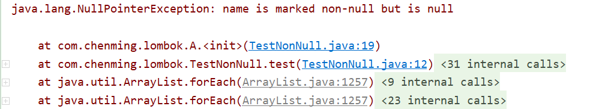
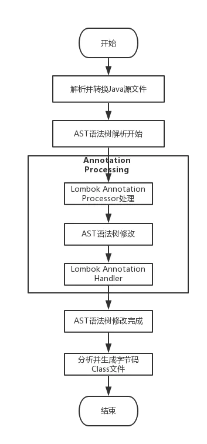

[参考]

> 1. https://www.cnblogs.com/heyonggang/p/8638374.html
> 2. https://blog.csdn.net/cauchy6317/article/details/102498569
> 3. https://www.jianshu.com/p/422f151fccd3

# 1. 背景介绍

> Lombok能以简单的注解形式来简化Java代码，提高开发人员的开发效率。

开发中经常需要写的JavaBean，都需要花时间去添加对应的Getter/Setter，也需要去写构造器、equals等方法，而且需要维护，当属性多时会出现大量的Getter/Setter方法，这些显得很冗长也没有太多技术含量，一旦修改属性，就容易出现忘记修改对应方法的失误。


Lombok能通过注解的方式，让我们不用再编写构造器、Setter/Getter、equals、hashcode、toString等方法，而是在编译的时候，自动为我们生成这些方法，这样就省去了手动重建这些代码的麻烦，使得代码看起来更简洁。


# 2. Maven引入

引入Lombok只需要通过Maven的形式引入Jar包即可：

```xml
<!-- https://mvnrepository.com/artifact/org.projectlombok/lombok -->
<dependency>
    <groupId>org.projectlombok</groupId>
    <artifactId>lombok</artifactId>
    <version>1.18.16</version>
    <scope>provided</scope>
</dependency>
```

但是要注意，在IDEA中使用Lombok的话，还需要安装一个Lombok的插件，否则的话就会因为找不到Setter/Getter、toString等方法而标红；

【安装插件】


# 3. 使用

## 3.1 @Data

> @Data注解在类上，会为类的所有属性自动生成setter/getter、equals、canEquals、hashcode、toString方法和无参构造器，如为final属性，则不会为该属性生成setter方法，只会生成getter方法，如果是static属性，则不会生成setter/getter方法。

```java
@Data
public class TestData {
    private Integer id;
    private String name;
    private int age;
    private final Double money = 1.0;
    private static Boolean flag = false;
    private static final String URL = "https://www.baidu.com";
}
```

编译该段源代码之后，查看编译后生成的.class文件，可以看到[id、name、age]都有setter/getter方法，而money只有getter方法。**flag和URL都没有生成setter/getter方法**。

【编译后的文件 TestData.class】

```java
public class TestData {
    private Integer id;
    private String name;
    private int age;
    private final Double money = 1.0D;
    private static Boolean flag = false;
    private static final String URL = "https://www.baidu.com";

    public TestData() {
    }

    public Integer getId() {
        return this.id;
    }

    public String getName() {
        return this.name;
    }

    public int getAge() {
        return this.age;
    }

    public Double getMoney() {
        return this.money;
    }

    public void setId(Integer id) {
        this.id = id;
    }

    public void setName(String name) {
        this.name = name;
    }

    public void setAge(int age) {
        this.age = age;
    }

    public boolean equals(Object o) {
        //...
    }

    protected boolean canEqual(Object other) {
        return other instanceof TestData;
    }

    public int hashCode() {
        //....
    }

    public String toString() {
        return "TestData(id=" + this.getId() + ", name=" + this.getName() + ", age=" + this.getAge() + ", money=" + this.getMoney() + ")";
    }
}
```


## 3.2 @Setter/@Getter

如果觉得@Data太过残暴（因为@Data集合了@ToString、@EqualsAndHashCode、@Getter/@Setter、@RequiredArgsConstructor的所有特性）不够精细，可以使用@Setter/@Getter注解。

@Setter/@Getter可以标注在类上和属性上

```java
@Setter
@Getter
public class TestSetterAndGetter {
    private Integer id;
    private String name;
    private int age;
    @Setter
    private final Double money = 1.0;
    private static Boolean flag = false;
    @Setter
    private static final String URL = "https://www.baidu.com";
}
```

编译该段源代码之后，查看编译后生成的.class文件，可以看到[id、name、age]都有setter/getter方法，而money只有getter方法。**flag和URL都没有生成setter/getter方法**。

**即使是在static变量前加了@Setter注解，生成的.class中也没有setter方法。**

[编译后的文件 TestSetterAndGetter.class]

```java
public class TestSetterAndGetter {
    private Integer id;
    private String name;
    private int age;
    private final Double money = 1.0D;
    private static Boolean flag = false;
    private static final String URL = "https://www.baidu.com";

    public TestSetterAndGetter() {
    }

    public void setId(Integer id) {
        this.id = id;
    }

    public void setName(String name) {
        this.name = name;
    }

    public void setAge(int age) {
        this.age = age;
    }

    public Integer getId() {
        return this.id;
    }

    public String getName() {
        return this.name;
    }

    public int getAge() {
        return this.age;
    }

    public Double getMoney() {
        return this.money;
    }
}
```


## 3.3 @NonNull

> 该注解用在属性或构造器上，Lombok会生成一个非空的声明，用于校验参数，能帮助避免空指针。

```java
public class TestNonNull {
    @Test
    public void test() {
        A a = new A(null);
    }
}

class A {
    private String name;

    public A(@NonNull String name) {
        this.name = name;
    }

    public void method(@NonNull String str) {
        System.out.println(str);
    }
}
```

查看编译之后的.class文件，可以发现Lombok为我们生成了null-check

[编译后的 TestNonNull.class]

```java
class A {
    private String name;

    public A(@NonNull String name) {
        if (name == null) {
            throw new NullPointerException("name is marked non-null but is null");
        } else {
            this.name = name;
        }
    }

    public void method(@NonNull String str) {
        if (str == null) {
            throw new NullPointerException("str is marked non-null but is null");
        } else {
            System.out.println(str);
        }
    }
}
```

如果运行测试方法之后，会报错：




## 3.4 @Cleanup

> 该注解能帮助我们自动调用close()方法，很大的简化了代码

在IO流的学习中，每次都要在finally里面关闭资源，如下面的代码：

```java
try {
	// to do something
}finally {
    if (in != null) {
        in.close();
    }
}
```

这样的代码如同模板一样，出现在程序的各个地方，很让人头疼，一般解决这个问题的方法有两种：

	- 使用Lombok的@Cleanup注解
	- 使用JDK1.7的try-with-resource语法糖【**推荐使用**】

### 3.4.1 Lombok的@Cleanup

```java
public class TestCleanup {
	@Test
    public void testCleanup() throws IOException {
        // 使用Lombok的@Cleanup
        @Cleanup
        InputStream inputStream = new FileInputStream("");
    }
    
    //...
}
```

[编译后的文件 TestCleanup.class]

```java
public class TestCleanup {
    public TestCleanup() {
    }

    @Test
    public void testCleanup() throws IOException {
        InputStream inputStream = new FileInputStream("");
        if (Collections.singletonList(inputStream).get(0) != null) {
            inputStream.close();
        }

    }
    
    //...
}
```

### 3.4.2 JDK的try-with-resource语法

```java
public class TestCleanup {
    //...

    @Test
    public void testTrywithResurce() throws IOException {
        //使用JDK自带的try-with-resource语法糖
        try (InputStream inputStream = new FileInputStream("");){

        }
    }
}
```

[编译后的文件 TestCleanup.class]

```java
public class TestCleanup {
    public TestCleanup() {
    }

    //...

    @Test
    public void testTrywithResurce() throws IOException {
        InputStream inputStream = new FileInputStream("");
        Object var2 = null;
        if (inputStream != null) {
            if (var2 != null) {
                try {
                    inputStream.close();
                } catch (Throwable var4) {
                    ((Throwable)var2).addSuppressed(var4);
                }
            } else {
                inputStream.close();
            }
        }

    }
}
```


## 3.5 @EqualsAndHashCode

> 默认情况下，会使用所有非静态(no-static)和非瞬时态(no-transient)属性来生成equals和hashcode，也能通过exclude注解来排除一些属性。

```java
@EqualsAndHashCode
public class TestEqualsAndHashCode {
    private Integer id;
    private String name;
    private int age;
    private final Double money = 1.0;
    private static Boolean flag = false;
    private static final String URL = "https://www.baidu.com";
}
```

[编译后的文件 TestEqualsAndHashCode.class]

```java
public class TestEqualsAndHashCode {
    private Integer id;
    private String name;
    private int age;
    private final Double money = 1.0D;
    private static Boolean flag = false;
    private static final String URL = "https://www.baidu.com";

    public TestEqualsAndHashCode() {
    }

    public boolean equals(Object o) {
        if (o == this) {
            return true;
        } else if (!(o instanceof TestEqualsAndHashCode)) {
            return false;
        } else {
            TestEqualsAndHashCode other = (TestEqualsAndHashCode)o;
            if (!other.canEqual(this)) {
                return false;
            } else if (this.age != other.age) {
                return false;
            } else {
                label49: {
                    Object this$id = this.id;
                    Object other$id = other.id;
                    if (this$id == null) {
                        if (other$id == null) {
                            break label49;
                        }
                    } else if (this$id.equals(other$id)) {
                        break label49;
                    }

                    return false;
                }

                Object this$money = this.money;
                Object other$money = other.money;
                if (this$money == null) {
                    if (other$money != null) {
                        return false;
                    }
                } else if (!this$money.equals(other$money)) {
                    return false;
                }

                Object this$name = this.name;
                Object other$name = other.name;
                if (this$name == null) {
                    if (other$name != null) {
                        return false;
                    }
                } else if (!this$name.equals(other$name)) {
                    return false;
                }

                return true;
            }
        }
    }

    protected boolean canEqual(Object other) {
        return other instanceof TestEqualsAndHashCode;
    }

    public int hashCode() {
        int PRIME = true;
        int result = 1;
        int result = result * 59 + this.age;
        Object $id = this.id;
        result = result * 59 + ($id == null ? 43 : $id.hashCode());
        Object $money = this.money;
        result = result * 59 + ($money == null ? 43 : $money.hashCode());
        Object $name = this.name;
        result = result * 59 + ($name == null ? 43 : $name.hashCode());
        return result;
    }
}
```


## 3.6 @ToString

> 使用@ToString注解类，Lombok会生成一个toString()方法，默认情况下，会输出类名、所有非static属性（会按照属性定义顺序），用逗号来分割。

```java
@ToString
public class TestToString {
    private Integer id;
    private String name;
    private int age;
    private final Double money = 1.0;
    private static Boolean flag = false;
    private static final String URL = "https://www.baidu.com";
}
```

【反编译后的文件 TestToString.class】

```java
public class TestToString {
    private Integer id;
    private String name;
    private int age;
    private final Double money = 1.0D;
    private static Boolean flag = false;
    private static final String URL = "https://www.baidu.com";

    public TestToString() {
    }

    public String toString() {
        return "TestToString(id=" + this.id + ", name=" + this.name + ", age=" + this.age + ", money=" + this.money + ")";
    }
}
```

@ToString注解有一些属性

	- inculdeFieldNames：布尔值，是否打印字段名称。默认值为true，即打印字段名和字段值，如果为flase，则只打印字段值。
	- callSuper：布尔值，是否调用父类的toString()方法，即可以将超类实现toString的输入包含到输出中。
	- @ToString.Exclude：默认情况下，将打印所有非静态字段，如果要跳过某些字段，可以使用@ToString.Exclude来注释这些字段。
	- onlyExplicitlyIncluded：布尔值，如果设置为true，那么只有在字段上显式的标注了@ToString.Inculude的字段，才会再toString()方法里输出。


## 3.7 @XXXArgsConstructor

### 3.7.1 @NoArgsConstructor

> @NoArgsConstructor将生成没有参数的构造器。

如果一个类仅仅只需要一个无参的构造器，那么完全没有必要使用@NoArgsConstructor注解，因为Java会在编译时，为没有构造参数的类自动生成一个无参的构造器。

所以，@NoArgsConstructor注解需要在已经存在构造函数时使用，才显得有意义。

### 3.7.2 @RequiredArgsConstructor

> @RequiredArgsConstructor为所有未初始化的final字段，以及标有@NonNull注解的字段。对于标有@NonNull注解的字段，还将生成一个显示的null检查

```
@RequiredArgsConstructor
public class TestRequiredArgsConstructor {
    private Integer id;
    @NonNull
    private String name;
    private final Double money;
    private static Boolean flag;
    private static final String URL = "https://www.baidu.com";
}
```

[编译后的文件 TestRequiredArgsConstructor.class]

```java
public class TestRequiredArgsConstructor {
    private Integer id;
    @NonNull
    private String name;
    private final Double money;
    private static Boolean flag;
    private static final String URL = "https://www.baidu.com";

    public TestRequiredArgsConstructor(@NonNull String name, Double money) {
        if (name == null) {
            throw new NullPointerException("name is marked non-null but is null");
        } else {
            this.name = name;
            this.money = money;
        }
    }
}
```

可以看到`未初始化`的final实例变量和`未初始化的的@NonNull标记`的成员变量，会生成一个带参构造函数。

[注1]static变量并不会生成构造函数

[注2]若是将name和money都进行显式的初始化，则不会生成带参构造器

### 3.7.3 @AllArgsConstructor

> @AllArgsConstructor为类中的实例变量生成一个构造函数

```java
@AllArgsConstructor()
public class TestAllArgsConstructor {
    private Integer id;
    private String name = "cm";
    private int age;
    private final Double money = 1.0;
    private static Boolean flag = false;
    private static final String URL = "https://www.baidu.com";
}
```

[编译后的文件 TestAllArgsConstructor.class]

```java
public class TestAllArgsConstructor {
    private Integer id;
    private String name = "cm";
    private int age;
    private final Double money = 1.0D;
    private static Boolean flag = false;
    private static final String URL = "https://www.baidu.com";

    public TestAllArgsConstructor(Integer id, String name, int age) {
        this.id = id;
        this.name = name;
        this.age = age;
    }
}
```


## 3.8 @Accessors

> @Accessors注解用来配置Lombok如何产生和显式Setter/Getter方法

@Accessors注解既可以在类上，也可以在属性上。

@Accessors有三个属性，分别是fluent、chain、prefix。

### 3.8.1 fluent

> fluent为一个布尔值，如果为true，生成的Getter/Setter方法则没有set/get前缀，默认为false。

```java
@Setter
@Getter
@Accessors(fluent = true)
public class TestAccessors {
    private Integer id;
    private String name;
    private int age;
    private final Double money = 1.0;
    private static Boolean flag = false;
    private static final String URL = "https://www.baidu.com";
}
```

【编译后生成的文件 TestAccessors.class】

```java
public class TestAccessors {
    private Integer id;
    private String name;
    private int age;
    private final Double money = 1.0D;
    private static Boolean flag = false;
    private static final String URL = "https://www.baidu.com";

    public TestAccessors() {
    }

    public TestAccessors id(Integer id) {
        this.id = id;
        return this;
    }

    public TestAccessors name(String name) {
        this.name = name;
        return this;
    }

    public TestAccessors age(int age) {
        this.age = age;
        return this;
    }

    public Integer id() {
        return this.id;
    }

    public String name() {
        return this.name;
    }

    public int age() {
        return this.age;
    }

    public Double money() {
        return this.money;
    }
}
```

### 3.8.2 chain

> chain的中文含义是链式的，如果为true生成的set方法返回this，为false生成的set方法是void类型。默认为false。

### 3.8.3 prefix

> prefix的中文含义是前缀，用于生成Getter/Setter方法的字段名会去掉前缀

```java
@Data
@Accessors(prefix = "p")
class User {
	private Long pId;
	private String pName;
	
	// 生成的getter和setter方法如下，方法体略
	public Long getId() {}
	public void setId(Long id) {}
	public String getName() {}
	public void setName(String name) {}
}
```


# 4 Lombok原理

lombok自动生成代码的核心之处就在于注解的解析上。

JDK5引入了注解的同时，也提供了两种解析方式：运行时解析和编译时解析。

## 4.1 运行时解析：

运行时能够解析的注解，必须将@Retention设置为RUNTIME，这样就可以通过反射拿到该注解。java.lang.reflect反射包中提供了一个接口AnnotatedElement，该接口定义了获取注解信息的几个方法，Class、Constructor、Field、Method、Package等都实现了该接口，对反射熟悉的应该都会很熟悉这种解析方式。

## 4.2 编译时解析：

编译时解析，有两种机制，分别简单描述下：

### 4.2.1 Annotation Processing Tool：

apt自JDK5产生，JDK7已标记为过期，不推荐使用，JDK8中已彻底删除，自JDK6开始，可以使用Pluggable Annotation Processing API来替代它，apt被替换主要有两点原因：

- api都在com.sun.mirror非标准包下
- 没有集成到javac中，需要额外运行

### 4.2.2 Pluggable Annotation Processing API：

> Pluggable Annotation Processing API，可插件化的注解处理API，是在JSR269标准中定义的。

JSR269自JDK6加入，作为apt的代替，它解决了apt的两个问题，javac在执行的时候会调用实现了该API的程序，这样我们就可以对编译器做一些增强，这时javac执行的过程如下：


从上面这个原理图可以看出Annotation Processing是编译器在解析Java源代码和生成class字节码文件之间的一个步骤。

Lombok本质就是一个实现了“JSR 269 API”的程序。在使用javac的过程中，它的执行流程如下：



1）javac对源码进行分析，生成了一颗抽象语法树（AST）。

2）运行过程中调用实现了“JSR 269 API”的Lombok程序。

3）Lombok根据自己编写的注解处理器，动态修改AST，增加新的节点（即Lombok自定义注解所需要生成的代码）。

4）javac使用修改后的抽象语法树（AST）生成字节码文件。


