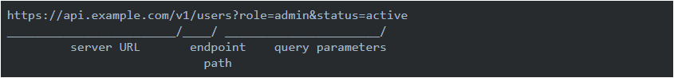
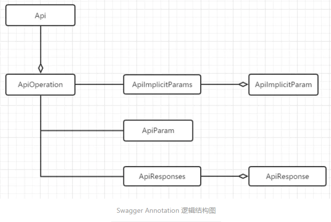

[参考]

> 1. https://developer.ibm.com/zh/articles/j-using-swagger-in-a-spring-boot-project/#
> 2. https://www.jianshu.com/p/b0b19368e4a8
> 3. https://www.javazhiyin.com/57982.html

# 0. 前言

现在越来越多的公司采用前后端分离的开发模式，让前端和后端的工作由完全不同的工程师进行开发完成。此时，维持一份完整的及时更新的`Rest API`文档，会极大的提高我们的工作效率。而传统的文档更新方式（如手动编写），很难保证文档的及时性，经常会年久失修，失去应有的意义。

因此，选择一种新的API文档维护方式很有必须，这也是这篇文章要介绍的内容

# 1. OpenAPI规范介绍

`OpenAPI Specification`简称OAS，中文也称`OpenAPI`描述规范，使用OpenAPI文件可以描述整个API，它制定了一套的适合通用的与语言无关的`REST API`描述规范，如API路径规范、请求方法规范、请求参数规范、返回格式规范等各种相关信息，使人类和计算机都可以不需要访问源代码就可以理解和使用服务的功能。

下面是OpenAPI规范中建议的API设计规范，基本路径设计规范：



对于传参的设计也有规范，可以像下面这样：

```shell
路径参数，例如：/users/{id}

查询参数，例如：/users?id=xxx

header参数，例如：x-MyHeader:value

cookie参数，例如：Cookie：debug=0;csrftoken=xxxx
```

`OpenAPI`规范的东西远远不止这些，目前OpenAPI规范最新版本是3.0.2，如果想了解更多的OpenAPI规范，可以访问下面的连接：

[OpenAPI Specification](https://github.com/OAI/OpenAPI-Specification/blob/master/versions/3.0.2.md)

# 2. Swagger介绍

## 2.1 Swagger基本介绍

### 2.1.1 Swagger特性：

Swagger是一组基于OpenAPI规范构建的开源工具，可以帮助从API的设计到API文档的输出再到API的测试，直至最后的API部署等整个API的开发周期提供相应的解决方案，是一个庞大的项目。

Swagger有几个重要的特性：

- 代码侵入式注解
- 遵循YAML文档格式
- 非常适合三端（PC、IOS和Android）的API管理，尤其适合前后端完全分离的架构模式。
- 减少没有必要的文档，符合敏捷开发理念
- 功能强大

### 2.1.2 Swagger组件：

Swagger拥有众多不同语言和平台的开源实现与工具，主要有：

- Swagger UI：基于Swagger-compliant API的一套可以展示优美文档的Web应用。
- Swagger Editor：一款以YAML格式编辑与管理API的工具，同时支持JSON格式的文档描述。
- Swagger-Core：Swagger的Java/Scala实现，并已集成在JAX-RS，Servlets与Play Framework。
- Swagger-JS：Swagger的JavaScript版本实现。
- Swagger Codegen：它可以通过为Open API（以前称为Swagger）规范定义的任何API生成服务器存根和客户端SDK来简化构建过程。

如果要想要了解更多的组件，可以参考[此处](https://swagger.io/tools/open-source/open-source-integrations/)

尤其要注意的是Swagger UI，它是Swagger的Web页面展现形式，能够对符合Swagger规范的文件进行解析与显示。通过友好的页面，可以对API进行分组管理、文档显示以及实现Mock测试。所以在大多数情况下，都是用Swagger UI实现对API的管理与展现。

## 2.2 Swagger的优点

- 代码变，文档变。只需要少量的注解，Swagger就可以根据代码自动生成API文档，很好的保证了文档的时效性。
- 跨语言性，支持40多种语言。
- Swagger UI呈现出来的是一份可交互式的API文档，我们可以直接在文档页面尝试API的调用，省去了准备复杂的调用参数的过程。
- 还可以将文档规范导入相关的工具（例如SoapUI），这些工具将会为我们自动的创建自动化测试。

# 3. Springfox介绍

源于Java中Spring框架的流行，让一个叫Marrty Pitt的老外有了为SpringMVC添加接口描述的想法，因此他创建了一个遵守OpenAPI规范（OAS）的项目，取名为`swagger-springmvc`，这个项目可以让Spring项目自动生成JSON格式的OpenAPI文档。

后台这个项目发展成为`Springfox`，再后来拓展出`springfox-swagger2`，为了让JSON格式的API文档更好的呈现，又出现了springfox-swagger-ui用来展示和测试生成的OpenAPI。这里的springfox-swagger-ui其实就是上面介绍的Swagger-ui，只是它被通过webjar的方式打包到jar包内，并通过Maven的方式引入进来

Springfox同时实现了Swagger UI和Swagger Core。

# 4. Swagger常用注解

> Swagger的annotation主要分为两类，一类是对Model的注解；一类是对API的注解。

[参考]

> https://github.com/swagger-api/swagger-core/wiki/Annotations-1.5.Xz

## 4.1 API注解

对于API的设计，一般倾向于将功能相同的API归集为一组。在SpringMVC中，利用Controller来实现，每个Controller里包含若干个REST API，而每个API都有输入和输出值。

所以Swagger对API的注解也是参照这个层级来划分与实现的，其逻辑结构如下图：



- @Api：

  该注解讲一个Controller标注为一个Swagger资源（API）。在默认情况下，Swagger-Core只会扫描解析具有@Api注解的类，而会自动忽略其它他类别资源（JAX-RS endpoints，Servlets等等）。

  该注解包含以下几个重要属性：

  - tags：API分组标签。具有相同标签的API将会被归并到一组内展示。
  - value：如果tags没有定义，value将作为Api的tags使用。
  - description：API的详细描述，在1.5.X版本之后不再使用，**但实际发现在2.0.0版本中任然可以使用。**

- @ApiOperation：

  在指定的（路由）路径上，对一个操作或HTTP方法进行描述。具有相同路径的不同操作会被归组为同一个操作对象。不同的HTTP请求方法及路径组合构成一个唯一操作。

  该注解的属性有：

  - value：对操作的简单说明，长度为120个字母，60个汉字
  - notes：对操作的详细说明
  - httpMethod：HTTP请求的动作名，可选值有："GET","POST","PUT","DELETE","HEAD","OPTIONS","PATCH"
  - code：默认为200，有效值必须符合标准的HTTP Status Code Definitions。

- @ApiImplicitParams：

  注解ApiImplicitParam的容器类，以数组方式存储。

- @ApiImplicitParam：

  对API的单一参数进行注解。虽然注解@ApiParam同JAX-RS参数相绑定，但这个@ApiImplicitParam注解可以以统一的方式定义参数列表，也是在Servlets及非JAX-RS环境下，唯一的方式参数定义方式。注意这个注解@APIImplicitParam必须被包含在注解@APIImplicitParams之内，可以设置以下重要参数属性

  - name：参数名称
  - value：参数的简短描述
  - required：是否为必传参数
  - dataType：参数类型，可以为类名，也可以为基本类型
  - paramType：参数的传入类型，可选的值有path,query,body,header,form

- @ApiParam：

  增加对参数的元信息说明，这个注解只能被使用在JAX-RS 1.x/2.x的综合环境下。其主要的属性有：

  - required：是否为必传参数
  - value：参数简短说明

- @ApiResponses：

  注解@ApiResponse的包装类，数组结构。即使只是用一个@ApiResponse注解，也需要将@ApiResponse注解包含在注解@ApiResponses内。

- @ApiResponse：

  描述一个操作可能的返回结果。当REST API请求发生时，这个注解可用于描述所有可能的成功与错误码。可以用，也可以不用这个注解去描述操作的返回类型，但成功操作的返回类型必须在@ApiOperation中定义。如果API具有不同的返回类型，那么需要分别定义返回值，并将返回类型进行关联。但Swagger不支持同一返回码，多种返回类型的注解。注意：这个注解必须被包含在@ApiResponse注解中。

  - code：HTTP请求返回码，有效值必须符合标准的HTTP Status Code Definitions。
  - message：更加容易理解的文本消息。
  - response：返回类型信息，必须使用完全限定类名。
  - responseContainer：如果返回类型为容器类型，可以设置相应的值。有效值为"List","Set","Map"，其它任何无效值都会被忽略。


## 4.2 Model注解

- @ApiModel：

  提供对Swagger model额外信息的描述。在标注@ApiOperation注解的操作内，所有的类将自动被内省，但利用这个注解可以做一些更加详细的model结构说明。

  主要属性有：

  - value：model的别名，默认为类名
  - description：model的详细描述

- @ApiModelProperty：

  对model属性的注解，主要的属性值有：

  - value：属性简短描述
  - example：属性的实例值
  - required：是否为必须

# 5. Swagger+SpringBoot环境搭建

## 5.1 添加依赖：

### 5.1.1 Spring Web模块依赖：

因为我们需要在浏览器上进行API操作交互，所以我们这里引入Spring Web模块SpringMVC

```xml
<dependency>
    <groupId>org.springframework.boot</groupId>
    <artifactId>spring-boot-starter-web</artifactId>
</dependency>
```

### 5.1.2 Swagger依赖：

```xml
<dependency>
    <groupId>io.springfox</groupId>
    <artifactId>springfox-swagger2</artifactId>
    <version>2.9.2</version>
</dependency>
```

### 5.1.3 Swagger-ui依赖：

swagger-ui是为了让生成的API有更好的展示效果，没有swagger-ui也是可以的

```xml
<dependency>
    <groupId>io.springfox</groupId>
    <artifactId>springfox-swagger-ui</artifactId>
    <version>2.9.2</version>
</dependency>
```


## 5.2 编写接口

这里我们只是单纯的使用Swagger，所以这里我只写Controller，service/dao等都不写了。

并且代码就不粘贴了，可以到项目`22-Swagger-StudyDemo-01`查看


## 5.3 文档信息配置

Swagger还支持设置一些文档的版本号、联系人邮箱、网站、版权、开源协议等等信息，但与上面几条不同的是这些信息不是通过注解配置，而是通过创建一个ApiInfo对象，并且使用Docket.apiInfo()方法来设置，我们在SwaggerConfig类中新增如下内容即可。

```java
@Configuration
@EnableSwagger2
public class SwaggerConfig {
    @Bean
    public Docket api() {
        return new Docket(DocumentationType.SWAGGER_2)
                .select()
                .apis(RequestHandlerSelectors.any())
                .paths(PathSelectors.any())
                .build()
                .apiInfo(apiInfo());
    }

    /**
     * api附件的文档信息
     * @return
     */
    public ApiInfo apiInfo() {
        return new ApiInfo(
                "Swagger学习",
                "SpringBoot集成Swagger",
                "API v1.0",
                "Terms of service",
                new Contact("陈明","","2040820766@qq.com"),
                "Apache",
                "https://www.apache.org",
                Collections.emptyList()
                );
    }
}
```


