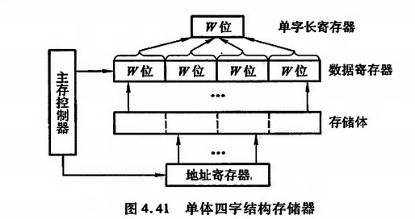
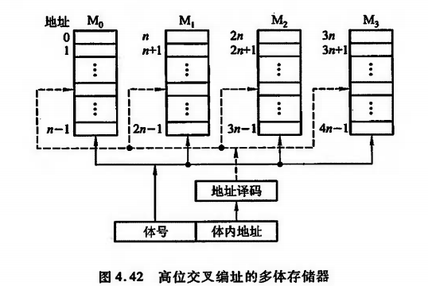
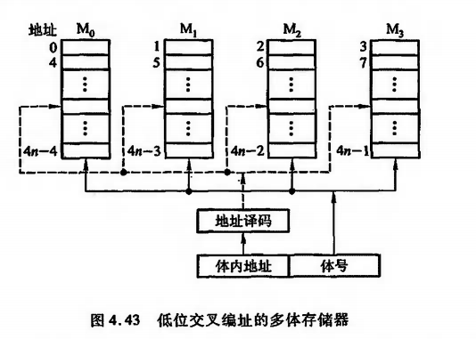
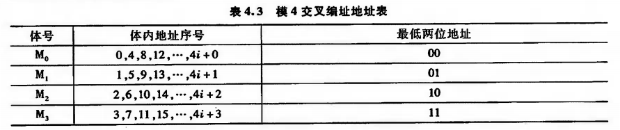
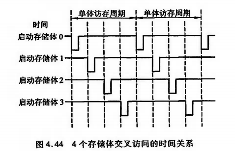
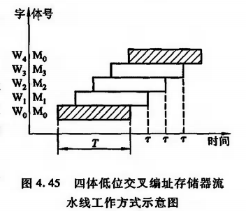

### 4.2.7 提高访存速度的措施：

随着计算机应用领域的不断扩大，处理的信息量越来越大，对于存储器的工作速度和容量要求也越来越高。此外，因CPU的功能不断增强，I/O设备的数量不断增多，致使主存的存取速度也成为计算机系统的瓶颈。可见，提高访存速度也成为迫不及待的任务。为了解决此问题，除了寻找高速元件和采用层次结构以外，调整主存的结构也可提高访存速度。

#### 4.2.7.1 单体多字系统：

由于程序和数据在存储体内是连续存放的，因此CPU访存取出的信息也是连续的，如果可以在一个存取周期内，从同一地址取出4条指令，然后再逐条将指令送至CPU执行，即每隔1/4存取周期，主存向CPU送一条指明，这样显然增大了存储器的带宽，提高了单体存储器的工作速度，如图4.41所示：



图中示意了一个单体四字结构的存储器，每字W位。按地址在一个存取周期内可读出4 x W位的指令或数据，使主存带宽提高到4倍。显然，采用这种办法的前提是：指令和数据在主存内必须是连续存放的，一旦遇到转移指令，或者操作数不能连续存放，这种方法的效果就不明显。

#### 4.2.7.2 多体并行系统：

>多体并行系统就是采用多体模块组成的存储器。

每个模块有相同的容量和存取速度，各模块各自都有独立的地址寄存器（MAR）、数据寄存器（MDR）、地址译码、驱动电路和读/写电路，它们能并行工作，又能交叉工作。

并行工作即同时访问N个模块，同时启动，同时读出，完全并行的工作（不过同时读出的字在总线上需分时传送）。图4.42是适合于并发工作的高位交叉编制的多体存储器结构示意图，图中程序因按体内地址顺序存放（一个体存满后，再存入下一个体），故又有顺序存储之城。



显然，高位地址可表示体号，地位地址为体内地址。按这种编址方式，只要合理调动，使不同的请求源可同时访问不同的体，便可实现并行工作。

例如，当一个体正与CPU交换信息，另一个体可同时与外部设备进行直接存储器访问，实现两个体并行工作。这种编址方式由于一个体内的地址是连续的，有利于存储器的扩充。

图4.43是按低位交叉编址的多模块结构示意图：



由于程序连续存放在相邻体中，故又有交叉存储之称。显然低位地址用来表示体号，高位地址为体内地址。这种编址方法又称为模M编址（M等于模块数），表4.3列出了交叉编址的地址号。



一般模块数M取2的方幂，使硬件电路比较简单。有的机器为了减少存储器冲突，采用质数个模块，例如，我国银河机的M为31，其硬件实现比较复杂。

多体模块结构的存储器采用交叉编址后，可以在不改变每个模块存取周期的前提下，提高存储器的带宽。图4.44示意了CPU交叉访问4个存储体的时间关系，负脉冲为启动每个体的工作信号。



虽然对每个体而言，存储周期均未缩短，但由于CPU交叉访问各体，使4个存储体的读/写过程重叠执行，最终在一个存取周期的时间内，存储器实际上向CPU提供了4个存储字。如果每个模块存储字长为32位，则在一个存储周期内（除第一个存储周期外），存储器向CPU提供了32 x 4 = 128位二进制代码，大大增加了存储器的带宽。

假设每个体的存储字长和数据总线的宽度一致，并假设低位交叉的存储器模块数为n，存取周期为T，总线传输周期为t，那么当采用流水线方式（如图4.44所示）存取时，应满足T=nt。为了保证启动某体后，经nt时间再次启动该体时，它的上次存取操作已经完成，要求低位交叉存储器的模块大于等于n。以4体低位交叉编址的存储器为例，采用流水方式存取的示意图如图4.45所示：



可见，对于低位交叉的存储器，连续读取n个字所需的时间t1为：

```javascript
t1 = T + (n -1)t
```


