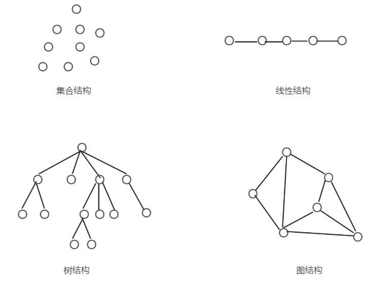

# 1 基本介绍

## 1.1 基本概念和术语

### 1.1.1 数据

> **数据**（Data）是客观事物的符号表示，是所有能输入到计算机中并被计算机程序处理的符号的总称。

如数学计算中用到的整数和实数，文本编辑中用到的字符串，多媒体程序处理的图形、图像、声音及动画等通过特殊编码定义后的数据。


### 1.1.2 数据元素

> **数据元素**（Data Element）是数据的基本单位，在计算机中通常作为一个整体进行考虑和处理。在有些情况下，数据元素也称为元素、记录等。

数据元素用于完整的描述一个对象，如一条学生记录，图中的一个顶点等。


### 1.1.3 数据项

> **数据项**（Data Item）是`组成数据元素的`、`有独立含义的`、`不可分割的`最小单位。

如学生基本信息表中的学号、姓名、性别等都是数据项。


### 1.1.4 数据对象

> **数据对象**（Data Object）是性质相同的数据元素的集合，是数据的一个子集。

例如：

+ 整数数据对象是集合 N = {0, ±1，±2，···}
+ 字母字符数据对象是集合 C = {'A','B',···,'Z','a','b',···,'z'}
+ 学生信息表也可以是一个数据对象
+ ......

由此可以看出，不论数据元素集合是无限集（如整数集），或是有限集（如字母字符集），还是由多个数据项组成的复合数据元素（如学生表，一条学生记录就是一个数据元素）的集合，只要集合内的性质均相同，那可称之为一个数据对象。


## 1.2 数据结构

> 数据结构（Data Structure）是相互之间存在一种或多种特定关系的数据元素的集合。

**数据结构是带“结构”的数据元素的集合，“结构”就是指数据元素之间存在的关系。**

数据结构包括逻辑结构和存储结构两个层次。

### 1.2.1 逻辑结构

> 数据的**逻辑结构**是从逻辑关系上描述数据，它与数据的存储无关，是独立于计算机的。

因此，*数据的逻辑结构可以看做是从具体问题抽象出的数学模型*。

数据的逻辑结构有两个要素：`一是数据元素`；`二是关系`。[关系是指数据元素之间的逻辑关系]

根据数据元素之间关系的不同特性，通常有**四类基本结构**：



下面四种结构中所举的示例是以某班级学生作为数据对象，来分别考察数据元素之间的关系。

#### 1.2.1.1 集合结构

> 数据元素之间除了“属于同一集合”的关系外，别无其他关系。

例如：确定一名学生是否为班级成员，只需将班级看成一个集合结构。

#### 1.2.1.2 线性结构

> 数据元素之间存在一对一的关系。

例如：将学生信息数据按照其入学报到的时间先后顺序进行排序，将组成一个线性结构。

#### 1.2.1.3 树结构

> 数据元素之间存在一对多的关系

例如：在班级的管理体系中，班长管理多个组长，每位组长管理多名组员，从而形成树形结构。

#### 1.2.1.4 图结构或网状结构

> 数据元素之间存在多对多的关系。

例如：多位同学之间的朋友关系，任何两位同学都可以是朋友，从而构成图状结构或网状结构。

其中`集合结构`、`树结构`、`图结构`都属于非线性结构

线性结构包括：

- 线性表（典型线性表）
- 栈和队列（具有特殊限制的线性表）
- 字符串（也是特殊的线性表，其特殊形表现在它的数据元素仅由一个字符组成）
- 数组（是线性表的推广，它的数据元素是一个线性表）
- 广义表（也是线性表的推广，它的数据元素是一个线性表，但不同构，即或者是单元素，或者是线性表）

非线性结构包括：

- 树（具有多个分支的层次结构）
- 二叉树（具有两个分支的层次结构）
- 有向图（一种图结构，边是顶点的有序对）
- 无向图（一个图结构，边是顶点的无序对）

这几种逻辑结构可以用一个层次图描述，如下图：


### 1.2.2 存储结构

> 数据对象（数据集合）在计算机中的存储表示称为数据的存储结构，也称为物理结构

数据元素在计算机中有两种基本的存储结构，分别是**顺序存储结构**和**链式存储结构**。

#### 1.2.2.1 顺序存储结构

> 顺序存储结构是借助元素在存储器中的相对位置来表示数据元素之间的逻辑关系，通常借助程序设计语言的数组类型来描述。

#### 1.2.2.2 链式存储结构

顺序存储结构要求所有的元素依次存放在一片连续的存储空间中，而链式存储结构，无序占用一整块内存空间。但为了表示节点之间的关系，需要给每个节点附件指针字段，用于存放猴急元素的存储地址。


## 1.3 数据类型和抽象数据类型

### 1.3.1 数据类型

> **数据类型**是一个值的集合和定义在这个值集上的一组操作的总称。

在程序设计语言中，每一个数据都属于某种数据类型，类型或明显或隐含的规定了数据的取值范围、存储方式以及允许进行的运算。

例如：C语言中的整型变量，其值集为某个区间上的整数（区间大小依赖于不同的机器），定义在其上的操作为加、减、乘、除和取模等算术运算；而实型变量也有自己的取值范围和相应运算，比如取模运算是不能用于实型变量的。

程序设计语言允许用户**直接使用**的数据类型由具体语言决定，数据类型反映了程序设计语言的数据描述和处理能力。C语言除了提供整型、实型、字符型等基本类型数据外，还允许用户自定义各种类型数据，例如数组、结构体和指针等。

### 1.3.2 抽象数据类型

抽象就是抽出实际问题的本质。在计算机中使用二进制来表示数据，在汇编语言中则可以给出各种数据的十进制表示，她们是二进制数据的抽象，使用者在编程时可以直接使用，不必考虑实现细节。在高级语言中，则给出更高一级的数据抽象，出现了数据类型，如整型、实型、字符型等，可以进一步利用这些类型构造出线性表、栈、队列、树、图等复杂的抽象数据类型。

> 抽象数据类型（Abstract Data Type,ADT）一般指由用户定义的、表示应用问题的数学模型，以及定义在这个模型上的一组操作的总称，具体包括三部分：数据对象、数据对象上关系的集合、以及对数据对象的基本操作的集合。

根据题的一点说就是：

> 我们都知道Java在默认情况下，所有的基本数据类型（int,float,boolean等）都支持基本运算，如加减法，这是因为系统已经帮我们实现了这些基本数据类型的基本运算。而对于自定义的数据类型（如类）也需要定义相应的运算，但在实际使用这些自定义的数据类型的运算时需要自己实现相关的运算，也就是说用户自定义的数据类型的运算需要我们自己利用系统提供的基本运算来定义和实现。这些自定义了数据结构和包含相关运算组合实现的数据类型就称其为抽象数据类型，因此一个ADT会包含数据声明和运算声明。
>
> 常用的ADT包括链表、栈、队列、优先队列、二叉树、散列表、图等。

的定义格式如下：

```c++
ADT 抽象数据类型名 {
    数据对象:<数据对象的定义>
    数据关系:<数据关系的定义>
    基本操作:<基本操作的定义>
} ADT 抽象数据类型名
```


## 1.4 抽象数据类型的表示与实现

运用抽象数据类型描述数据结构，有助于在设计一个软件系统时，不必先考虑其中包含的数据对象，以及操作在不同处理器中的表示和实现细节，而是在构成软件系统的每个相对独立的模块上定义一组数据和相应的操作。


# 2. 算法和算法分析

> 数据结构与算法之间存在着本质联系，在某一类型数据结构上，总要涉及其上施加的运算，而只有通过对所定义运算的研究，才能清楚理解数据结构的定义和作用；在涉及运算时，总要联系到该算法处理的对象和结果的数据。

## 2.1 算法的定义及特性

> 算法是为了解决某类问题而规定的一个有限长的操作序列

一个算法必须满足以下五个重要特性：

1. **有穷性**：一个算法必须总是在执行有穷步后结束，且每一步都必须在有穷时间内完成。
2. **确定性**：对于每种情况下所应执行的操作，在算法中都有确切的规定的，不会产生二义性，使算法的执行者或阅读者都能明确其含义及如何执行。
3. **可行性**：算法中的所有操作都可以通过已经实现的基本操作运算执行有限次来实现。
4. **输入**：一个算法有零个或多个输入。当用函数描述算法时，输入往往是通过形参表示的，在它们被调用时，从主调函数获得输入值。
5. **输出**：一个算法有一个或多个输出，它们是算法进行信息加工后得到的结果，无输出的算法没有任何意义。当用函数描述算法时，输出多用返回值或引用类型的形参表示。[即要么有返回值；要么传入一个引用，对引用的数据进行操作，也是能够得到加工后的数据。]


## 2.2 评价算法优劣的基本标准

一个算法的优劣应该从以下几个方面来评价：

1. **准确性**：在合理的数据输入下，能够在有限的运行时间内得到正确的结果。
2. **可读性**：一个好的算法，首先应该便于人们理解和相互交流，其才是机器可执行性。
3. **健壮性**：当输入的数据非法时，好的算法能适当的做出正确反应或进行相应处理，而不会产生一些莫名其妙的输出结果。
4. **高效性**：高效性包括时间和空间两个方面。时间高效是指算法设计合理，执行效率高，可以用时间复杂度来衡量；空间高效性是指算法占用存储容量合理，可以用空间复杂度来衡量。时间复杂度和空间复杂度是衡量算法的两个主要指标。


## 2.3 算法的时间复杂度

衡量算法效率的方法主要有两类：事后统计法和事前分析估算法。

事后统计法需要先将算法实现，然后测算其时间和空间开销。这种方法的缺陷很显然，一是必须把算法转换成可执行的程序，二是时空开销的测算结果依赖于计算机的软硬件等环境因素，这很容易掩盖算法本身的优劣。

所以我们通常采用事前分析估算法，通过计算算法的渐进复杂度来衡量算法的效率。

### 2.3.1 问题规模

不考虑计算机的软硬件等环境因素，影响算法时间代价的最主要因素是问题规模。

**问题规模**是算法求解问题输入量的多少，是问题大小的本质表示，一般用整数n表示。

### 2.3.2 语句频度

一个算法的执行时间大致上等于其所有语句执行时间的总和，而语句的执行时间则为该条语句的重复执行次数和执行一次所需时间的乘积。

一条语句的重复执行系数称作**语句频度**。

### 2.3.3 算法的时间复杂度定义

为了客观的反映一个算法的执行时间，可以只用算法中的“**基本语句**”的执行次数来度量算法的工作量。

> 所谓“**基本语句**”指的是算法中重复执行次数和算法的执行时间成正比的语句，它对算法运行时间的贡献最大。

通常，算法的执行时间是随问题规模增长而增长的，因此对算法的评价通常只需考虑其随问题规模增长的趋势。这种情况下，我们只需要考虑当问题规模充分大时，算法中基本语句的执行次数在渐进意义下的阶。

一般情况下，算法中基本语句重复执行的次数是问题规模n的某个函数f(n)，算法的时间量度记做：

​														T(n) = O(f(n))

它表示随问题规模n的增大，算法执行时间的增长率和f(n)的增长率相同，称做算法的渐进时间复杂度，简称**时间复杂度**。

数学符号“O”的严格定义为：

> 若T(n)和f(n)是定义在正整数集合上的两个函数，则T(n) = O(f(n))表示存在正的常熟C和n<sub>0</sub>，使得当n>=n<sub>0</sub>时都满足0<=T(n)<=Cf(n)

### 2.3.4 最好、最坏和平均时间复杂度

对于某些算法，其基本有的频度不仅仅与问题的规模相关，还依赖与其他因素。

在此，仅举一例说明之：

```java
(1)for(int i = 0; i < n; i++)
(2)    if (a[i] == e) return i + 1;
(3)return 0
```

容易看出，此算法中语句（2）的频度不仅与问题规模n有关，还与输入实例中数组a[i]的个元素值及e的取值有关。

假设在数组a[i]中必须存在值等于e的元素，则查找必定成功，且for循环内的语句的频度将随被找到的元素在数组中出现的位置不同而不同，最好情况是，每次要找的值与e相同的元素敲好就是数组中的第一个元素，则不论数组的规模多大，语句（2）的频度f(n)=1；最坏情况是，每次待查找的都是数组中最后一个元素，则语句（2）的频度f(n)=n。

而对于一个算法来说，需要考虑各种可能出现的情况，以及每一种情况出现的概率，一般情况下，可假设待查找的元素在数组中所有位置上出现的可能性均相同，则可取语句（2）的频度在最好情况与最坏情况下的平均值，即f(n)=n+1/2，作为它的量度。

```shell
假设有一个长度为n的数组，要查找的值e出现在数组中每一个位置的概率都相等，即在数组中每一个位置查找到e元素的概率都是1/n；

那么：
如果e在第1个位置，语句（2）只需要执行1次；
如果e在第2个位置，语句（2）只需要执行2次；
依次类推...
如果e在第n个位置，语句（2）只需要执行n此；

所以，平均需要执行的次数为：
1 * 1/n + 2 * 1/n + 3* 1/n + ... + n * 1/n = (n+1)/2
```

> 称算法在最好情况下的时间复杂度为**最好时间复杂度**，指的是算法计算量可能达到的最小值；称算法最坏情况下的时间复杂度为**最坏时间复杂度**，指的是算法计算量可能达到的最大值；算法的**平均时间复杂度**是指算法在所有可能情况下，按照输入实例以等概率出现时，算法计算量的加权平均值。

对算法复杂度的度量，人们更关心的是最坏情况下和平均情况下的时间复杂度，然而在很多情况下，算法的平均时间复杂度难于确定。

**因此，通常只讨论算法在最坏情况下的时间复杂度，即分析在最坏情况下，算法执行时间的上界。**


## 2.4 算法的空间复杂度

关于算法的存储空间需求，类似于算法的时间复杂度，我们采用渐进空间复杂度作为算法所需存储空间的度量，简称**空间复杂度**。它也是问题规模n的函数，记作：

​										S(n) = O(f(n))

一般情况下，一个程序在机器上执行时，除了需要寄存本身所用的指令、常数、变量和输入数据外，还需要一些对数据进行操作的辅助存储空间。

其中，对于输入数据所占的具体存储量取值与问题本身，与算法无关，这样只需分析该算法在实现时所需要的的辅助空间就可以了。

若算法执行时所需要的的辅助空间相对于输入数据而言是个常数，则称这个算法为原地工作，辅助空间为O(1)。

下面列举简单示例说明如何求算法的空间复杂度

[数组逆序-1]

```c
for(i = 0; i < n/2; i++) {
    t = a[i];
    a[i] = a[n-i- 1];
    a[n-i-1] = t;
}
```

这个算法仅需要借助一个变量t，与问题规模n大小无关，所以其空间复杂度为O(1)。

[数组逆序-2]

```c
for(i = 0;i<n;i++)
    b[i] = a[n-i-1];
for(i = 0;i<n;i++)
    a[i] = b[i];
```

这个算法需要借助一个大小为n的辅助数组b，所以其空间复杂度为O(n)。


# 3. 线性表

[参考]

> https://blog.csdn.net/u012124438/article/details/77618861


## 3.1 线性表的定义

> 由n（n>=0）个数据特性相同的元素构成的有限序列称为线性表。

对于非空的线性表或线性结构，其特点是：

1. 存在唯一的一个被称为“第一个”的数据元素；
2. 存在唯一的一个被称为“最后一个”的数据元素；
3. 除第一个外，结构中的每个数据元素均只有一个前驱；
4. 除最后一个外，结构中的每个数据元素均只有一个后继；


## 3.2 线性表的顺序表示和实现（顺序表）

### 3.2.1 定义

> 线性表的顺序表示指的是用一组地址连续的存储单元一次存储线性表的数据元素，这种表示也称为线性表的顺序存储结构或顺序映像。
>
> **通常，称这种存储结构的线性表为顺序表**。其特点是，逻辑上相邻的数据元素，其物理次序也是相邻的

假设顺序表的每个元素占用L个存储单元，并以所占的第一个单元的存储地址作为数据元素的存储起始位置。则线性表中第 i+1 个数据元素的存储地址LOC(a<sub>i+1</sub>)和第i个数据元素的存储位置LOC(a<sub>i</sub>)之间满足下列关系。

​												**LOC(a<sub>i+1</sub>) = LOC(a<sub>i</sub>) + L**

一般来说，线性表的第i个数据元素a<sub>i</sub>的存储位置为：

​												**LOC(a<sub>i</sub>) = LOC(a<sub>1</sub>) + (i-1)xL**

### 3.2.2 存储结构示意图


### 3.2.3 代码实现

> 具体代码实现看 JavaStudyProject/04-DataStructureAndAlgorithm-StudyDemo-01


## 3.3 线性表的链式表示和实现（链表）

线性表链式存储结构的特点是：用一组任意的存储单元存储线性表的数据元素（这组存储单元可以是连续的，也可以是不连续的）。

根据链表节点所含指针个数、指针指向和指向连接方式，可将链表分为单链表、循环链表、双向链表、二叉链表、十字链表、邻接表、邻接多重表等。其中单链表、循环链表和双向链表用于实现线性表的链式存储结构，其他形式多用于实现树和图等非线性结构。

为了处理方便，在单链表的第一个结点之前附设一个结点，称之为头结点，下图为增加头结点之后的结构：


下面对首元结点、头结点、头指针三个容易混淆的概念加以说明：

> 1. 首元结点是指链表中存储第一个数据元素a<sub>1</sub>的结点，如上图所示的“ZHAO”。
> 2. 头结点是在首元结点之前附设的一个结点，其指针域指向首元结点。头结点的数据源可以不存储任何信息，也可以存储于数据元素类型相同的其他附加信息。
> 3. 头指针是指向链表中第一个结点的指针。若链表设有头结点，则头指针所指结点为线性表的头结点；若链表不设有头结点，则头指针所指结点为该线性表的首元结点。

> 关于链表的实现代码，单向链表、双向链表、单项循环链表、双向循环链表等都可以查考：
>
> 04-DataStructureAndAlgorithm-StudyDemo-01\src\main\java\com\chenming\dataAndAlgorithm\dataStructure\list


# 4. 栈

## 4.1 栈的定义

> 栈是限定仅在表尾进行插入或删除操作的线性表。


## 4.2 栈的特点

对于栈来说，表尾称为栈顶，表头称为栈底，栈的修改是按照后进先出的原则进行的，因此栈又称为后进先出（LIFO）的线性表


## 4.3 栈的代码实现


## 4.4 栈与递归

> 所谓递归是指，若在一个函数、过程或者数据结构定义的内部又直接（或间接）出现定义本身的应用，则称它们是递归的，或者是递归定义的。

在以下三种情况下，常常使用递归的方法：

### 4.4.1 定义是递归的：

有很多数学函数是递归定义的，如大家熟悉的阶乘函数，斐波那契数列等。

### 4.4.2 数据结构是递归的：

某些数据结构本身具有递归的特性，则它们的操作可递归的描述。

例如，对于链表，其结点LNode的定义由数据域data和指针域next组成，而指针域next是一种指向LNode类型的指针，即LNode的定义中又用到了其自身，所以链表是一种递归的数据结构。

### 4.4.3 问题的解法是递归的：

还有一类问题，虽然问题本身没有明显的递归结构，但用递归求解比迭代求解更简单，如Hanoi塔问题、八皇后问题、迷宫问题等。


## 4.5 栈的应用


# 5. 队列

## 5.1 队列的定义

> 队列是一种先进先出（FIFO）的线性表。它只允许在表的一端进行插入，而在另一端删除元素。


## 5.2 队列的代码实现


## 5.3 队列的应用


