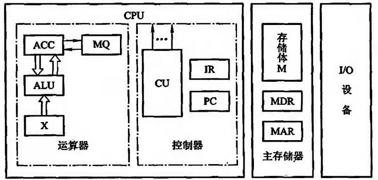

[参考]

> 1. https://www.icourse163.org/learn/NUDT-359002?tid=1002787006#/learn/content?type=detail&id=1003836848&cid=1004616604&replay=true
> 2. https://mooc.study.163.com/learn/1000002002?tid=2402970006&_trace_c_p_k2_=5217a7a2a6a74d53acf0953d2ed28ef9#/learn/content?type=detail&id=2403306501


# 1. 计算机系统概论

## 1.1 计算机系统简介

### 1.1.1 计算机的软硬件概念：

计算机的软件通常分为两大类：系统软件和应用软件

- 系统软件：系统软件又称为系统程序，主要用来管理整个计算机系统，监视服务，使系统资源得到合理调度，高效运行。它包括：标准程序库、语言处理程序、操作系统、服务程序、数据库管理系统、网络软件。
- 应用软件：应用软件又称为应用程序，它是用户根据任务需要所编制的各种程序，如科学计算程序、数据处理程序、过程控制程序、事务管理程序。

### 1.1.2 计算机的层次结构：


> 软硬件的交界面的划分并不是一成不变的，但一般来说，软硬件的交界面指的是指令系统。

>随着超大规模集成电路技术的不断发展，一部分软件功能将由硬件来实现，例如，目前操作系统已实现了部分固化（把软件永恒的存于只读存储器中），称为固件。

### 1.1.3 计算机组成和计算机体系结构：

#### 1.1.3.1 计算机体系结构：

> 计算机体系结构是指那些能够被程序员所见到的计算机系统的属性，即概念性的结构与功能特性。

计算机系统的属性通常是指用机器语言编程的程序员（也包括汇编语言程序设计者和汇编程序设计者）所看到的传统机器的属性，包括指令集、数据类型、存储器寻址技术、I/O机理等，大都属于抽象的属性。

#### 1.1.3.2 计算机组成：

> 计算机组成是指如何实现计算机体系结构所体现的属性，它包含了许多对程序员来说是透明的硬件细节。


## 1.2 计算机的基本组成

### 1.2.1 冯诺依曼计算机的特点：

1945年，数学家冯诺依曼在研究EDVAC机时提出了**“存储程序”**的概念，以此概念为基础的各类计算机统称为冯诺依曼机。它的特点可归结如下：

- 计算机由运算器、存储器、控制器、输入设备和输出设备五大部件组成；

- **指令和数据以`同等的地位`存放于存储器内**，并可按地址访问；

- 指令和数据均用二进制数表示；

- 指令由操作码和地址码组成，操作码用来表示操作的性质，地址码用来表示操作数在存储器中的位置；

- 指令在存储器内按顺序存放。通常，指令是顺序执行的，在特定的条件下，可根据运算结果或根据设定的条件改变执行顺序；

- 机器以运算器为中心，输入输出设备与存储器间的数据传送通过运算器完成。

  [注]`早期的计算机是以运算器为核心，但现代的计算机优化为以存储器为核心`。

### 1.2.2 计算机的硬件框图：

典型的冯诺依曼计算机是以运算器为中心的，如下图所示：


现代的计算机已转化为以存储器为中心，如下图：


图中各部件的功能如下：

- 运算器用来完成算术运算和逻辑运算，并将运算的中间结果暂存到运算器内；
- 存储器用来存放数据和程序；
- 控制器用来控制、指挥程序和数据的输入、运行以及处理运算结果；
- 输入设备用来将人们熟悉的信息形式转换为机器能识别的信息形式，常见的有键盘、鼠标等；
- 输出设备可将机器运算结果转换为人们熟悉的信息形式，如打印机输出、显示器输出等；

`计算机的五大部件（又称五大子系统）在控制器的统一指挥下，有条不紊的自动工作`。

由于运算器和控制器在逻辑关系和电路结构上关系十分紧密，尤其在大规模集成电路制作工艺出现以后，这两大部件往往集成在同一个芯片上，因此，通常将它们合起来统称为中央处理器（Central Processing Unit，CPU）。把输入设备与输出设备简称为I/O设备。

这样，现代计算机可认为由三大部件组成：CPU、I/O设备及主存储器（Main Memory，MM），如下图所示。CPU与主存储器合起来又可称为主机，I/O设备又可称为外部设备。


### 1.2.3 计算机的工作步骤：

#### 1.2.3.1 计算机的工作部件分析：

为了比较形象的了解计算机的工作过程，首先分析一下如下图的计算机组成框图：



​														图1.2.3.1

##### 1.2.3.1.1 主存储器：

主存储器（简称主存或内存）包括存储体M、各种逻辑部件及控制电路等。

存储体由许多存储单元组成，每个存储单元又包含若干个存储元件（或称存储基元、储存元），每个存储元件能寄存一位二进制代码“0”或“1”。可见，一个存储单元可存储一串二进制代码，称这串二进制代码为一个存储字，这串二进制代码的位数称为**存储字长**。存储字长可以是8位、16位或32位等。

一个存储字可代表一个二进制数，也可代表一串字符，如存储字为001101100111101，既可表示为由十六进制字符组成的367DH，又可代表16位的二进制数，此值对应十进制数为13949，还可以代表两个两个ASCII码：“6”和“}”。一个存储字还可以代表一条指令。

主存的工作方式就是按存储单元的地址号来实现对存储字各位的存（写入）、取（读出）。这种存取方式称为按地址读取方式，即按地址访问存储器（简称访存）。

为了能实现按地址访问的方式，主存中还必须配置两个寄存器MAR和MDR。MAR（Memory Address Registry）是存储器地址寄存器，用来存放欲访问的存储单元的地址，其位数对应存储单元的个数（如MAR为10位，则有2^10=1024个存储单元吗，记为1K）。MDR（Memory Data Registry）是存储器数据寄存器，用来存放从存储体某单元取出的代码或者准备往某存储单元存入的代码，其位数与存储字长相等。当然，要想完整的完成一个取或存操作，CPU还得给主存加以各种控制信号，如读命令、写命令和地址译码驱动信号等。`随着硬件技术的发展，主存都制成大规模集成电路的芯片，而将MAR和MDR集成在CPU芯片中`。

早期计算机的存储字长一般和机器的指令字长和数据字长相等，故访问一次主存便可取一条指令或一个数据。随着计算机应用范围的不断扩大，解题精度的不断提高，往往要求指令字长是可变的，数据字长也要求可变。为了适应指令和数据字长的可变性，其长度不由存储字长来确定，而由字节的个数来表示。1个字节（Byte）被定义为8位（bit）二进制代码组成。例如，4字节数据就是32位二进制代码；2字节构成的指令字长是16位二进制代码。当然，此时存储字长、指令字长、数据字长三者可各不相同，但它们必须是字节的整数倍。

##### 1.2.3.1.2 运算器：

运算器最少包括3个寄存器（现代计算机内部往往设有通用寄存器组）和一个算数逻辑单元（ALU）。其中ACC（Accumulator）为累加器 、MQ（Multiplier-Quotient Registry）为乘商寄存器，X为操作数寄存器。这3个寄存器在完成不同运算时，所存放的操作数类别也各不相同。下表列出了寄存器存放不同类别操作数的情况：


不同机器的运算器结构是不同的。图1.2.3.1所示的运算器可将运算结果从ACC送至存储器中的MDR；而存储器的操作数也可从MDR送至运算器中的ACC、MQ或X。有的机器用MDR取代X寄存器。

下面简要分析一下这种结构的运算器加、减、乘、除四则运算的操作过程：

设：M表示存储器的任一地址号，[M]表示对应M地址号单元中的内容；X表示X寄存器，[X]表示X寄存器中的内容；ACC表示累加器，[ACC]表示累加器中的内容；MQ表示乘商寄存器，[MQ]表示乘商寄存器中的内容。

假设ACC中已有前一时刻的运算结果， 并作为下属运算中的一个操作数，则：

- 加法操作过程为：

  ```javascript
  [M] -> X
  [ACC] + [X] -> ACC
  ```

  即将[ACC]看做被加数，先从主存中取一个存放在M地址号单元内的加数[M]，送至运算器的X寄存器中，然后将被加数[ACC]与加数[X]相加，结果(和)保留在ACC中。

- 减法操作过程为：

  ```javascript
  [M] -> X
  [ACC] - [X] -> ACC
  ```

  即将[ACC]看做被减数，先取出存放在主存M地址号单元中的减数[M]并送入X，然后[ACC]-[X]，结果(差)保留在ACC中。

- 乘法操作过程为：

  ```xml
  [M] -> MQ
  [ACC] -> X
  0 -> ACC
  [X] * [MQ] -> ACC//MQ
  ```

  **[注] //表示两个寄存器串接**

  **[注] 第一步和第二步操作先后可以互换**

  即将[ACC]看做被乘数，先取出存放在主存M号地址单元中的乘数[M]并送入到乘商寄存器MQ，再把被乘数送入到X寄存器，并把ACC清0，然后[X]和[MQ]相乘，结果(积)的高位保留在ACC中，低位保留在MQ中。

- 除法操作过程为：

  ```javascript
  [M] -> X
  [ACC] ÷ [X] -> MQ
  余数R在ACC中
  ```

  即将[ACC]看做被除数，先取出存放在主存M号地址单元内的除数[M]并发送到X寄存器，然后[ACC]除以[X]，结果(商)暂留与MQ，[ACC]为余数R。若需要将商保留在ACC中，只需做一步`[MQ] -> [ACC]`即可。

##### 1.2.3.1.3 控制器：

`控制器是计算机的神经中枢，由它指挥各部件自动、协调的工作`。具体而言，它首先要命令存储器读出一条指令，称为取指过程(也称取指阶段)。接着，它要对这条指令进行分析，指出该指令要完成什么样的操作，并按寻址特征指明操作数的地址，称为分析过程(也称分析阶段、译码阶段)。最后根据操作数所在的地址以及指令的操作码完成某种操作，称为执行过程(也称为执行阶段)。

`控制器由程序计数器(Program Counter，PC)、指令寄存器(Instruction Registry，IR)以及控制单元(CU)组成。`

PC用来存放当前欲执行指令的地址，它与主存的MAR之间有一条直接通路，且具有自动加1的功能，即可自动形成下一条指令的地址。

IR用来存放当前的指令，IR的内容来自主存的MDR。IR的操作码（OP(IR)）送至CU，记作OP(IR)->CU，用来分析指令；其地址码（Ad(IR)）作为操作数的地址送至存储器的MAR，记作Ad(IR)->MAR。CU用来分析当前指令所需完成的操作，并发出各种微操作命令序列，用以控制被控对象。

##### 1.2.3.1.4 I/O：

I/O系统包括各种I/O设备及其相应的接口。每一种I/O设备都由I/O接口与主机联系，它接收CU发出的各种控制命令，并完成相应的操作。例如，键盘(输入设备)由键盘接口电路与主机联系；打印机(输出设备)由打印机接口电路与主机联系。

#### 1.2.3.2 计算机工作的全过程：

下面结合下图进一步深入领会计算机工作的全过程。


[注]上图中，操作码为6位，操作数为10位

首先，按上图所列的有序指令和数据，通过键盘输入到主存第0号至第12号单元中，并置PC的初始值为0(令程序的首地址为0)。启动机器后，计算机便自动按存储器中所存放的指令顺序有序的逐条完成取指令、分析指令和执行指令，直至执行到程序的最后一条指令为止。

例如，启动机器后，控制器立即将PC的内容发送至主存的MAR（记作PC->MAR），并命令存储器做读操作，此刻主存“0”号单元的内容“0000010000001000”（上图所列程序的第一条指令）便被送入到MDR内。然后由MDR送至控制器的IR（记作MDR->IR），完成一条指令的取指过程。经CU分析（记作OP(IR)->CU），操作码“000001”为取数指令，于是CU又将IR中的地址码“0000001000”送至MAR（记作Ad(IR)->MAR），并命令存储器做读操作，将该地址单元中的操作数x送至MDR，再由MDR送至运算器的ACC（记作MDR->ACC），完成此指令的执行过程。

此刻，也即完成第一条取数指令的全过程，即将操作数x送至运算器ACC中。

与此同时，PC完成自动加1的操作，形成下一条指令的地址“1”号。

同上所述，由PC将第二条指令的地址送至MAR，命令存储器做读操作，将“0001000000001001”送入到MDR，又又MDR送至IR。接着，CU分析操作码“000100”为乘法指令，故CU向存储器发出读命令，取出对应地址为“0000001001”单元中的操作数a，经MDR送至运算器MQ，CU再向运算器发送乘法操作命令，完成ax运算，并把运算结果ax存放在ACC中。同时PC又完成一次(PC)+1->PC，形成下一条指令的地址“2”号。依次类推，逐条取指、分析、执行，直至打印出结果。


## 1.3 计算机硬件的主要技术指标

### 1.3.1 机器字长：

> 机器字长是指CPU一次能处理数据的位数，通常与CPU的寄存器位数有关。

字长越长，数的表示范围越大，精度也越高。机器的字长也会影响机器的运算速度。

### 1.3.2 存储容量：

存储器的容量应该包括主存容量和辅存容量。

主存容量是指主存中存放二进制代码的总位数，即：

```javascript
存储容量 = 存储单元个数 * 存储字长
```

### 1.3.3 运算速度：

现在机器的运算速度普遍采用单位时间执行指令的平均条数来衡量，并用MIPS（Million instruction Per Second，百万条指令每秒）作为计量单位。例如，某机每秒能执行200万条指令，则记作2MIPS。

也可以用CPI（Cycle Per Instruction），即执行一条指令所需的时钟周期（机器主频的倒数），或用FLOPS（Floating Point Operation Per Second，浮点运算次数每秒）来衡量运算速度。


## 1.4 解疑答惑：

### 1.4.1 指令和数据都存于存储器中，计算机如何区分它们？

```javascript
解：
计算机硬件主要通过不同的时间段来区分指令和数据，即：取指周期(或取指微程序)取出的即为指令，执行周期(或相应微程序)取出的即为数据。
另外，也可通过地址来源区分，从PC指出的存储单元取出的是指令，由指令地址码部分提供操作数地址。
```


# 2. 计算机的发展及应用


# 3. 总线

## 3.1 总线的基本概念

计算机系统的五大部件之间的互联方式有两种：

- 一种是各部件之间使用单独的连线，称为分散连接；
- 一种是将各部件连到一组公共信息传输线上，称为总线连接；

> 总线是连接多个部件的信息的传输线，是各部件共享的传输介质。

当多个部件与总线相连时，如果出现两个或两个以上部件同时向总线发送信息，势必导致信号冲突，传输无效。因此，在某一个时刻，只允许有一个部件向总线发送信息，而多个部件可以同时从总线上接收相同的信息。

[注]总线并不是一条线，而是一组线。


## 3.2 总线的分类

总线的应用很广泛，从不同角度可以有不同的分类方法。按数据传送方式可分为并行传输总线和串行传输总线。在并行传输总线中，又可按传输数据宽度分为8位、16位、32位、64位等传输总线。若按总线的使用范畴划分，则又有计算机总线、测控总线、网络通信总线等。

下面按连接部件不同，介绍三类总线：

### 3.2.1 片内总线：

> 片内总线是指芯片内部的总线，如在CPU芯片内部，寄存器与寄存器之间、寄存器与算罗单元ALU之间都由片内总线连接

### 3.2.2 系统总线：

> 系统总线是指CPU、主存、I/O设备等`各大部件之间`的信息传输线。

由于这些部件通常都安放在主板或各个插件版(插卡)上，故又称板级总线(在一块电路板上各芯片间的连线)或板间连线。

按系统总线传输信息的不同，又可分为三类：`数据总线`、`地址总线`和`控制总线`。

#### 3.2.2.1 数据总线：

数据总线用来传输各功能部件之间的数据信息，它是`双向传输`总线，其位数与机器字长、存储字长有关，一般为8位、16位或32位。`数据总线的位数称为数据总线位宽`，它是衡量系统性能的一个重要参数。如果数据总线的位宽为8位，指令字长为16位，那么CPU在取指阶段必须两次访问内存。

#### 3.2.2.2 地址总线：

地址总线主要用来指出数据总线上的数据源或目的数据在主存单元的地址或I/O设备的地址。

例如，欲从存储器读出一个数据，则CPU要将此数据所在存储单元的地址送到地址线上。又如，与将某数据经I/O设备输出，则CPU除了需将数据送到数据总线外，还需将该输入设备的地址(通常都经I/O接口)送到地址总线上。可见，地址总线上的代码是用来指明CPU欲访问的存储单元或I/O端口的地址，由CPU输出，单向传输。

#### 3.2.2.3 控制总线：

由于数据总线、地址总线都是被挂在总线上的所有部件共享的，如何使各部件能在不同时刻占有总线使用权，需依靠控制总线来完成，因此控制总线是用来发出各种控制信号的传播线。通常对任一控制线而言，它的传输是单向的。例如，存储器读/写命令或I/O设备读/写命令都是由CPU发出的。但对于控制总线总体来说，又可认为是双向的。例如，当某设备准备就绪时，便向CPU发出中断请求；当某部件(如DMA接口)需获得总线使用权时，也向CPU发出总线请求。此外，控制总线还起到监视各部件状态的作用。例如，查询该设备是处于忙还是闲，是否出错等。因此对CPU而言，控制信号即有输出，又有输入。

常见的控制信号如下：

- 时钟：用来同步各种操作；
- 复位：初始化各部件；
- 总线请求：表示某部件需要获得总线使用权；
- 总线允许：表示需要获得总线使用权的部件已获得了控制权；
- 中断请求：表示某部件提出中断请求；
- 中断允许：表示中断请求已被接收；
- 存储器写：将数据总线上的数据写至存储器的指定地址单元内；
- 存储器读：将指定存储单元中的数据读到数据总线上；
- I/O读：从指定的I/O端口将数据读到数据总线上；
- I/O写：将数据总线上的数据传输到指定的I/O端口内；
- 传输响应：表示数据已被接收，或已将数据送至数据总线上；

### 3.2.3 通信总线：

> 用于**计算机系统之间**或**计算机系统与其他系统**（如控制仪表、移动通信等）之间的通信。

由于这类联系涉及许多方面，如外部连接、距离远近、	快慢、工作方式等，差别极大，因此通信总线的类别很多。

但按传输方式可分为两种：`串行通信`和`并行通信`。

#### 3.2.3.1 串行通信：

串行通信是指在单条1位宽的传输线上，一位一位的按顺序分时传送。如1字节的数据，在串行传送中，1字节数据要通过一条传输线分8次由低位到高位按顺序逐位传送。

#### 3.2.3.2 并行通信：

并行通信是指数据在多条并行1位宽的传输线上，同时由源传送到目的地。如1字节的数据，在并行传送中，要通过8条并行传输线同时由源传送到目的地。

#### 3.2.3.3 区别：

并行通信适宜于近距离的数据传输，通常小于30m；串行通信适宜于远距离传输，可以从数米到数千公里。

而且，串行和并行通信的数据传送率都与距离成反比。

在短距离内，并行数据传送速率比串行数据传送速率高得多。随着大规模和超大规模集成电路的发展，逻辑器件的价格趋低，而通信线路费用趋高，因此对于远距离通信而言，采用串行通信费用远比并行通信费用低很多。


## 3.3 总线特性及性能指标

从物理角度来看，总线由许多导线直接印制在电路板上，延伸到各个部件。下图形象的表示了各个部件与总线之间的物理摆放位置。


图中CPU、主存、I/O这些插板(又称插卡)通过插头与水平方向总线插槽(将总线标准用印刷电路板或一束电缆连接而成的多头插座)连接。为了保证机械上的可靠性连接，必须规定其机械特性；为了确保电气上正确连接，必须规定其电气特性；为了保证正确地连接不同部件，还需规定其功能特性和时间特性。随着计算机的发展，Pentium Ⅲ以上的微型计算机已将CPU芯片直接安置在主板上，而且很多插卡已经做成专用芯片，减少了插槽，使其结构更合理。

总线特性包括一下几项：

### 3.3.1 总线特性：

#### 3.3.1.1 机械特性：

机械特性是指在总线连接方式上的一些性能，如插头与插座使用的标准，它们的几何尺寸、形状、引脚的个数以及排列的顺序，接头处的可靠接触等。

#### 3.3.1.2 电气特性：

电气特性是指在总线的每一根传输线上信号的传递方向和有效的电平范围。`通常规定由CPU发出的信号称为输出信号，送入CPU的信号称为输入信号`。

#### 3.3.1.3 功能特性：

功能特性是指总线中每根传输线的功能，例如：地址总线用来指出地址码；数据总线用来传输数据；控制总线发出控制信号，既有从CPU发出的，如存储器读/写、I/O设备读/写、也有I/O设备像CPU发来的，如中断请求、DMA请求等。由此可见，各条线的功能不同。

#### 3.3.1.4 时间特性：

时间特性是指总线中的任一根线在什么时间内有效。每条总线上的各种信号互相存在一种有效时序的关系，因此，时间特性一般可用信号时序图来描述。

### 3.3.2 总线的性能指标：

#### 3.3.2.1 总线宽度：

通常是指数据总线的根数，用bit(位)表示，如8位、16位、32位、64位(即8根、16根、32根、64根)

#### 3.3.2.2 总线带宽：

总线带宽可以理解为总线的数据传输速率，即单位时间内总线上传输数据的位数，通常用每秒传输信息的字节数来衡量，单位可用MBps(兆字节每秒)表示。例如，总线工作频率为33MHz，总线宽度为32位(4B)，则总线带宽为33*(32/8)=132MBps。

#### 3.3.2.3 时钟同步/异步：

总线上的数据与时钟同步工作的总线称为同步总线，与时钟不同步工作的总线称为异步总线。

#### 3.3.2.4 总线复用：

一个信号线上分时传送两种信息。例如，通常地址总线与数据总线在物理上是分开的两种总线，地址总线传输地址码，数据总线传输数据信息。为了提高总线的利用率，优化设计，特将地址总线和数据总线共用一组物理线路，在这组物理线路上分时传输地址信号和数据信号，即为总线的多路复用。

#### 3.3.2.5 信号线数：

地址总线、数据总线和控制总线三种总线数的总和。

#### 3.3.2.6 总线控制方式：

包括突发工作、自动配置、仲裁方式、逻辑方式、技术方式等。

#### 3.3.2.7 其他指标：

如负载能力、电源电压、总线宽度能否扩展等。

下表列出几种流行的微机总线性能，可供参考：


### 3.3.3 总线标准：


## 2.4 总线结构

### 2.4.1 单总线结构：


### 2.4.2 双总线结构：


### 2.4.3 三总线结构：

- 结构一

  

- 结构二

  

### 2.4.4 四总线结构：


### 2.4.5 总线结构举例：

#### 2.4.5.1 传统微型机总线结构：


#### 2.4.5.2 VL-BUS局部总线结构：


#### 2.4.5.3 PCI总线结构：


#### 2.4.5.4 多层PCI总线结构：


## 2.5 总线控制

### 2.5.1 总线判优控制：

#### 2.5.1.1 基本概念：

> 主设备(模块)：对总线有控制权（可以提出总线占用请求，以及控制总线上的信息传输）
>
> 从设备(模块)：响应从主设备发来的总线命令（不可以提出总线占用其你去，也不能控制总线上的信息传输）
>
> 注：有些设备既可以是主设备，也可以是从设备

#### 2.5.1.2 判优控制的方法：

判断控制的方法分为两种：

- 集中式：把总线的判优逻辑做在一个部件上
  - 链式查询
  - 计数器定时查询
  - 独立请求方式
- 分布式：判优逻辑分布到各个设备或者各个设备的端口上

### 2.5.2 集中式判优：

#### 2.5.2.1 链式查询：


#### 2.5.2.2 计数器定时查询：


#### 2.5.2.3 独立请求方式：


### 2.5.3 总线通信控制：

> 总线通信控制的目的就是为了解决主设备和从设备之间协调通信的问题

#### 2.5.3.1 总线传输周期：

- 申请分配阶段：主模块申请，总线总裁决定
- 寻址阶段：主模块向从模块给出`地址`和`命令`
- 传输阶段：主模块和从模块交换数据
- 结算阶段：主模块和从模块撤销有关消息

#### 2.5.3.2 总线通信的四种方式：

- 同步通信：由统一的定长定宽的时标控制数据传输
- 异步通信：采用应答方式，没有公共时钟标准
- 半同步通信：同步、异步结合
- 分离式通信：充分挖掘系统总线每个瞬间的潜力


# 3. 存储器

## 3.1 概述

### 3.1.1 存储器可以为哪些类型？

#### 3.1.1.1 按存储介质分类：

- 半导体存储器：TTL、MOS，易失

- 磁表面存储器：磁头、载磁体，非易失

- 磁芯存储器：   硬磁材料、环状元件，非易失

  

- 光盘存储器：激光、磁光材料，非易失

#### 3.1.1.2 按存取方式分类：

- 存取时间与物理地址无关（随机访问）：

  这种随机访问的存储器都可以称为随机存储器，但是由于历史原因，随机存储器又可以分为两类：

  - 随机存储器：RAM，在程序执行过程中可读可写
  - 只读存储器：ROM，在执行执行过程中只读

  [注]只读存储器虽然是只读的，但也是随机访问的。

- 存储时间与物理地址有关（串行访问）：

  - 顺序存储存储器：磁带
  - 直接存储存储器：磁盘

- 按在计算机中的作用分类：

  - 主存储器：
    - RAM
      - 静态RAM
      - 动态RAM
    - ROM
      - MROM：掩膜ROM
      - PROM：可编程ROM
      - EPROM：电可编程ROM
      - EEPROM：电可擦除可编程ROM
  - Flash Memory：性能介于主存和辅存之间（一般SSD就是基于此的）
  - 辅助存储器：磁盘、磁带、光盘

### 3.1.2 现代存储器的层次结构：

缓存-主存层次和主存-辅存层次：


## 3.2 主存储器（内存）

### 3.1.1 主存储器的基本组成：


### 3.1.2 主存和CPU的联系：


## 3.3 高速缓冲存储器


## 3.4 辅助存储器（外存）


