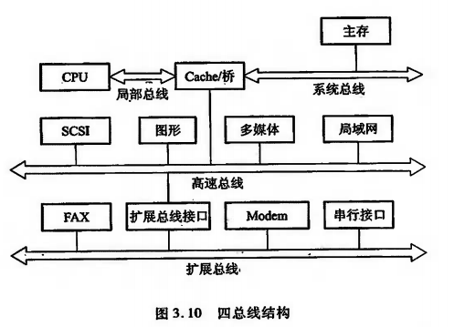
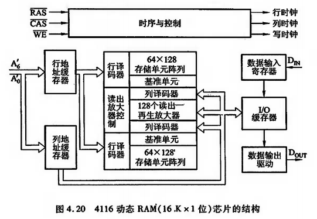
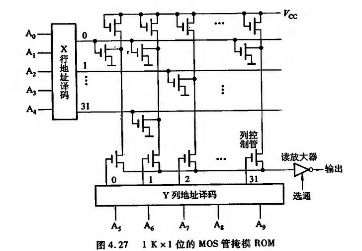
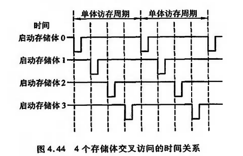

[参考]

> 1. https://www.icourse163.org/learn/NUDT-359002?tid=1002787006#/learn/content?type=detail&id=1003836848&cid=1004616604&replay=true
> 2. https://mooc.study.163.com/learn/1000002002?tid=2402970006&_trace_c_p_k2_=5217a7a2a6a74d53acf0953d2ed28ef9#/learn/content?type=detail&id=2403306501


# 1. 计算机系统概论

## 1.1 计算机系统简介

### 1.1.1 计算机的软硬件概念：

计算机的软件通常分为两大类：系统软件和应用软件

- 系统软件：系统软件又称为系统程序，主要用来管理整个计算机系统，监视服务，使系统资源得到合理调度，高效运行。它包括：标准程序库、语言处理程序、操作系统、服务程序、数据库管理系统、网络软件。
- 应用软件：应用软件又称为应用程序，它是用户根据任务需要所编制的各种程序，如科学计算程序、数据处理程序、过程控制程序、事务管理程序。

### 1.1.2 计算机的层次结构：


> 软硬件的交界面的划分并不是一成不变的，但一般来说，软硬件的交界面指的是指令系统。

>随着超大规模集成电路技术的不断发展，一部分软件功能将由硬件来实现，例如，目前操作系统已实现了部分固化（把软件永恒的存于只读存储器中），称为固件。

### 1.1.3 计算机组成和计算机体系结构：

#### 1.1.3.1 计算机体系结构：

> 计算机体系结构是指那些能够被程序员所见到的计算机系统的属性，即概念性的结构与功能特性。

计算机系统的属性通常是指用机器语言编程的程序员（也包括汇编语言程序设计者和汇编程序设计者）所看到的传统机器的属性，包括指令集、数据类型、存储器寻址技术、I/O机理等，大都属于抽象的属性。

#### 1.1.3.2 计算机组成：

> 计算机组成是指如何实现计算机体系结构所体现的属性，它包含了许多对程序员来说是透明的硬件细节。


## 1.2 计算机的基本组成

### 1.2.1 冯诺依曼计算机的特点：

1945年，数学家冯诺依曼在研究EDVAC机时提出了**“存储程序”**的概念，以此概念为基础的各类计算机统称为冯诺依曼机。它的特点可归结如下：

- 计算机由运算器、存储器、控制器、输入设备和输出设备五大部件组成；

- **指令和数据以`同等的地位`存放于存储器内**，并可按地址访问；

- 指令和数据均用二进制数表示；

- 指令由操作码和地址码组成，操作码用来表示操作的性质，地址码用来表示操作数在存储器中的位置；

- 指令在存储器内按顺序存放。通常，指令是顺序执行的，在特定的条件下，可根据运算结果或根据设定的条件改变执行顺序；

- 机器以运算器为中心，输入输出设备与存储器间的数据传送通过运算器完成。

  [注]`早期的计算机是以运算器为核心，但现代的计算机优化为以存储器为核心`。

### 1.2.2 计算机的硬件框图：

典型的冯诺依曼计算机是以运算器为中心的，如下图所示：


现代的计算机已转化为以存储器为中心，如下图：


图中各部件的功能如下：

- 运算器用来完成算术运算和逻辑运算，并将运算的中间结果暂存到运算器内；
- 存储器用来存放数据和程序；
- 控制器用来控制、指挥程序和数据的输入、运行以及处理运算结果；
- 输入设备用来将人们熟悉的信息形式转换为机器能识别的信息形式，常见的有键盘、鼠标等；
- 输出设备可将机器运算结果转换为人们熟悉的信息形式，如打印机输出、显示器输出等；

`计算机的五大部件（又称五大子系统）在控制器的统一指挥下，有条不紊的自动工作`。

由于运算器和控制器在逻辑关系和电路结构上关系十分紧密，尤其在大规模集成电路制作工艺出现以后，这两大部件往往集成在同一个芯片上，因此，通常将它们合起来统称为中央处理器（Central Processing Unit，CPU）。把输入设备与输出设备简称为I/O设备。

这样，现代计算机可认为由三大部件组成：CPU、I/O设备及主存储器（Main Memory，MM），如下图所示。CPU与主存储器合起来又可称为主机，I/O设备又可称为外部设备。


### 1.2.3 计算机的工作步骤：

#### 1.2.3.1 计算机的工作部件分析：

为了比较形象的了解计算机的工作过程，首先分析一下如下图的计算机组成框图：


​														图1.2.3.1

##### 1.2.3.1.1 主存储器：

主存储器（简称主存或内存）包括存储体M、各种逻辑部件及控制电路等。

存储体由许多存储单元组成，每个存储单元又包含若干个存储元件（或称存储基元、储存元），每个存储元件能寄存一位二进制代码“0”或“1”。可见，一个存储单元可存储一串二进制代码，称这串二进制代码为一个存储字，这串二进制代码的位数称为**存储字长**。存储字长可以是8位、16位或32位等。

一个存储字可代表一个二进制数，也可代表一串字符，如存储字为001101100111101，既可表示为由十六进制字符组成的367DH，又可代表16位的二进制数，此值对应十进制数为13949，还可以代表两个两个ASCII码：“6”和“}”。一个存储字还可以代表一条指令。

主存的工作方式就是按存储单元的地址号来实现对存储字各位的存（写入）、取（读出）。这种存取方式称为按地址读取方式，即按地址访问存储器（简称访存）。

为了能实现按地址访问的方式，主存中还必须配置两个寄存器MAR和MDR。MAR（Memory Address Registry）是存储器地址寄存器，用来存放欲访问的存储单元的地址，其位数对应存储单元的个数（如MAR为10位，则有2^10=1024个存储单元吗，记为1K）。MDR（Memory Data Registry）是存储器数据寄存器，用来存放从存储体某单元取出的代码或者准备往某存储单元存入的代码，其位数与存储字长相等。当然，要想完整的完成一个取或存操作，CPU还得给主存加以各种控制信号，如读命令、写命令和地址译码驱动信号等。`随着硬件技术的发展，主存都制成大规模集成电路的芯片，而将MAR和MDR集成在CPU芯片中`。

早期计算机的存储字长一般和机器的指令字长和数据字长相等，故访问一次主存便可取一条指令或一个数据。随着计算机应用范围的不断扩大，解题精度的不断提高，往往要求指令字长是可变的，数据字长也要求可变。为了适应指令和数据字长的可变性，其长度不由存储字长来确定，而由字节的个数来表示。1个字节（Byte）被定义为8位（bit）二进制代码组成。例如，4字节数据就是32位二进制代码；2字节构成的指令字长是16位二进制代码。当然，此时存储字长、指令字长、数据字长三者可各不相同，但它们必须是字节的整数倍。

##### 1.2.3.1.2 运算器：

运算器最少包括3个寄存器（现代计算机内部往往设有通用寄存器组）和一个算数逻辑单元（ALU）。其中ACC（Accumulator）为累加器 、MQ（Multiplier-Quotient Registry）为乘商寄存器，X为操作数寄存器。这3个寄存器在完成不同运算时，所存放的操作数类别也各不相同。下表列出了寄存器存放不同类别操作数的情况：


不同机器的运算器结构是不同的。图1.2.3.1所示的运算器可将运算结果从ACC送至存储器中的MDR；而存储器的操作数也可从MDR送至运算器中的ACC、MQ或X。有的机器用MDR取代X寄存器。

下面简要分析一下这种结构的运算器加、减、乘、除四则运算的操作过程：

设：M表示存储器的任一地址号，[M]表示对应M地址号单元中的内容；X表示X寄存器，[X]表示X寄存器中的内容；ACC表示累加器，[ACC]表示累加器中的内容；MQ表示乘商寄存器，[MQ]表示乘商寄存器中的内容。

假设ACC中已有前一时刻的运算结果， 并作为下属运算中的一个操作数，则：

- 加法操作过程为：

  ```javascript
  [M] -> X
  [ACC] + [X] -> ACC
  ```

  即将[ACC]看做被加数，先从主存中取一个存放在M地址号单元内的加数[M]，送至运算器的X寄存器中，然后将被加数[ACC]与加数[X]相加，结果(和)保留在ACC中。

- 减法操作过程为：

  ```javascript
  [M] -> X
  [ACC] - [X] -> ACC
  ```

  即将[ACC]看做被减数，先取出存放在主存M地址号单元中的减数[M]并送入X，然后[ACC]-[X]，结果(差)保留在ACC中。

- 乘法操作过程为：

  ```xml
  [M] -> MQ
  [ACC] -> X
  0 -> ACC
  [X] * [MQ] -> ACC//MQ
  ```

  **[注] //表示两个寄存器串接**

  **[注] 第一步和第二步操作先后可以互换**

  即将[ACC]看做被乘数，先取出存放在主存M号地址单元中的乘数[M]并送入到乘商寄存器MQ，再把被乘数送入到X寄存器，并把ACC清0，然后[X]和[MQ]相乘，结果(积)的高位保留在ACC中，低位保留在MQ中。

- 除法操作过程为：

  ```javascript
  [M] -> X
  [ACC] ÷ [X] -> MQ
  余数R在ACC中
  ```

  即将[ACC]看做被除数，先取出存放在主存M号地址单元内的除数[M]并发送到X寄存器，然后[ACC]除以[X]，结果(商)暂留与MQ，[ACC]为余数R。若需要将商保留在ACC中，只需做一步`[MQ] -> [ACC]`即可。

##### 1.2.3.1.3 控制器：

`控制器是计算机的神经中枢，由它指挥各部件自动、协调的工作`。具体而言，它首先要命令存储器读出一条指令，称为取指过程(也称取指阶段)。接着，它要对这条指令进行分析，指出该指令要完成什么样的操作，并按寻址特征指明操作数的地址，称为分析过程(也称分析阶段、译码阶段)。最后根据操作数所在的地址以及指令的操作码完成某种操作，称为执行过程(也称为执行阶段)。

`控制器由程序计数器(Program Counter，PC)、指令寄存器(Instruction Registry，IR)以及控制单元(CU)组成。`

PC用来存放当前欲执行指令的地址，它与主存的MAR之间有一条直接通路，且具有自动加1的功能，即可自动形成下一条指令的地址。

IR用来存放当前的指令，IR的内容来自主存的MDR。IR的操作码（OP(IR)）送至CU，记作OP(IR)->CU，用来分析指令；其地址码（Ad(IR)）作为操作数的地址送至存储器的MAR，记作Ad(IR)->MAR。CU用来分析当前指令所需完成的操作，并发出各种微操作命令序列，用以控制被控对象。

##### 1.2.3.1.4 I/O：

I/O系统包括各种I/O设备及其相应的接口。每一种I/O设备都由I/O接口与主机联系，它接收CU发出的各种控制命令，并完成相应的操作。例如，键盘(输入设备)由键盘接口电路与主机联系；打印机(输出设备)由打印机接口电路与主机联系。

#### 1.2.3.2 计算机工作的全过程：

下面结合下图进一步深入领会计算机工作的全过程。


[注]上图中，操作码为6位，操作数为10位

首先，按上图所列的有序指令和数据，通过键盘输入到主存第0号至第12号单元中，并置PC的初始值为0(令程序的首地址为0)。启动机器后，计算机便自动按存储器中所存放的指令顺序有序的逐条完成取指令、分析指令和执行指令，直至执行到程序的最后一条指令为止。

例如，启动机器后，控制器立即将PC的内容发送至主存的MAR（记作PC->MAR），并命令存储器做读操作，此刻主存“0”号单元的内容“0000010000001000”（上图所列程序的第一条指令）便被送入到MDR内。然后由MDR送至控制器的IR（记作MDR->IR），完成一条指令的取指过程。经CU分析（记作OP(IR)->CU），操作码“000001”为取数指令，于是CU又将IR中的地址码“0000001000”送至MAR（记作Ad(IR)->MAR），并命令存储器做读操作，将该地址单元中的操作数x送至MDR，再由MDR送至运算器的ACC（记作MDR->ACC），完成此指令的执行过程。

此刻，也即完成第一条取数指令的全过程，即将操作数x送至运算器ACC中。

与此同时，PC完成自动加1的操作，形成下一条指令的地址“1”号。

同上所述，由PC将第二条指令的地址送至MAR，命令存储器做读操作，将“0001000000001001”送入到MDR，又又MDR送至IR。接着，CU分析操作码“000100”为乘法指令，故CU向存储器发出读命令，取出对应地址为“0000001001”单元中的操作数a，经MDR送至运算器MQ，CU再向运算器发送乘法操作命令，完成ax运算，并把运算结果ax存放在ACC中。同时PC又完成一次(PC)+1->PC，形成下一条指令的地址“2”号。依次类推，逐条取指、分析、执行，直至打印出结果。


## 1.3 计算机硬件的主要技术指标

### 1.3.1 机器字长：

> 机器字长是指CPU一次能处理数据的位数，通常与CPU的寄存器位数有关。

字长越长，数的表示范围越大，精度也越高。机器的字长也会影响机器的运算速度。

### 1.3.2 存储容量：

存储器的容量应该包括主存容量和辅存容量。

主存容量是指主存中存放二进制代码的总位数，即：

```javascript
存储容量 = 存储单元个数 * 存储字长
```

### 1.3.3 运算速度：

现在机器的运算速度普遍采用单位时间执行指令的平均条数来衡量，并用MIPS（Million instruction Per Second，百万条指令每秒）作为计量单位。例如，某机每秒能执行200万条指令，则记作2MIPS。

也可以用CPI（Cycle Per Instruction），即执行一条指令所需的时钟周期（机器主频的倒数），或用FLOPS（Floating Point Operation Per Second，浮点运算次数每秒）来衡量运算速度。


## 1.4 解疑答惑：

### 1.4.1 指令和数据都存于存储器中，计算机如何区分它们？

```javascript
解：
计算机硬件主要通过不同的时间段来区分指令和数据，即：取指周期(或取指微程序)取出的即为指令，执行周期(或相应微程序)取出的即为数据。
另外，也可通过地址来源区分，从PC指出的存储单元取出的是指令，由指令地址码部分提供操作数地址。
```


# 2. 计算机的发展及应用


# 3. 总线

## 3.1 总线的基本概念

计算机系统的五大部件之间的互联方式有两种：

- 一种是各部件之间使用单独的连线，称为分散连接；
- 一种是将各部件连到一组公共信息传输线上，称为总线连接；

> 总线是连接多个部件的信息的传输线，是各部件共享的传输介质。

当多个部件与总线相连时，如果出现两个或两个以上部件同时向总线发送信息，势必导致信号冲突，传输无效。因此，在某一个时刻，只允许有一个部件向总线发送信息，而多个部件可以同时从总线上接收相同的信息。

[注]总线并不是一条线，而是一组线。


## 3.2 总线的分类

总线的应用很广泛，从不同角度可以有不同的分类方法。按数据传送方式可分为并行传输总线和串行传输总线。在并行传输总线中，又可按传输数据宽度分为8位、16位、32位、64位等传输总线。若按总线的使用范畴划分，则又有计算机总线、测控总线、网络通信总线等。

下面按连接部件不同，介绍三类总线：

### 3.2.1 片内总线：

> 片内总线是指芯片内部的总线，如在CPU芯片内部，寄存器与寄存器之间、寄存器与算罗单元ALU之间都由片内总线连接

### 3.2.2 系统总线：

> 系统总线是指CPU、主存、I/O设备等`各大部件之间`的信息传输线。

由于这些部件通常都安放在主板或各个插件版(插卡)上，故又称板级总线(在一块电路板上各芯片间的连线)或板间连线。

按系统总线传输信息的不同，又可分为三类：`数据总线`、`地址总线`和`控制总线`。

#### 3.2.2.1 数据总线：

数据总线用来传输各功能部件之间的数据信息，它是`双向传输`总线，其位数与机器字长、存储字长有关，一般为8位、16位或32位。`数据总线的位数称为数据总线位宽`，它是衡量系统性能的一个重要参数。如果数据总线的位宽为8位，指令字长为16位，那么CPU在取指阶段必须两次访问内存。

#### 3.2.2.2 地址总线：

地址总线主要用来指出数据总线上的数据源或目的数据在主存单元的地址或I/O设备的地址。

例如，欲从存储器读出一个数据，则CPU要将此数据所在存储单元的地址送到地址线上。又如，与将某数据经I/O设备输出，则CPU除了需将数据送到数据总线外，还需将该输入设备的地址(通常都经I/O接口)送到地址总线上。可见，地址总线上的代码是用来指明CPU欲访问的存储单元或I/O端口的地址，由CPU输出，单向传输。

#### 3.2.2.3 控制总线：

由于数据总线、地址总线都是被挂在总线上的所有部件共享的，如何使各部件能在不同时刻占有总线使用权，需依靠控制总线来完成，因此控制总线是用来发出各种控制信号的传播线。通常对任一控制线而言，它的传输是单向的。例如，存储器读/写命令或I/O设备读/写命令都是由CPU发出的。但对于控制总线总体来说，又可认为是双向的。例如，当某设备准备就绪时，便向CPU发出中断请求；当某部件(如DMA接口)需获得总线使用权时，也向CPU发出总线请求。此外，控制总线还起到监视各部件状态的作用。例如，查询该设备是处于忙还是闲，是否出错等。因此对CPU而言，控制信号即有输出，又有输入。

常见的控制信号如下：

- 时钟：用来同步各种操作；
- 复位：初始化各部件；
- 总线请求：表示某部件需要获得总线使用权；
- 总线允许：表示需要获得总线使用权的部件已获得了控制权；
- 中断请求：表示某部件提出中断请求；
- 中断允许：表示中断请求已被接收；
- 存储器写：将数据总线上的数据写至存储器的指定地址单元内；
- 存储器读：将指定存储单元中的数据读到数据总线上；
- I/O读：从指定的I/O端口将数据读到数据总线上；
- I/O写：将数据总线上的数据传输到指定的I/O端口内；
- 传输响应：表示数据已被接收，或已将数据送至数据总线上；

### 3.2.3 通信总线：

> 用于**计算机系统之间**或**计算机系统与其他系统**（如控制仪表、移动通信等）之间的通信。

由于这类联系涉及许多方面，如外部连接、距离远近、	快慢、工作方式等，差别极大，因此通信总线的类别很多。

但按传输方式可分为两种：`串行通信`和`并行通信`。

#### 3.2.3.1 串行通信：

串行通信是指在单条1位宽的传输线上，一位一位的按顺序分时传送。如1字节的数据，在串行传送中，1字节数据要通过一条传输线分8次由低位到高位按顺序逐位传送。

#### 3.2.3.2 并行通信：

并行通信是指数据在多条并行1位宽的传输线上，同时由源传送到目的地。如1字节的数据，在并行传送中，要通过8条并行传输线同时由源传送到目的地。

#### 3.2.3.3 区别：

并行通信适宜于近距离的数据传输，通常小于30m；串行通信适宜于远距离传输，可以从数米到数千公里。

而且，串行和并行通信的数据传送率都与距离成反比。

在短距离内，并行数据传送速率比串行数据传送速率高得多。随着大规模和超大规模集成电路的发展，逻辑器件的价格趋低，而通信线路费用趋高，因此对于远距离通信而言，采用串行通信费用远比并行通信费用低很多。


## 3.3 总线特性及性能指标

从物理角度来看，总线由许多导线直接印制在电路板上，延伸到各个部件。下图形象的表示了各个部件与总线之间的物理摆放位置。


图中CPU、主存、I/O这些插板(又称插卡)通过插头与水平方向总线插槽(将总线标准用印刷电路板或一束电缆连接而成的多头插座)连接。为了保证机械上的可靠性连接，必须规定其机械特性；为了确保电气上正确连接，必须规定其电气特性；为了保证正确地连接不同部件，还需规定其功能特性和时间特性。随着计算机的发展，Pentium Ⅲ以上的微型计算机已将CPU芯片直接安置在主板上，而且很多插卡已经做成专用芯片，减少了插槽，使其结构更合理。

总线特性包括一下几项：

### 3.3.1 总线特性：

#### 3.3.1.1 机械特性：

机械特性是指在总线连接方式上的一些性能，如插头与插座使用的标准，它们的几何尺寸、形状、引脚的个数以及排列的顺序，接头处的可靠接触等。

#### 3.3.1.2 电气特性：

电气特性是指在总线的每一根传输线上信号的传递方向和有效的电平范围。`通常规定由CPU发出的信号称为输出信号，送入CPU的信号称为输入信号`。

#### 3.3.1.3 功能特性：

功能特性是指总线中每根传输线的功能，例如：地址总线用来指出地址码；数据总线用来传输数据；控制总线发出控制信号，既有从CPU发出的，如存储器读/写、I/O设备读/写、也有I/O设备像CPU发来的，如中断请求、DMA请求等。由此可见，各条线的功能不同。

#### 3.3.1.4 时间特性：

时间特性是指总线中的任一根线在什么时间内有效。每条总线上的各种信号互相存在一种有效时序的关系，因此，时间特性一般可用信号时序图来描述。

### 3.3.2 总线的性能指标：

#### 3.3.2.1 总线宽度：

通常是指数据总线的根数，用bit(位)表示，如8位、16位、32位、64位(即8根、16根、32根、64根)

#### 3.3.2.2 总线带宽：

总线带宽可以理解为总线的数据传输速率，即单位时间内总线上传输数据的位数，通常用每秒传输信息的字节数来衡量，单位可用MBps(兆字节每秒)表示。例如，总线工作频率为33MHz，总线宽度为32位(4B)，则总线带宽为33*(32/8)=132MBps。

#### 3.3.2.3 时钟同步/异步：

总线上的数据与时钟同步工作的总线称为同步总线，与时钟不同步工作的总线称为异步总线。

#### 3.3.2.4 总线复用：

一个信号线上分时传送两种信息。例如，通常地址总线与数据总线在物理上是分开的两种总线，地址总线传输地址码，数据总线传输数据信息。为了提高总线的利用率，优化设计，特将地址总线和数据总线共用一组物理线路，在这组物理线路上分时传输地址信号和数据信号，即为总线的多路复用。

#### 3.3.2.5 信号线数：

地址总线、数据总线和控制总线三种总线数的总和。

#### 3.3.2.6 总线控制方式：

包括突发工作、自动配置、仲裁方式、逻辑方式、技术方式等。

#### 3.3.2.7 其他指标：

如负载能力、电源电压、总线宽度能否扩展等。

下表列出几种流行的微机总线性能，可供参考：


### 3.3.3 总线标准：


## 3.4 总线结构

### 3.4.1 单总线结构：

下图是单总线结构的示意图：


它将CPU、主存、I/O设备(通过I/O接口)都挂在一组总线上，允许I/O设备之间、I/O设备与CPU之间或I/O设备与主存之间直接交换信息。

这种结构简单，也便于扩充，但所有的传送都通过这组共享总线，因此极易形成计算机系统的瓶颈。它也不允许两个以上的部件在同一时刻向总线传输信息，这就必然会影响系统工作效率的提高。这类总线多数被小型计算机或微型计算机所采用的。

### 3.4.2 双总线结构：

下图是双总线结构的示意图


双总线结构的特点是将速度较低的I/O设备从单总线上分离出来，形成主存总线与I/O总线分开的结构。

**通道是一个具体特殊功能的处理器，CPU将一部分功能下放给通道，使其对I/O设备具有统一管理的功能，以完成外部设备与主存储器之间的数据传送，其系统的吞吐能力可以相当大。**

这种结构大多用于大、中型计算机系统。

如果将速率不同的I/O设备进行分类，然后将它们连接在不同的通道上，那么计算机系统的工作效率将会更高，由此发展处多总线结构。

### 3.4.3 多总线结构：

下图是三总线结构的示意图：


图3.8中主存总线用于将CPU与主存之间的传输；I/O总线供CPU与各类I/O设备之间的传递信息；DMA总线用于高速I/O设备(磁盘、磁带等)与主存之间直接交换信息。在三总线结构中，任一时刻只能使用一种总线。主存总线与DMA总线不能同时对主存进行存取，I/O总线只有在CPU执行I/O指令时才能用到。

```javascript
要获得总线进行信息传输，主设备首先要得到总线的控制权，在同一时刻，只允许一个主设备拥有对总线的控制权。
```

下图是另一种三总线结构的示意图：


由图可见，处理器与Cache之间有一条局部总线，它将CPU与Cache或与更多的局部设备连接。Cache的控制机构不仅将Cache连接到局部总线上，而且还直接连到系统总线上，这样Cache就可以通过系统总线与主存传输信息，而且I/O设备与主存之间的传输也不必通过CPU。还有一条扩展总线，它将局域网、小型计算机接口(SCSI)、调制解调器(Modem)以及串行接口等都连接起来，并且通过这些接口又可与各类I/O设备相连，因此它可支持相当多的I/O设备。与此同时，扩展总线又通过扩展总线接口与系统总线相连，由此便可实现这两种总线之间的信息传递，可见其系统的工作效率明显提高。

为了进一步提高I/O设备的性能，使其更快的响应命令，又出现了四总线结构，如下图所示：



在这里又增加看一条与计算机系统紧密相连的高速总线。在高速总线上解挂了一些高速I/O设备，如高速局域网、图形工作站、多媒体、SCSI等。它们通过Cache控制机构中的高速总线桥或高速缓冲器与系统总线和局部总线相连，使得这些高速设备与CPU更密切。而一些较低的设备如图文传真FAX、调制解调器、串行接口扔挂在总线上，并由拓展总线接口与高速总线相连。

这种结构对高速设备而言，其自身的工作可以很少依赖CPU，同时它们又比扩展总线上的设备更贴近CPU，可见对于高性能设备与CPU来说，各自的效率将获得更大的提高。在这种结构中，CPU、高速总线的速度以及各自信号线的定义完全可以不同，以至各自改变其结构也不会影响高速总线的正常工作，反之亦然。

### 3.4.4 总线结构举例：

#### 3.4.4.1 传统微型计算机总线结构：

下图是传统微型计算机的总线结构示意图：


有上图可见，不论高速局域网、高性能图形还是低速的FAX、Modem都挂接在ISA或EISA总线上，并通过ISA或EISA总线控制器与系统总线相连，这样势必出现总线传输数据的瓶颈。只有将高速、高性能的外设，如高速局域网卡、高性能图形卡等尽量靠近CPU本身的总线，并与CPU同步或准同步，才可能消除瓶颈问题。这就要求改变总线结构来提高传输速率，为此，出现了VL-BUS局部总线结构。

#### 3.4.4.2 VL-BUS局部总线结构：


由图可见，将原先挂在ISA总线上的高速局域网卡、多媒体卡、高性能卡、高性能图形卡等从ISA总线上卸下来，挂在局部总线VL-BUS上，再与系统总线相连。而将打印机、FAX、Modem等低速设备仍挂在ISA总线上。局部总线VL-BUS就相当于CPU与高速I/O设备之间架上了高速通道，使CPU与高性能外设得到充分发挥，满足了图形界面软件的要求。

由于VL-BUS是从CPU总线演化而来的，与CPU的关系太紧密(实际上这种总线与486配合最佳)，以致很难支持功能更强的CPU，因此出现了PCI总线。

#### 3.4.4.3 PCI总线：


由上图可见，PCI总线是通过PCI桥路(包括PCI控制器和PCI加速器)与CPU总线相连。

这种结构使CPU总线与PCI总线互相隔离，具有更高的灵活性，可以支持更多的高速运行设备，而且具有即插即用的特性。

当然，挂在PCI总线上的设备都要求数据传输速率高的设备如多媒体卡、高速局域网适配器、高性能图形卡等，与高速CPU总线是相互匹配的。至于低速的FAX、Modem、打印机仍然挂在ISA、EISA总线上。

当PCI总线驱动能力不足时，可采用多层结构，如下图所示：


## 3.5 总线控制

由于总线上连接这多个部件，什么时候由哪个部件发送信息，如何给信息传送定时，如何防止信息丢失，如何避免多个部件同时发送，如何规定接收信息的部件等一系列问题都需要由总线控制器统一管理。

它主要包括判优控制（或成仲裁逻辑）和通信控制。

### 3.5.1 总线判优控制：

#### 3.5.1.1 基本概念：

> 主设备(模块)：对总线有控制权（可以提出总线占用请求，以及控制总线上的信息传输）
>
> 从设备(模块)：响应从主设备发来的总线命令（不可以提出总线占用请求，也不能控制总线上的信息传输）
>
> 注：有些设备既可以是主设备，也可以是从设备

总线上所连接的各类设备，按其对总线有无控制功能可分为主设备(模块)和从设备(模块)两种。主设备对总线有控制权，从设备只能响应从主设备发出的总线命令，对总线没有控制权。总线上的信息是由主设备发出总线请求信号，若多个主设备同时要使用总线时，就由总线控制器的判优、仲裁逻辑按一定的优先等级顺序确定哪个主设备能使用总线。只有获得总线使用权的主设备才能开始传送数据。

#### 3.5.1.2 总线判优控制：

判断控制的方法可分为`集中式`和`分布式`两种，前者将控制逻辑集中在一处(如在CPU中)，后者将控制扩机分散在总线连接的各个部件或设备上。

常见的集中控制优先权仲裁方法有以下四种：

##### 3.5.1.2.1 链式查询：

链式查询方式如下图所示：


图中控制总线有3根用于总线控制（BS总线忙、BR总线请求、BG总线同意），其中总线同意信号是串行的从一个I/O接口送到下一个I/O接口。如果BG达到的接口有总线请求，BG信号就不再往下传，意味着该接口获得了总线控制权，并奖励总线忙BS信号，表示它占用了总线。

可见在链式查询中，离总线控制部件最近的设备具有最高的优先级。

这种方式的特点是：只需要很少几根线就能按一定优先次序实现总线控制，并且很容易扩充设备，但对电路故障很敏感，且优先级别低的设备可能很难获得请求。

##### 3.5.1.2.2 计数器定时查询：

计数器定时查询方式如下图所示：


相比链式查询方式，多了`一组`设备地址线，少了一根总线同意BG。

总线控制部件接收到由BR送来的总线请求信号后，在总线未被占用(BS=0)的情况下，总线控制部件中的计算器开始计数，并通过设备地址线，向各设备发出一组地址信号。当某个请求占用总线的设备地址与计数值一致时，便获得总线使用权，此时终止计算查询。

**[注]因为公用的一根BR请求先，所以总线控制部件不知道究竟是哪一个主设备发起了总线占用请求，只能按计数器计数出来的值来寻找主设备。**

这种方式的特点是：计数可以从“0”开始，此时一旦设备的优先次序被固定，设备的优先级就按0,1,...,n的顺序降序排列，而且固定不变；计数也可从上一次计数的终止点开始，即是一种循环方法，此时设备使用总线的优先级相等；计数器的初始值还可由程序设置，故优先次序可以改变。这种方式对电路故障不如链式查询敏感，但增加了控制线(设备地址线)数，控制也比较复杂。

##### 3.5.1.2.3 独立请求方式：

链式查询方式和计数器定时查询方式都属于串行查询，速度是较慢的，而独立请求是并行查询方式，速度较快。

独立请求方式如下图所示：


由图中可见，每一台设备均有一对总线请求线 BR<sub>i</sub> 和 总线同意线 BG<sub>i</sub> 。当设备要求使用总线时，便发出该设备的请求信号。

总线控制部件中有一排队电路，可根据优先次序确定响应哪一设备的请求。这种方式的特点是：响应速度快，优先次序控制灵活(通过程序改变)，但控制线数量多，总线控制更复杂。链式查询中仅用两根线确定总线使用权属于哪个设备，在计数器查询中大致用log<sub>2</sub>n根线，其中n是允许接纳的最大设备数，而独立请求方式需采用2n根线。

##### 3.5.1.2.4 并串行仲裁：

并串行仲裁方式是练市查询方式和独立请求方式的折中。


这种方式，是将主设备进行了分组，在每一组间采用独立请求方式，即每一组的主设备都能并行的发起总线占用请求；在而每一组内，则采用链式查询方式，找到具体的某个发起请求的主设备。

如上图中，将C1和C3划分在第二组，将C2和C4划分在第一组。第一组和第二组是独立请求方式，若经过总线控制部件仲裁之后，认为第二组具有较高的优先级，那么BG<sub>2</sub>就会有信号，而BG<sub>2</sub>在第二组内串行流过。

这种方式兼具了串链法和并行法的优越性，既具有较好的灵活性、可拓展性，又可容纳较多的设备而不使结果过于复杂，还有较快的响应速度。

### 3.5.3 总线通信控制：

> 总线通信控制的目的就是为了解决主设备和从设备之间协调通信的问题

众多部件共享总线，在争夺总线使用权时，应按各部件的优先级来解决。在通信时间上，则应按分时方式来处理，即以获得总线使用权的先后顺序分时占用总线，即哪一个部件获得使用权，此刻就由它传送一下，下一部件获得使用权，接着下一时刻传送。这样一个接一个轮流交替传送。

通常将完成一次总线操作的时间称为总线周期，可分为以下4个阶段。

#### 3.5.3.1 总线周期：

- 申请分配阶段：由需要使用总线的主模块(或主设备)提出申请，经总线仲裁机构决定下一传输周期的总线使用权授予某一申请者。
- 寻址阶段：取得了使用权的主模块通过总线发出本次要访问的从模块(或从设备)的地址及有关命令，启动参与本次传输的从模块。
- 传输阶段：主模块与从模块进行数据交换，数据由源模块发出，经数据总线流入目的模块。
- 结束阶段：主模块的有关信息均从系统总线上撤除，让出总线使用权。

对于仅有一个主模块的简单系统，无需申请、分配和撤除，总线使用权始终归它占有。对于包含中断、DMA控制或多处理器的系统，还需要有其他管理机构来参与。

#### 3.5.3.2 总线通信的四种方式：

`总线通信主要解决通信双方如何获知传输开始和传输结束，以及通信双方如何协调如何配合。`

通常用4中方式：`同步通信`、`异步通信`、`半同步通信`和`分离式通信`。

##### 35.3.2.1 同步通信：

> 通信双方由统一时标控制数据传送称为同步通信。


# 4. 存储器

## 4.1 概述

存储器是计算机系统的记忆设备，用来存放程序和数据。随着计算机的发展，存储器在系统中的地位越来越重要。

由于超大规模集成电路的制作技术，使CPU的速度变得惊人的高，而存储器的取数和存数的速度与它很难适配，这使计算机系统的运行速度在很大程度上受到存储器速度的制约。此外，由于I/O设备不断增多，如果它们与存储器交换信息都通过CPU来实现，这将大大降低CPU的工作效率。为此，出现了I/O与存储器的直接存取方式(DMA)，这也使存储器的地位更加突出。尤其在多处理机的系统中，各处理剂本身都需与其主存交换信息，而且各处理机在互相通信中，也都需要共享存放在存储器中的数据。因此，存储器的地位就更为重要。

可见，从某种意义而言，存储器的性能已成为计算机系统的核心。

### 4.1.1 存储器分类？

当今，存储器的种类繁多，从不同的角度对存储器可做不同的分类。

#### 4.1.1.1 按存储介质分类：

> 存储介质是指能寄存"0"、"1"两种代码并能区分两种状态的物质或元器件。

存储介质主要有半导体存储器、磁性材料和光盘等。

##### 4.1.1.1.1 半导体存储器：

> 存储元件由半导体器件组成的存储器称为半导体存储器。

现代半导体存储器都用超大规模集成电路工艺制成芯片，其优点是体积小、功耗低、存储时间短。其缺点是当电源消失时，所存信息也随即丢失，它是一种易失性存储器。近年来已研究出用非挥发性材料制成的半导体存储器客服了信息丢失的弊病。

半导体存储器又可按其材料的不同，分为`双极型`（TTL）半导体存储器和`MOS`半导体存储器两种。前者具有高速的特点；后者具有高集成度的特点，并且制造简单，成本低廉，功耗小，故MOS半导体存储器被广泛使用。

##### 4.1.1.1.2 磁表面存储器：

> 磁表面存储器是在金属或塑料基体的表面上涂一层磁性材料作为记录介质，工作时磁层随磁载体高速运转，用磁头在磁层上进行读/写操作，故称磁表面存储器。

按载磁体形状的不同，可分为磁盘、磁带和磁鼓。现代计算机已很少采用磁鼓。

由于用具有矩形磁滞回线特性的材料做磁表面物质，它们按其剩磁状态的不同而区分"0"和"1"，而且剩磁状态不会轻易丢失，故这类存储器具有非易失性的特点。

##### 4.1.1.1.3 磁芯存储器：

磁芯是由硬磁材料做成的环状元件，在磁芯中穿有驱动线(通电流)和读出线，这样便可进行读/写操作。磁芯属磁性材料，故它也是不易失的永久记忆存储器。不过，磁芯存储器的体积过大、工艺复杂、功耗太大，故20世纪70年代后，逐渐被半导体存储器取代，目前几乎已不被采用。

##### 4.1.1.1.4 光盘存储器：

光盘存储器是应用激光在记录介质(磁光材料)上进行读/写的存储器，具有非易失性的特点。由于光盘记录密度高、耐用性好、可靠性高和互换性强等特点，光盘存储器越来越被用于计算机系统。

#### 4.1.1.2 按存取方式分类：

按存取方式可把存储器分为随机存储器、只读存储器、顺序存取存储器和直接存取存储器。

##### 4.1.1.2.1 随机存储器(Random Access Memory,RAM)：

RAM是一种可读/写存储器，其特点是存储器的任何一个存储单元的内容都可以随机存取，而且存取时间与存储单元的物理位置无关。计算机系统中的主存都采用这种随机存储器。由于存储信息原理的不同，RAM又分为静态RAM(以触发器原理寄存信息)和动态RAM(以电容充放电原理寄存信息)。

##### 4.1.1.2.2 只读存储器(Read Only Memory,ROM)：

只读存储器是能对其存储的内容读出，而不能对其重新写入的存储器。这种存储器一旦存入了原始信息之后，在程序执行过程中，只能将内部信息读出，而不能随意重写写入新的信息去改变原始信息。因此，通常用它存放固定不变的程序、常数和汉字字库，甚至用于操作系统的固化。

它与随机存储器可共同作为主存的一部分，统一构成主存的地址域。

早期只读存储器的存储内容根据用户要求，厂家采用掩膜工艺，把原始信息记录在芯片中，一旦制作完成后无法更改，称为掩膜型只读存储器(Masked ROM,MROM)。随着半导体技术的发展和用户需求的变化，只读存储器先后派生出可编程只读存储器(Programmable ROM,PROM)、可擦除可编程只读存储器(Erasable Programmabe ROM,EPROM)以及用电可擦除可编程只读存储器(Electrically Erasable Programmable ROM,EEPROM)。近年来还出现了闪速存储器Flash Memory，它具有EEPROM的特点，而速度比EEPROM快得多。

**[注]只读存储器也是随机访问的。**

##### 4.1.1.2.3 串行访问存储器：

如果对存储单元进行读/写操作时，需按其物理位置的先后顺序寻找地址，则这种存储器称为串行访问存储器。显然这种存储器由于信息所在位置不同，使得读/写时间均不相同。例如，磁带存储器，不论信息处在哪个位置，读/写时必须从其介质的始端开始按顺序寻找，故这类串行访问的存储器又称为顺序存取存储器。

还有一种属于部分串行访问的存储器，如磁盘。在对磁盘读写时，首先直接指出该存储器中的某个小区域(磁道)，然后再顺序寻访，直至找到位置。故其前段是直接访问，后段是串行访问，称为直接存取存储器。

#### 4.1.1.3 按载计算机中的作用分类：

按在计算机系统中的作用分类，存储器主要分为`主存储器`、`辅助存储器`、`缓冲存储器`。

主存储器的特点是它可以和CPU直接交换信息。辅助存储器是主存储器的后援存储器，用来存放当前暂时不用的程序和数据，它不能与CPU直接交换信息。

两者相比，主存速度快、容量小、每位价格高；辅存速度慢、容量大、每位价格低。

缓冲存储器(简称缓存)用在两个速度不同的部件之间，例如，CPU与主存之间可设置一个快速缓存，起到缓冲作用。

综上所述，存储器分类如下图所示：


### 4.1.2 存储器的层次结构：

存储器有3个主要性能指标：速度、容量和每位价格(简称位价)。

一般来说，速度越高位价就越高；容量越大，位价就越低，而且容量越大，速度必越低。人们追求大容量、高速度、低位价的存储，可惜这是很难达到的，

下图形象的反映了上述三者的关系：


图中由上至下，位价越来越低，速度越来越慢，容量越来越大，CPU访问的频度越来越少。

最上层的寄存器通常都制作在CPU芯片内。寄存器中的数直接在CPU内部参与运算，CPU内可以有几个、几十个寄存器，它们的速度最快，位价最高，容量最小。

主存用来存放将要参与运行的程序和数据，其速度与CPU的速度差距较大，为了使它们之间速度更好的匹配，在主存与CPU之间插入了一种比主存速度更快、容量更小的高速缓冲存储器Cache，显然其位价要高于主存。

以上三类存储器都是由速度不同。位价不等的半导体存储材料制成的，它们都设在主机内。现代计算机将Cache也制作在CPU内。

磁盘、磁带属于辅助存储器，其容量比主存大得多，大都用来存放暂时未用到的程序和数据文件。CPU不能直接访问辅存，辅存只能与主存交换信息，因此辅存的速度可以比主存慢很多。

实际上，存储系统层次结构主要体现`缓存 — 主存` 和 `主存 — 辅存`这两个存储层次上，如下图所示：

 

显然，CPU和缓存、主存都能直接交换信息；缓存能直接和CPU、主存交换信息；主存可以和缓存、CPU、辅存交换信息。

`缓存 — 主存层次主要解决CPU与主存速度不匹配的问题`。由于缓存的速度比主存的速度高，只要将CPU近期要用的信息调入缓存，CPU便可以直接从缓存中获取信息，从而提高访存速度。但由于缓存的容量小，因此需要不断的将主存的内容调入缓存，使缓存中原来的信息被替换掉。`主存和缓存之间的数据调动是由硬件自动完成的`，对程序员是透明的。

`主存 — 辅存层次主要解决存储系统的容量问题`。辅存的速度比主存的速度低，而且不能和CPU直接交换信息，但它的容量比主存大得多，可以存放大量暂时未用到的信息。当CPU需要用到这些信息时，再将辅存的内容调入主存，供CPU直接访问。`主存和辅存之间的数据调动是由硬件和操作系统共同完成的`。

从CPU的角度来看，缓存 — 主存 这一层次的速度接近于缓存，高于主存；其容量和位价却接近于主存，这就从速度和成本的矛盾中获得了理想的解决办法。主存 — 缓存这一层次，从整体分析，其速度接近于主存，容量接近于辅存，平均位价也接近于低速、廉价的辅存位价，这又解决了速度、容量、成本这三者的矛盾。现代的计算机系统几乎都具有这两个存储层次，构成了缓存、主存、辅存三级存储系统。

在主存 — 辅存 这一层次的不断发展中，逐渐形成了虚拟存储系统。在这个系统中，程序猿编程的地址范围与存储器的地址空间相对应。例如，机器指令地址码为24位，则虚拟存储器存储单元的个数可达16M。可是这个数与主存的实际存储单元的个数要大得多，称这类指令地址码为虚地址(虚存地址、虚拟地址)或逻辑地址，而把主存的实际地址称为物理地址或实地址。物理地址是程序在执行过程中能够真正访问的地址，也是实实在在的主存地址。对具有虚拟存储器的计算机系统而言，程序员编程时，可用的地址空间远远大于主存空间，使程序员以为自己占有一个容量极大的主存，其实这个主存并不存在，这就是将其称为虚拟存储器的原因。

`对虚拟存储器而言，其逻辑地址变换为物理地址的工作是由计算机系统的硬件和操作系统自动完成的，对程序员是透明的`。

当虚地址的内容在主存时，机器便可立即使用；若虚地址的内容不在主存，则必须先将此虚地址的内容传递到主存的合适单元后再为机器所用。有关这些方面的内容，可以在“计算机体系结构”和“操作系统”课程中学到。


## 4.2 主存储器（内存）

### 4.2.1 概述：

主存储器(简称主存)的基本结构已经在第一章介绍过，如下图所示：


实际上，根据MAR中的地址访问某个存储单元时，还需经过地址译码、驱动等电路，才能找到所需访问的单元。读出时，需经过读出放大器，才能将被选中单元的存储字送到MDR。写入时，MDR中的数据也必须经过写入电路才能真正写入到被选中的单元。可见，主存的实际结构如下图所示：


`现代计算机的主存都由半导体集成电路构成，图中的驱动器、译码器和读写电路均制作在主存储芯片中，而MAR和MDR制作在CPU芯片内。`

存储芯片和CPU芯片可通过总线连接，如下图所示：


```javascript
当要从存储器读出某一信息字时，首先由CPU将该字的地址送到MAR，经地址总线送至主存，然后发出读命令。主存接到接到读命令后，得知需将该地址单元的内容读出，便完成读操作，将该单元的内容送至数据总线上，至于该信息由MDR送至什么地方，这已不是主存的任务，而是由CPU决定的。
若要向主存存入一个信息字时，首先CPU将该字所在的主存单元的地址经MAR送到地址总线，并将信息字送入MDR，然后向主存发出写命令，主存接到写命令后，便将数据线上的信息写入到对应地址线指出的主存单元中。
```

#### 4.2.1.1 主存中存储单元地址的分配：

主存各存储单元的空间位置是由单元地址号来表示的，而地址总线是用来指出存储单元的地址号的，根据该地址可读出或写入一个存储字。

不同机器存储字长也不同，为了满足字符处理的需要，常用8位二进制数表示一个字节，因此存储字长都取8的倍数。

`通常计算机系统即可按字寻址，也可按字节寻址。`

例如IBM370机的字长为32位，它可按字节寻址，即它的每一个存储字包含4个可独立寻址的字节，其地址分配如下如所示：


字地址是用该字高位字节的地址来表示，故其字地址是4的整数倍，正好用地址码的末两位来区分同一字的4个字节的位置。

但对PDP-11机而言，其字为16位，字地址是2的倍数，它用低位字节的地址来表示字地址，如下图所示：


由图(a)所示，对24位地址线的主存而言，按字节寻址的范围是16M，按字寻址的范围为4M。

由图(b)所示，对24位地址线的主存而言，按字节寻址的范围是16M，按字寻址的范围为8M。

```javascript
[大端(大尾)/小端(小尾)]
https://www.cnblogs.com/sddai/p/5790585.html

[x86系列的计算机采用小端模式]
```


#### 4.2.1.2 主存的技术指标：

主存的主要技术指标是存储容量和存储速度。

##### 4.2.1.2.1 存储容量：

> 存储容量是指主存能存放二进制代码的总位数，即：
>
> 存储容量 = 存储单元个数 x 存储字长

##### 4.2.1.2.2 存储速度：

存储速度是由存取时间和存取周期来表示的。

- 存取时间又称为存储器的访问时间（Memory Access Time），是指启动一次存储器操作（读或写）到完成该操作所需的全部时间。

  存取时间分读出时间和写入时间两种：

  - 读出时间是从存储器接收到有效地址开始，到产生有效输出所需要的的全部时间。
  - 写入时间是从存储器接收到有效地址开始，到数据写入被选中单元为止所需的全部时间。

- 存取周期（Memory Cycle Time）是指存储器进行连续两次独立的存储器操作（如连续两次的读操作）所需的最小时间间隔，`通常存取周期大于存取时间`。现代MOS型存储器的存取周期为100ns；双极型TTL存储器的存取周期接近10ns。

##### 4.2.1.2.3 存储器带宽：

与存取周期密切相关的指标为存储器带宽，它表示单位时间内存储器存取的信息量，单位可用字/秒或字节/秒表示。

如存取周期为500ns，每个存取周期可访问16位，则它的带宽为32M位/秒。带宽是衡量数据传输率的重要技术指标。

存储器的带宽决定了以存储器为中心的机器获得信息的传输速度，它是改善机器瓶颈的一个关键因素。为了提高存储器的带宽，可以采用以下措施：

- 缩短存储周期；
- 增加存储字长，使每个存取周期可读/写更多的二进制位数；
- 增加存储体；

### 4.2.2 半导体存储芯片简介：

#### 4.2.2.1 半导体存储芯片的基本结构：

半导体存储芯片采用超大规模集成电路制作工艺，在一个芯片内集成具有记忆功能的存储矩阵、译码驱动电路和读/写电路等，如下图所示：


译码驱动能把地址总线送来的地址信号翻译成对应存储单元的选择信号，该信号在读/写电路的配合下完成对选中 的读/写操作。

读/写电路包括读出放大器和写入电路，用来完成读/写操作。

存储芯片通过地址总线、数据总线和控制总线与外部连接。

地址线是单向输入的，其位数与芯片容量有关。

数据线是双向的(有的芯片可用成对出现的数据线分别作为输入和输出)，其位数与芯片可读出或写入的数据位数有关。数据线的位数与芯片容量有关。

地址线和数据线的位数共同反映存储芯片的容量。例如，地址线为10根，数据线为4根，则芯片容量为2<sup>10</sup> x 4 = 4K；又如地址线为14根，数据线为1根，则其容量为16K位。

控制线主要有读/写控制线与片选线两种。不同存储芯片的读/写控制线和片选线可以不同。有的芯片的读/写控制线共用1根（如2114），有的分用两根（如6264）；有的芯片的片选线用1根（如2114），有的用2根（如6264）。读/写控制线决定芯片进行读/写操作，片选线用来选择存储芯片。由于半导体存储器是由许多芯片组成的，为此需用片选信号来确定哪个芯片被选中。例如，一个64K x 8位的存储器可由32片16K x 1位的存储芯片组成，如下图所示：


但每次读出一个存储字时，只需选中8片。

#### 4.2.2.2 半导体存储芯片的译码驱动方式：

半导体存储芯片的译码驱动方式有两种：`线选法`和`重合法`，如下图4.9和4.10所示：


图4.9是一个16 x 1字节线选法存储芯片的结构示意图。它的特点是用一根字选择线（字线），直接选中一个存储单元的各位（如一个字节）。这种方式结构比较简单，但只适于容量不大的存储芯片。

如当地址信啊A<sub>3</sub>A<sub>2</sub>A<sub>1</sub>A<sub>0</sub>为1111时，则第15根字线被选中，对应图4.9中的最后一行8位代码便可直接读出或写入。

图4.10是一个1K x 1位重合法结构示意图。显然，只要用64根选择线（X、Y两个方向各32根），便可选择32 x 32矩阵中的任一位。例如，当地址线为全0时，译码输出X<sub>0</sub>和Y<sub>0</sub>有效，矩阵中第0行、第0列共同选中的那位即被选中。由于被选单元是由X、Y两个方向的地址线决定的，故称为重合法。当欲构成1K x 1字节的存储器时，只需用8片如图4.10所示的芯片即可。

### 4.2.3 随机存取存储器：

随机存取存储器按其存储信息的原理不同，可分为静态RAM和动态RAM两大类。

#### 4.2.3.1 静态RAM（Static RAM，SRAM）：

##### 4.2.3.1.1 静态RAM基本单元电路：

`存储器中用于寄存"0"和"1"代码的电路称为存储器的基本单元电路`，图4.11是一个由6个MOS管组成的基本单元电路。

> [注]基本单元电路是寄存`一位`"0"或"1"的。

图中T<sub>1</sub> ~ T<sub>4</sub>是一个由MOS管组成的触发器基本电路，T<sub>5</sub>、T<sub>6</sub>犹如一个开关，受行地址选择信号控制。由T<sub>1</sub> ~ T<sub>6</sub>这6个MOS管共同构成一个基本单元电路。T<sub>7</sub>、T<sub>8</sub>受列地址选择控制，分别与位线A'和A相连，它们并不包含在基本单元电路内，而是芯片内同一列的各个基本单元电路所共有的。

> [注]行地址选择线、列地址选择线都不是某一个基本单元电路所独有的。

假设触发器已经有了"1"信号，即A点为高电平。当需读出时，只要使行、列地址选择信号均有效，则使T5、T6、T7、T8均导通，A点高电平通过T6后，再由位线A通过T8作为读出放大器的输入信号，在读出有效时，将"1"信号读出。

> [注]此时A点为高电平，那么 A' 点就为低电平，低电平也会顺着位线 A' 流通，但是因为写放大器没有被导通，所以到写放大器这里就被截止了。

**由于静态RAM是用触发器工作原理存储信息，因此即便信息读出后，它仍保持其原状态，不需要再生**。但电源掉电时，原存信息丢失，故它属易失性半导体存储器。

写入时不论触发器原状态如何，只要将写入代码送至图4.11的D<sub>IN</sub>端，在写选择有效时，经两个写放大器，使两端输出为相反电平。当行、列地址选择有效时，使T5、T6、T7、T8导通，并将A与A'点置成完成相反的电平。这样，就把欲写入的信息写入到该基本单元电路中。如欲写入"1"，即D<sub>IN</sub>=1，经两个写放大器使位线A位高电平，位线 A' 位低电平，结果使A点为高，A' 点为低，即写入了"1"信息。

##### 4.2.3.1.2 静态RAM芯片举例：

Intel 2114的基本单元电路由6个MOS管组成，图4.12是一个容量为1K x 4位的2114外特性示意图。


图中，`A9~A0`为地址输入端；`IO1~IO4`为数据输入/输出端；CS' 为片选信号（低电平有效）；WE' 为写允许信号（低电平为写，高电平为读）；Vcc为电源端；GND为接地端。

2114 RAM芯片的结构示意图如图4.13岁时。


图中存储矩阵由64 x 64个基本单元电路组成，列I/O电路即为读/写电路。10根地址线分为行地址`A8~A3`和列地址A9、A2、A1、A0，4根数据线为`I/O4~I/O1`，它们是受输入/输出三态门控制的双向总线。当CS' 和 WE' 均为低电平时，输入三态门打开，`I/O4~I/O1`上的数据即写入到指定地址单元中。当 CS' 为低电平、WE' 为高电平时，输出三态门打开，列I/O电路的输出经片内总线输出至数据线`I/O4~I/O1`上。

2114 RAM芯片内的存储矩阵结构如图4.14所示。其中每一个小方块均为一个由6个MOS管组成的基本单元电路，排列成64 x 64矩阵，64列对应64对T7、T8管。又将64列分成4组，每组包含16列，并与一个读/写电路相连，读/写电路受 WE' 和 CS' 控制，4个读/写电路对应4根数据线`I/O1~I/O4`。

由图中可见，行地址译码后可选中一行；列地址译码后可选中4组中的对应列，共4列。

当对某个基本单元电路进行读/写操作时，必须被行、列地址共同选中。例如，当`A9~A0`为全0时，对应列地址A8~A3为000000，列地址A9、A2、A1、A0也为0000，则第0行的第0、16、32、48这4个基本单元电路被选中。此刻，若做读操作，则 CS' 为低电平，WE' 为高电平，在读/写电路的输出端`I/O1~I/O4`便输出第0行的第0、16、32、48这4个基本单元电路所存的信息。若做写操作，将写入信息送至`I/O1~I/O4`端口，并使 CS' 为低电平，WE' 为低电平，同样这4个输入信息将分别写入到第0行的第0、16、32、48这4个单元中。

##### 4.2.3.1.3 静态RAM读/写时序：


#### 4.2.3.2 动态RAM（Dynamic RAM，DRAM）：

##### 4.2.3.2.1 动态RAM的基本单元电路：

常见的动态RAM基本单元电路有三管式和单管式两种，它们的共同特点都是考电容存储电荷的原理来寄存信息。

> 若电容上存有足够多的电荷表示存"1"，电容上无电荷表示存"0"。电容上的电荷一般只维持1~2ms，因此即使电容不掉电，信息也会自动消失。为此，必须在2ms内对其所有存储单元恢复一次原状态，这个过程称为再生或刷新。

由于它与静态RAM相比，具有集成度更高、功耗更低等特点，目前被各类计算机广泛应用。

图4.17示意了由T1、T2、T3这3个MOS管组成的三管MOS动态RAM基本单元电路。


- 读出时，先对预充电管T4置一预充电信号（在存储矩阵中，每一列共用一个T4管），使读数据线达高电平V<sub>DD</sub>。然后由读选择线打开T2，若T1的极间电容C<sub>g</sub>存有足够多的电荷（被认为原存"1"），使T1导通，则因T2、T1导通接地，使读数据线降为零电平，读出"0"信息。若C<sub>g</sub>没有足够电荷（原存"0"），则T1截止，读数据线为高电平不变，读出"1"信息。可见，由读出线的高低电平可区分其是读“1”，还是读“0”，只是它与原存信息相反。
- 写入时，将写入信号加到写数据线上，然后由写选择线打开T3，这样，C<sub>g</sub>便能随输入信息充电（写“1”）或放电（写“0”）。

为了提高集成度，将三管电路进一步简化，去掉T1，把信息存在电容C<sub>g</sub>上，将T2、T3合并成一个管子T，便得到单管MOS动态RAM基本单元电路，如图4.18所示：


- 读出时，字线上的高电平使T导通，若C<sub>s</sub>有电荷，经T管在数据线上产生电流，可视为读出“1”。若C<sub>s</sub>无电荷，则数据线上无电流，可视为读出“0”。读操作结束时，C<sub>s</sub>的电荷已释放完毕，故是破坏性读出，必须再生。
- 写入时，字线为高电平使T导通，若数据线上位高电平，经T管对C<sub>s</sub>充电，使其存“1”；若数据线为低电平，则C<sub>s</sub>经T放点，使其无电荷而存“0”。

##### 4.2.3.2.2 动态RAM芯片举例：

###### 4.2.3.2.2.1 三管动态RAM：

三管动态RAM芯片结构的示意图如图4.19所示：


这是一个1K x 1位的存储芯片，图中每一个小方块代表由3个MOS管组成的动态RAM基本单元电路。

它们排列成32 x 32的矩阵，每一列都有一个刷新放大器（用来形成再生信息）和一个预充电管（图中未画）

- 读出时，先置以预充电信息，按着按行地址`A9~A5`经行译码器给出读选择信号，同时由列地址`A4~A0`经列译码器给出列选择信息。只有在行、列选择信号共同作用下的基本单元才能将其信息经读数据线送到读/写控制电路，并从数据线D输出。
- 写入时，在受行地址控制的行译码器给出的写选择信号的作用下，选中芯片的某一行，并在列地址的作用下，由列译码器的输出控制读/写控制电路，只将数据线D的信息送到被选中列的写数据线上，信息即被写入到行列共同选中的基本单元电路中。

###### 4.2.3.2.2.2 单管动态RAM：

单管动态RAM芯片结构的示意图如图4.20所示：



这是一个16K x 1位的存储芯片，按理应有14根地址线，但为了减少芯片封装的引脚数，地址线只有7根。因此，地址信息分两次传送，先传送7位行地址保存到芯片内的行地址数据缓存器内，再送7位列地址保存到列地址缓存器中。芯片内有时序电路，它受行地址选通 RAS'、列地址选通 CAS' 以及写允许信号 WE' 控制。

16K x 1位的存储芯片共有16K个单管MOS基本单元电路，它们排列成128 x 128的矩阵，如图4.21所示：

 

图中的行线就是图4.18中的字线，列线就是图4.18中的数据线。128行分布在读放大器的左右两侧（左侧为`0~63`，右侧为`64~127`）每根行选择线与128个MOS管的栅极相连。128列共有128个读放大器，它的两侧又分别与64个MOS管相连，每根列地址线上都有一个列地址选择管。128个列地址选择管的输出又互相拼接在一起与I/O缓冲器相连，I/O缓冲器的一端接输出驱动器，可输出数据；另一端接输入器供数据输入。

- 读出时，行、列地址受 RAS' 和 CAS' 控制，分两次分别存入行、列地址缓存器。行地址经行译码后选中一行，使该列上所有的MOS管均导通，并分别将其电容C<sub>s</sub>上的电荷反映到128个读放大器的某一侧（第`0~63`行反映到读放大器的左侧，第`64~127`行反映到读放大器的右侧）。

  **读放大器的工作原理像一个撬撬板电路，类似于一个触发器，其左右两侧电平相反。**

  此外，列地址先经译码后选中某一列，该列上的列地址选择管导通，即可将读放大器右侧信号经读/写线、I/O缓冲器输出至D<sub>OUT</sub>端。例如，选中第63行、第0列的单管MOS电路，若其C<sub>s</sub>有电荷为"1"状态，则反映到第0列读放大器的左侧为"1"，右侧为"0"，经列地址选择管输出至D<sub>OUT</sub>为0，与原存信息相反。同理，第`0~62`行经读放大器至输出线D<sub>OUT</sub>的信息与原存信息均相反。而读出第`64~127`行时，因它们的电容C<sub>s</sub>上的电荷均反映到读放大器的右侧，故经列地址选择管输出至D<sub>OUT</sub>的信息均相同。

- 写入时，行、列地址也要分别送入到芯片内的行、列地址缓存器，经译码可选中某行、某列。输入信息D<sub>IN</sub>通过数据输入器，经I/O缓冲器送到读/写线上，但只有被选中的列地址选择管导通，可将读/写线上的信息送至该列的读放大器右侧，破坏了读放大器的平衡，使读放大器的右侧与输入信息相同，左侧与输入信息相反，读放大器的信息便可写入到选中行的C<sub>s</sub>中。例如，选中第64行、第127列，输入信息为"1"，则第127列地址选择管导通，将"1"信息送至第127列的读放大器右侧。虽然第64行上的128个MOS管均导通，但惟有第64行、第127列的MOS管能将读放大器的右侧信息"1"对C<sub>s</sub>充电，使其写入"1"。值得注意的是写入读放大器左侧行信息与输入信息都是`反相`的，而由读出过程分析又知，对读放大器左侧进行读操作时，读出的信息也是`反相`的，故最终结果是正确的。

##### 4.2.3.2.3 动态RAM时序：


##### 4.2.3.2.4 动态RAM的刷新：

刷新的过程实质上是先将原存信息读出，再由刷新放大器形成原信息并重新写入的再生过程（图4.19中的刷新放大器及图4.21中的读放大器均起此作用）。

由于存储单元被访问是随机的，有可能某些存储单元长期得不到访问，不进行存储器的读/写操作，其存储单元内的原信息将会慢慢消失。为此，必须采用定时刷新的方法，它规定在一定的时间内，对动态RAM的全部基本单元电路必做一次刷新，一般取2ms，这个时间称为刷新周期，又称为周生周期。刷新是一行行进行的，必须在刷新周期内，由专用的刷新电路来完成对基本单元电路的逐行刷新，才能保证动态RAM内的信息不丢失。通常有三种方式刷新：集中刷新、分散刷新和异步刷新。

###### 4.2.3.2.4.1 集中刷新：

集中刷新是在规定的一个刷新周期内，对全部存储单元集中一段时间逐行进行帅鑫，此刻必须停止读/写操作。例如，对128 x 128矩阵的存储芯片进行刷新时，若存取周期为0.5us，刷新周期为2ms（占4000个存取周期），则对128行集中刷新共需64us（一个存取周期可以刷新一行，128行需要128个存取周期，总的时间也就是64us），其余的1936us（共3872个存取周期）用来读/写或维持信息，如图4.24所示：


由于在这64us时间内不能进行读/写操作，故称为“死时间”，又称访存“死区”，所占比率为128/4000 x 100% = 3.2%，称为死时间率。

###### 4.2.3.2.4.2 分散刷新：

> 分散刷新是指对每行存储单元的刷新分散到每个存取周期内完成。

其中，把机器的存取周期t<sub>C</sub>分成两段，前半段t<sub>M</sub>用来读/写或维持信息，后半段t<sub>R</sub>用来刷新，即t<sub>C</sub> = t<sub>M</sub> + t<sub>R</sub>。若读/写周期为0.5us，则存取周期为1us。仍以128 x 128矩阵的存储芯片为例，刷新按行进行，每隔128us就可以将存储芯片全部刷新一遍，如图4.25所示。


这比允许的间隔2ms要短的多，而且也不存在停止读/写操作的时间，但存储周期长了，整个系统速度降低了。

[注]这种方法会过度刷新。

###### 4.2.3.2.4.3 异步刷新：

异步刷新是前两种方式的结合，它既可缩短“死时间”，又充分利用最大刷新间隔为2ms的特点。例如，对于存取周期为0.5us，排列成128 x 128的存储芯片，可采取在2ms内对128行各刷新一遍，即每隔15.6us（2000 / 128 = 15.6us）刷新一行，而每行刷新的时间仍为0.5us，如图4.26所示：


这样，刷新一行只停止一个存储周期，但对每行来说，刷新间隔时间仍为2ms，而“死时间”缩短为0.5us。

如果将动态RAM的刷新安排在CPU对指令的译码阶段，由于这个阶段CPU不访问存储器，所以这种方案既客服了分散刷新需独占0.5us用于刷新，使存储周期加长且降低系统速度的缺点，又不会出现集中刷新的访存“死区”问题，从根本上提高了整机的工作效率。

###### 4.2.3.2.4.4 动态RAM与静态RAM的比较：

目前，动态RAM的应用比静态RAM要广泛得多，其原因如下：

1）在同样大小的芯片中，动态RAM的集成度远高于静态RAM，如动态RAM的基本单元电路为一个MOS管，静态RAM的基本单元电路可为**4~6**个MOS管。

2）动态RAM行、列地址按先后顺序输送，减少了芯片引脚，封装尺寸也减少[静态RAM为了速度，一般不会发两次传送地址]。

3）动态RAM的价格比静态RAM的价格便宜。当采用同一档次的实现技术时，动态RAM的容量大约是静态RAM容量的**4~8**倍，静态RAM的存取周期比动态RAM的存取周期快**8~16**倍，但价格也贵**8~16**倍。

随着动态RAM容量不断扩大，速度不断提高，它倍广泛应用于计算机的主存。

动态RAM也有缺点：

1）由于使用动态元件（电容），因此它的速度比静态RAM低；

2）动态RAM需要再生，故需配置再生电路，也需要消耗一部分功率。通常，容量不大的高速缓冲存储器大多用静态RAM实现。

### 4.2.4 只读存储器：

按ROM的原始定义，一旦注入原始信息即不能改变，但随着用户的需求，总希望能任意修改ROM内的原始信息。这便出现了PROM、EPROM、EEPROM等。

对半导体ROM而言，基本器件为两种：MOS型和TTL型。

#### 4.2.4.1 掩膜ROM（Mask ROM）：

图4.27所示为MOS型掩膜ROM，其容量为1K x 1位，采用重合法驱动，行、列地址线分别经行、列译码器，各有32根行、列选择线。行选择线与列选择线交叉处既可有耦合元件MOS管，也可没有。列选择线各控制一个列控制管，32个列控制管的输入端公用一个读放大器。当地址全为"0"时，第0行、第0列被选中，若其交叉处有耦合元件MOS管，因其道通而使列输入线为低电平，经读出放大器反相为高电平，输出"1"。当地址**A4~A0**为11111，**A9~A5**为00000时，即第31行、第0列被选中，但此刻行、列的交叉处无MOS管，故0列线输出为高电平，经读放大器反相为"0"输出。可见，用行、列交叉处是否有耦合元件MOS管，便可区分原存"1"还是存"0"。当然，此ROM制成后不可能改变原行、列交叉处的MOS管是否存在，所以，用户是无法改变原始状态的。



#### 4.2.4.2 PROM：

PROM是可以实现一次性编程的只读存储器，图4.28示意一个由双极型电路和熔丝构成的基本单元电路。在这个电路中，基极由行线控制，发射极与列线之间形成一条镍铬合金薄膜制成的熔丝（可用光刻技术实现），集电极接电源V<sub>cc</sub>。熔丝断和未断可区别其所存信息是"1"或"0"。


图4.29是由图4.28所示基本单元电路构成的16 x 1位双极型镍铬熔丝式PROM芯片。用户在使用前，可按需要将信息存入行、列交叉的耦合元件内。若欲存"0"，则置耦合元件一大电流，将熔丝烧断。若欲存"1"，则耦合处不置大电流，熔丝不断。当被选中时，熔丝断处将读出"0"，熔丝未断处将读出"1"。例如，当地址**A3~A0**为0000时，第0行、第0列被选中，此刻行、列交叉的耦合元件熔丝未断，故读出D=1；若**A3~A0**=0001，则第1行、第0列被选中，此刻行、列交叉的耦合元件熔丝已断，读出D=0。当然，已断的熔丝式无法再恢复的，故这种ROM往往只能实现一次编程，不得再修改。


#### 4.2.4.3 EPROM：

EPROM是一种可擦除可编程只读存储器。它可以由用户对其所存信息作任意次的改写。

目前用的较多的EPROM是由浮动栅雪崩注入型MOS管构成，又称FAMOS型EPROM，如图4.30所示：


图中所示的N型沟道浮动栅MOS电路，在漏端D加上正电压（如25V、50ms宽的正脉冲），便会形成一个浮动栅，它阻止源S与漏D之间的导通，致使此MOS管处于"0"状态。若对D端不加正电压，则不能形成浮动栅，此MOS管便能正常导通，呈“1”状态。由此，用户可按需要对不同位置的MOS管D端施正电压，便制成了用户所需的ROM。一旦用户需重新改变其状态，可用紫外线赵县，驱动浮动栅，再按需要将不同位置的MOS管D端重新置于正电压，又得出新状态的ROM，故称之为EPROM。

图4.31为2716型EPROM逻辑图和引脚图。


这类芯片的外引脚除地址线、数据线外，还有两个电源引出头V<sub>cc</sub>和V<sub>pp</sub>。其中V<sub>cc</sub>接+5V；V<sub>pp</sub>平时接+5V，当其接+25V时用来完成编程。V<sub>ss</sub>为地。CS' 为片选段，读出时为低电平，编程写入时为高电平。PD'/progr是功率下降/编程输入端，在读出时为低电平；当此端为高电平时，可以使EPROM工号由525mW降至132mW；当需编程时，此端需加宽度为**50~55**ms、+5V的脉冲。

EPROM的改写可用两种方法：一种用紫外线照射，但擦出时间比较长，而且不能对个别需改写的单元进行单独擦除或重写。另一种方法用电气方法将存储内容擦除，再重写。甚至在联机条件下，用字擦除方式或页擦除方式，即可局部擦写，又可全部擦写，这种EPROM就是EEPROM。

进入到20世纪80年代，又出现了一种闪速存储器(Flash Memory)，又称快擦性存储器，它是在EPROM和EEPROM工艺基础上产生的一种新型的、具有性能价格比更好、可靠性更高的可擦写非易失性存储器。它既有EPROM的价格便宜、集成度高的优点，又有EEPROM电可擦除重写的特性。它据欧整片擦除的特点，其擦除、重写的速度快。一块1M位的闪速存储芯片的擦除、重写时间小于5us，比一般标准的EEPROM快得多，已具备了RAM的功能，可与CPU直接连接。它还就高速编程的特点，例如，采用快速脉冲编程算法对28F256闪速存储芯片每字节的编程时间仅需100us。此外，该器件具有存储器访问周期短，功耗低及与计算机接口简单等优点。

在需要周期性的修改存储信息的应用场合，闪速存储器是一个极为理想的器件，因为它至少可以擦写/编程10000次，这足以满足用户的需求。它比较适合于作为一种高密度、非易失数据采集和存储器件。在便携式计算机、工控系统及单片机系统中得到大量应用，近年来已将它用于微型计算机中存放输入输出驱动程序和参数等。

非易失性、长期反复使用的大容量闪速存储器还可替代磁盘，例如，在笔记本手掌型袖珍计算机中都大量采用闪速存储器做成固态盘替代磁盘，使计算机平均无故障时间大大延长，功耗更低、体积更小，消除了机电式磁盘驱动器所造成的数据瓶颈。

### 4.2.5 存储器与CPU的连接：

#### 4.2.5.1 存储容量的扩展：

由于单片存储芯片的容量总是有限的，很难满足实际的需要，因此，必须将若干存储芯片连在一起才能组成足够容量的存储器，称为存储容量的扩展，通常有位扩展和字扩展。

##### 4.2.5.1.1 位扩展：

> 位扩展是指增加存储字长。

例如，2片1K x 4位的芯片可组成1K x 8位的存储器，如图4.32所示。


图中2片2114的地址线**A9~A0**、CS'、WE' 都分别连在一起，其中一片的数据线作为高4位**D7~D4**，另一片的数据线作为低4位**D3~D0**。这样，便构成了一个1K x 8位的存储器。

又如，将8片16K x 1位的存储芯片连接，可组成一个16K x 8位的存储器，如图4.33所示：


##### 4.2.5.1.2 字扩展：

> 字扩展是指增加存储器的数量，即存储单元的数量。

例如，用2片1K x 8位的存储芯片可组成一个2K x 8位的存储器，即存储字(存储单元)增加了一倍，如图4.34所示：


在此，将A10用作片选信号。由于存储芯片的片选输入端要求低电平有效，故当A10位低电平时，CS<sub>0</sub>' 有效，选中左边的1K x 8位芯片；当A10位高电平时，反相后 CS<sub>1</sub>' 有效，选中右边的1K x 8位芯片。

##### 4.2.5.1.3 字、位扩展：

> 字、位扩展是指既增加存储字的数量，又增加存储字长。

图4.35示意用8片1K x 4位的芯片组成4K x 8位的存储器。


由图中可见，每2片构成一组1K x 8位的，4组便构成4K x 8位的存储器。地址线A11、A10经片译码器得到4个片选信号CS<sub>0</sub>' 、CS<sub>1</sub>'、 CS<sub>2</sub>'、 CS<sub>3</sub>'，分别选择其中1K x 8位的存储芯片。WE' 为读写控制信号。

#### 4.2.5.2 存储器与CPU的连接：

存储芯片与CPU芯片相连时，特别要注意片与片之间的地址线、数据线和控制线的连接。

##### 4.2.5.2.1 地址线的连接：

存储芯片的容量不同，其地址线数也不同，`CPU的地址线数往往比存储芯片的地址线数多`。通常总是将CPU地址线的地位与存储芯片的地址线相连。CPU地址线的高位或在存储芯片扩充时用，或做其他用途，如片选信号线等。例如，设CPU地址线为16位**A15~A0**，1K x 4位的存储芯片仅有10根地址线**A9~A0**，此时，可将CPU的低位地址线**A9~A0**与存储芯片地址线**A9~A0**相连。又如，当用16K x 1位存储芯片时，则其地址线有14根**A13~A0**，此时，可将CPU的低位地址**A13~A0**与存储芯片地址线**A13~A0**相连。

##### 4.2.5.2.2 数据线的连接：

同样，CPU的数据线数与存储芯片的数据线数也不一定相等。此时，必须对存储芯片扩位，使其数据位数与CPU的数据线数相等。

##### 4.2.5.2.3 读/写命令线的连接：

CPU读/写命令线一般可直接与存储芯片的读/写控制端相连，通常高电平为读，低电平为写。有些CPU的读/写命令线是分开的，此时CPU的读命令线应与存储芯片的允许读控制端相连，而CPU的写命令线则应与存储芯片的允许写控制端相连。

##### 4.2.5.2.4 片选线的连接：

片选线的连接是CPU与存储芯片正确工作的关键。存储器由许多存储芯片组成，哪一片被选中完全取决于该存储芯片的片选控制端 CS' 是否能接收到来自CPU的片选有效信号。

片选有效信号与CPU的访存控制信号 MREQ' （低电平有效）有关，因为只有当CPU要求访存时，才需选择存储芯片。若CPU访问I/O，则 MREQ' 为高电平，表示不要求存储器工作。此外，片选有效信号还和地址有关，因为CPU的地址线往往多于存储芯片的地址线，故那些未与存储芯片恋上的高位地址必须和访存控制信号共同产生存储芯片的片选信号。通常需用到一些逻辑电路，如译码器及其他各种门电路，来产生片选有效信号。

##### 4.2.5.2.5 合理选择存储芯片：

合理选择存储芯片主要是指存储芯片类型（RAM或ROM）和数量的选择。通常选用ROM存放系统程序、标准子程序和各类常数等。RAM则是为用户编程而设置的。此外，在考虑芯片数量时，要尽量使连线简单方便。

在实际应用CPU与存储芯片时，还会遇到两者时序的配合、速度、负载匹配等问题。

### 4.2.6 存储器的校验：


### 4.2.7 提高访存速度的措施：

随着计算机应用领域的不断扩大，处理的信息量越来越大，对于存储器的工作速度和容量要求也越来越高。此外，因CPU的功能不断增强，I/O设备的数量不断增多，致使主存的存取速度也成为计算机系统的瓶颈。可见，提高访存速度也成为迫不及待的任务。为了解决此问题，除了寻找高速元件和采用层次结构以外，调整主存的结构也可提高访存速度。

#### 4.2.7.1 单体多字系统：

由于程序和数据在存储体内是连续存放的，因此CPU访存取出的信息也是连续的，如果可以在一个存取周期内，从同一地址取出4条指令，然后再逐条将指令送至CPU执行，即每隔1/4存取周期，主存向CPU送一条指明，这样显然增大了存储器的带宽，提高了单体存储器的工作速度，如图4.41所示：


图中示意了一个单体四字结构的存储器，每字W位。按地址在一个存取周期内可读出4 x W位的指令或数据，使主存带宽提高到4倍。显然，采用这种办法的前提是：指令和数据在主存内必须是连续存放的，一旦遇到转移指令，或者操作数不能连续存放，这种方法的效果就不明显。

#### 4.2.7.2 多体并行系统：

>多体并行系统就是采用多体模块组成的存储器。

每个模块有相同的容量和存取速度，各模块各自都有独立的地址寄存器（MAR）、数据寄存器（MDR）、地址译码、驱动电路和读/写电路，它们能并行工作，又能交叉工作。

并行工作即同时访问N个模块，同时启动，同时读出，完全并行的工作（不过同时读出的字在总线上需分时传送）。图4.42是适合于并发工作的高位交叉编制的多体存储器结构示意图，图中程序因按体内地址顺序存放（一个体存满后，再存入下一个体），故又有顺序存储之城。


显然，高位地址可表示体号，地位地址为体内地址。按这种编址方式，只要合理调动，使不同的请求源可同时访问不同的体，便可实现并行工作。

例如，当一个体正与CPU交换信息，另一个体可同时与外部设备进行直接存储器访问，实现两个体并行工作。这种编址方式由于一个体内的地址是连续的，有利于存储器的扩充。

图4.43是按低位交叉编址的多模块结构示意图：


由于程序连续存放在相邻体中，故又有交叉存储之称。显然低位地址用来表示体号，高位地址为体内地址。这种编址方法又称为模M编址（M等于模块数），表4.3列出了交叉编址的地址号。


一般模块数M取2的方幂，使硬件电路比较简单。有的机器为了减少存储器冲突，采用质数个模块，例如，我国银河机的M为31，其硬件实现比较复杂。

多体模块结构的存储器采用交叉编址后，可以在不改变每个模块存取周期的前提下，提高存储器的带宽。图4.44示意了CPU交叉访问4个存储体的时间关系，负脉冲为启动每个体的工作信号。



虽然对每个体而言，存储周期均未缩短，但由于CPU交叉访问各体，使4个存储体的读/写过程重叠执行，最终在一个存取周期的时间内，存储器实际上向CPU提供了4个存储字。如果每个模块存储字长为32位，则在一个存储周期内（除第一个存储周期外），存储器向CPU提供了32 x 4 = 128位二进制代码，大大增加了存储器的带宽。

假设每个体的存储字长和数据总线的宽度一致，并假设低位交叉的存储器模块数为n，存取周期为T，总线传输周期为t，那么当采用流水线方式（如图4.44所示）存取时，应满足T=nt。为了保证启动某体后，经nt时间再次启动该体时，它的上次存取操作已经完成，要求低位交叉存储器的模块大于等于n。以4体低位交叉编址的存储器为例，采用流水方式存取的示意图如图4.45所示：


可见，对于低位交叉的存储器，连续读取n个字所需的时间t1为：

```javascript
t1 = T + (n -1)t
```

若采用高位交叉编址，则连续读取n个字所需的时间t2为：

```javascript
t2 = nT
```

#### 4.2.7.3 高性能存储芯片：

采用高性能存储芯片也是提高主存速度的措施之一。DRAM集成度高，价格便宜，广泛应用于主存。其发展速度很快，几乎每隔3年存储器芯片的容量就翻两番。为了进一步提高DRAM的性能，人们开发了许多对基本DRAM结构的增强预算，出现了SDRAM、RDRAM、CDRAM。

##### 4.2.7.3.1 SDRAM（Synchronous DRAM，同步DRAM）：

SDRAM与常用的异步DRAM不同，它与处理器的数据交换同步于系统的时钟信号，并且以处理器—存储器总线的最高速度运行，而不需要插入等待状态。典型的DRAM中，处理器将地址和控制信号送至存储器后，需经过一段延时，供DRAM执行各种内部操作（如输入地址、读出数据等），才能将数据从存储器中读出或将数据写入到存储器中。此时，如果CPU的速度与DRAM匹配，那么这个延时不会影响CPU的工作速度；如果CPU的工作速度更高，那么在这段时间内，CPU只能“等待”，降低了CPU的执行速度。而SDRAM能在系统时钟的控制下进行数据的读出和写入，CPU给出的地址和控制信号会被SDRAM锁存，直到指定的时钟周期后再响应。此时CPU可执行其他任务，无需“等待”。例如，系统的时钟周期为10ns，存储器接到地址后需50ns读出数据。对于异步工作的DRAM，CPU需要“等待”50ns获得数据，而对同步工作的SDRAM而言，CPU只需把地址放入锁存器中，在存储器进行读操作周期去完成其他操作。当CPU计时到5个周期后，便可获得从存储器读出的数据。

SDRAM还支持猝发访问模式，即CPU发出一个地址就可以连续访问一个数据块（通常为32字节）。SDRAM芯片内还可以包含多个存储体，这些体可以轮流工作，提高访问速度。现在又出现了双数据速率的SDRAM（Double Data Rate SDRAM，DDR-SDRAM），它是SDRAM的增强型版本，可以每周期两次向处理器发出数据。

##### 4.2.7.3.2 RDRAM（Rambus DRAM）：

由Rambus开发的RDRAM采用专门的DRAM和高性能的芯片接口取代现有的存储器接口。它主要解决存储器带宽的问题，通过高速总线获得存储器请求（包括操作时所需的地址、操作类型和字节数），总线最多可寻址320块RDRAM芯片，传输率可达1.6GBps。它不想传统的DRAM采用 RAS'、CAS'、WE' 信号来控制，二是采用异步的面向块的传输协议传送地址信息和数据信息。一个RDRAM芯片就像一个存储系统，通过一种新的互联电路RamLink，将各个DRAM芯片连接成一个环，数据通信在主存控制器的控制下进行，数据交换以包为单位。图4.47示意了RamLink体系结构：


##### 4.2.7.3.3 带Cache的DRAM（CDRAM）：

带Cache的DRAM是在通常的DRAM芯片内又集成了一个小的SRAM，又称增强型的DRAM（EDRAM）。图4.48是1M x 4位的CDRAM，其中SRAM为512 x 4位，DRAM排列成2048 x 512 x 4位的阵列。


由图中可见，地址引脚只有11根（**A10~A0**），而1M x 4位的存储芯片对应20位地址线，此20位地址需分时送入芯片内部。首先在行选通信号作用下，高11位地址经地址引脚输入，分别保存在行地址锁存器中和最后读出行地址锁存器中。在DRAM的2048行中，此指定行地址的全部数据512 x 4位被读到SRAM中暂存。然后再列选通信号作用下，低9位地址经地址引脚线输入，保存到列地址锁存器中。在读命令有效时，512个4位组成的SRAM中某一4位组被这个列地址选中，经数据线**D3~D0**从芯片输出。

下一次读取时，输入的地址立即与最后读出行锁存器的内容进行11位比较。若比较相符，说明该数据在SRAM中，再由输入列地址选择某一组4位组输出；若比较不相符，则需驱动DRAM阵列更新SRAM和最后读出行地址锁存器中的内容，并送出指定的4位组。

由此可见，以SRAM保存一行内容的方法，当对连续高11位地址相同（属于同一行地址）的数据进行读取时，只需连续变动9位列地址就可使相应的4位组连续读出，这被称为猝发式读取，对成块传送十分有利。


## 4.3 高速缓冲存储器

### 4.3.1 概述：

#### 4.3.1.1 问题的提出：

在多体并行存储系统中，由于`I/O设备向主存请求的级别高于CPU访存`，这就出现了CPU等待I/O设备访存的现象，致使CPU空等一段时间，甚至可能等待几个主存周期，从而降低了CPU的工作效率。为了避免CPU与I/O设备争抢访存，可在CPU与主存之间增加一级缓存（参见图4.3），这样，主存可将CPU要取的信息提前送至缓存，一旦主存与I/O设备交换时，CPU可直接从缓存中读取所需信息，不必空等而影响效率。


从另一角度来看，主存速度的提高始终跟不上CPU的发展。据统计，CPU的速度平均每年改进60%，而组成主存的动态RAM速度平均每年只改进7%，结果是CPU和动态RAM之前的速度间隙平均每年增大50%。例如，100MHz的Pentium处理器平均10ns就执行一条指令，而动态RAM的典型访问时间为**60~120**ns。这也希望由高速缓存Cache来解决主存与CPU速度的不匹配问题。

Cache的出现使CPU可以不直接访问主存，而与高速Cache交换信息。那么，这是否可能呢？

通过大量典型程序的分析，发现CPU从主存取指令或取数据，在一定时间内，只是对主存局部地址区域的访问。这是由于指令和数据在主存内都是连续存放的，并且有些指令和数据往往会被多次调用（如子程序、循环程序和一些常数），即**指令和数据在主存的地址不是随机的，而是相对的簇聚**，使得CPU在执行程序时，访存具有相对的局部性，这就称为`程序访问的局部性原理`。根据这一原理，很容易设想，只要将CPU近期要用到的程序和数据提前从主存送到Cache，那么就可以做到CPU在一定时间内只访问Cache。一般Cache采用高速的SRAM制作，其价格比主存贵，容量远小于主存，因此能很好的解决速度和成本的矛盾。

#### 4.3.1.2 Cache的工作原理：

图4.49是Cache-主存存储空间的基本结构示意图。


## 4.4 辅助存储器（外存）


